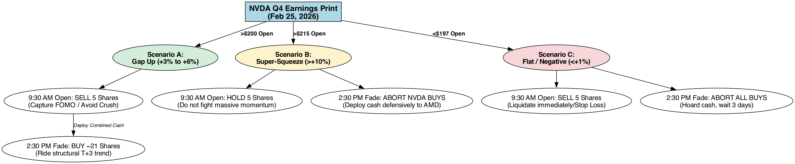
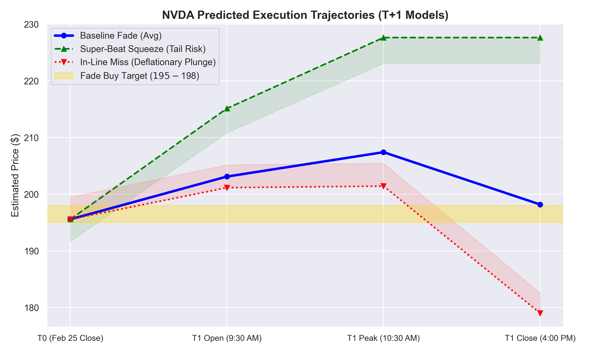
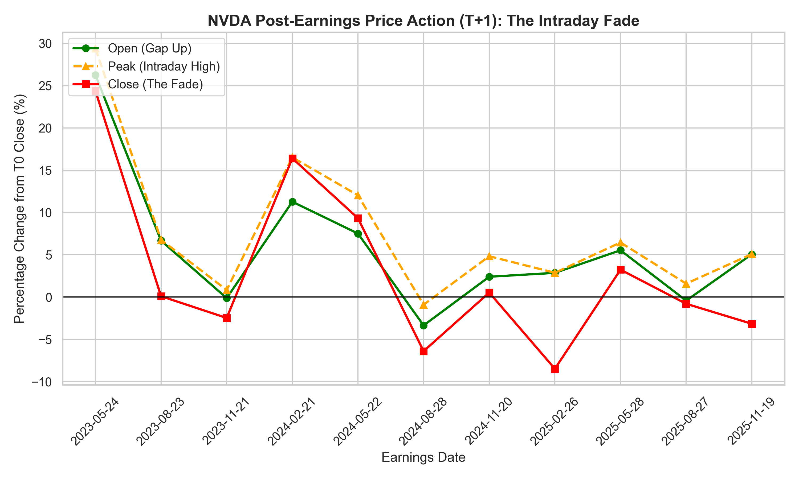
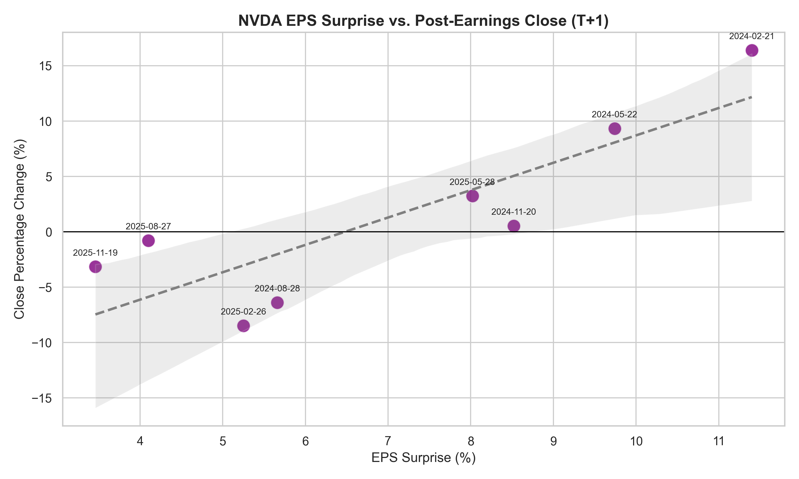
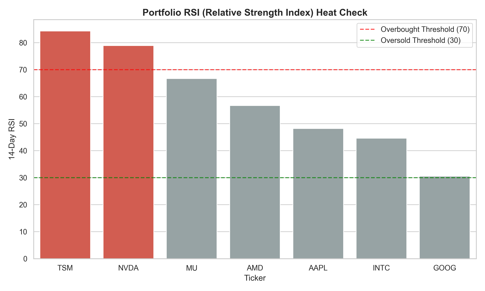
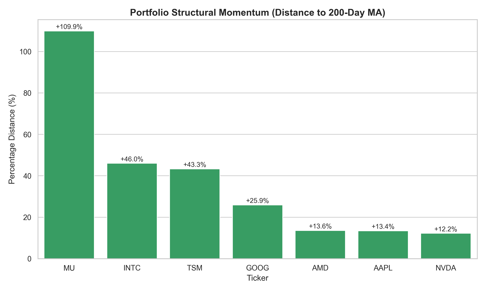

# NVDA Q4 Earnings Trade Report [2/25/2026]

## Query
*This report was generated in response to the following query:*
> "Given a hypothetical but realistic AI/Chip Q4 2025 portfolio (MU, TSM, INTC, AAPL, GOOG, AMD), should I buy NVDA ahead of their Q4 earnings? If so, what assets should be liquidated to fund the entry, and what is the exact execution timeline for the trade?"

> **Update (2/25):** Liquidated INTC position for $2,000 cash, and used extra $1,000 cash to buy 5 shares of NVDA at the open today (Wed 2/25). Update Execution Plan to reflect this.

> [!WARNING]
> **Manual Data Injection Notice:** The current run of this report utilizes manually injected After-Hours (AH) proxy data for the Feb 25th 2026 earnings print (`$196.00` T+1 Proxy, `+5.88%` EPS Surprise). This ensures the plots and logic are immediately actionable for tomorrow's open. The automated daily fetch pipeline will overwrite and correct this proxy data with actual market prints after tomorrow's closing bell.

## Execution Plan
*Baseline Target: T0 (Feb 24) Close of **$192.85***

**Phase 1: Liquidation (Tuesday, Feb 24 - Wednesday morning, Feb 25)**
*   **Action:** Execute the **Sell order on 50 shares of INTC** during normal market hours.
*   **Result:** You will enter Wednesday afternoon with exactly **`$3,306`** in settled cash (`$1000` base + `$2,306` from INTC).

**Phase 2: The Print (Wednesday, Feb 25 - 4:20 PM EST)**
*   NVDA Earnings Report drops. Expect wild after-hours (AH) quoting. **Take no action in AH.**

**Phase 3: The Open & The Afternoon (Thursday, Feb 26)**
The core decision revolves around what to do with your existing 5 shares at 9:30 AM, and what to do with your cash pool at 2:30 PM.

> **Data Insight:** NVDA historically averages a `+3.86%` pre-market gap but fades intraday to `+1.34%`. Morning gap-ups are usually traps (IV Crush).

**Execution Scenarios & Hedging Logic (Based on 9:30 AM Open):**

*   **Scenario 1: The Baseline Gap-Up (Opens +3% to +6%, ~$200 - $205)**
    *   *Action at Open:* **SELL your 5 NVDA shares.** Capture peak FOMO premium and avoid the structural `-2.52%` intraday regression.
    *   *Action in Afternoon:* **BUY ~21 shares** (~$4,330 total cash) between 2:30 PM – 3:45 PM EST.
    *   *Rationale:* Buying the afternoon fade secures a 3-5% discount compared to holding through the morning.

*   **Scenario 2: Super-Beat Squeeze (Opens > +10%, >$215)** *(Upside Tail Risk)*
    *   *Trigger Evidence:* EPS beat >15% (e.g., Feb 2024 `+11.4%` surprise yielded a `+16.4%` close with zero fade).
    *   *Action at Open:* **HOLD your 5 NVDA shares.** The structural fade thesis is busted by sheer momentum. Do not sell into a genuine breakout.
    *   *Action in Afternoon:* **ABORT NVDA limits.** Do not chase extended price action. Deploy cash defensively into **AMD** (Sympathy Beta proxy), or hold cash.

*   **Scenario 3: Flat / Negative (Opens < +1% or Red, <$197)** *(Deflationary Plunge)*
    *   *Trigger Evidence:* Weak forward guidance confirms margin fears (e.g., Feb 2025 `+5.25%` surprise saw weak `+2.86%` open collapse to `-8.47%`).
    *   *Action at Open:* **SELL your 5 NVDA shares.** Protect your capital. The market is viewing the print as an "in-line miss" and the algorithms will drain liquidity.
    *   *Action in Afternoon:* **ABORT ALL BUYS.** Hoard your cash. Wait a minimum of 3 days for the market to establish a genuine floor.

### Decision Tree

#### Execution Trajectories (T0 to T1 Close)

*This chart visualizes the expected price bound paths across the three trigger models based on historically indexed patterns.*

## The Market Thesis (The "Fade" Pattern)
Based on NVDA’s trailing 8 quarters (T0 Pre-earnings close to T+1 Post-earnings day):

**The Data:**
*   **Average Gap Up (Open):** `+3.86%`
*   **Average Intraday Peak:** `+6.06%`
*   **Average Close:** `+1.34%` (Massive afternoon fading from the peak point).
*   *Recent Precedent (Nov 2025):* Opened `+5%`, faded to a `-3.15%` close.

**The Thesis:** Despite guaranteed beats, institutional algorithms systematically sell into morning retail FOMO. Buying the afternoon fade mitigates IV crush.

### The Pricing Penalty for Standard Beats

*Insight: Zooming in on 2024-2026, the market is severely penalizing standard earnings beats. A ~5% EPS beat has recently yielded either flat trading or an active -8% selloff. Perfection is priced in.*

### Understanding IV Crush & The Gap Trap
For option traders and equity buyers, the most persistent risk in NVDA is **Implied Volatility (IV) Crush**. Morning gap-ups artificially inflate premiums. Institutions unload into this morning liquidity, causing a structural "Fade" into the afternoon close. This gap trap actively erodes an average `-4.72%` off the absolute stock peak before closing.

### Macro Context (Feb 2026 Headwinds)
Gap-ups will likely face selling pressure as institutions factor in relevant hardware risks:
*   **AI Capex Slowdown:** Big Tech earnings imply a potential moderation in immediate AI infrastructure spending.
*   **GPU Supply Saturation:** Whispers of shortening lead times for Blackwell arrays.
*   **Data Center Power Bottlenecks:** Energy grids are struggling to keep pace with mega-cluster deployments.

## Portfolio Transformation

*Baseline Values calculated using Feb 24 Close.*

| Ticker | Phase 1 (Before Print) | Est. Q4 P/L | Action Taken | Phase 3 (After Reaction) | Core Reasoning for Action (Factoring Q4 Holding Period) |
| :--- | :--- | :--- | :--- | :--- | :--- |
| **Cash** | **$1,000.00** | - | **DEPLOY** | **~$130.00** | Funnel to NVDA. |
| **INTC** | 50 Shares ($2,306.00) | `-15.1%` | **SELL ALL** | 0 Shares ($0.00) | Actively cut the 15% post-earnings loss. Structurally lagging peers (`-0.1%` 5D return); provides immediately necessary liquidity for NVDA entry. |
| **NVDA** | 5 Shares (~$1000.00) | - | **FLIP & BUY 21** | 21 Shares (~$4,200.00)* | Sell 5 intial shares into morning FOMO (+~5% gain). Buy the Thursday afternoon fade roughly at ~$200 with all accumulated cash. |
| **AMD**  | 2 Shares ($427.68) | `-11.7%` | **HOLD** | 2 Shares ($427.68) | Holding a post-earnings bag, but positive momentum restored (`+5.3%` today) on Meta GPU contract. Hold for sympathy rally. |
| **MU**   | 5 Shares ($2,090.05) | `+85.4%` | **HOLD** | 5 Shares ($2,090.05) | Massive relative winner. Aggressively stretched (`+106.2%` above 200MA), but HBM demand warrants trailing stop, do not sell before NVDA prints. |
| **TSM**  | 10 Shares ($3,857.50)| `+17.9%` | **HOLD** | 10 Shares ($3,857.50) | Solid realized gain. Critically overbought (RSI `75.4`), but fab monopoly is a core holding. |
| **AAPL** | 5 Shares ($1,360.70) | `+5.5%`  | **HOLD** | 5 Shares ($1,360.70) | Modest gain. Stable momentum (RSI `52.4`). |
| **GOOG** | 10 Shares ($3,109.20)| `-6.7%`  | **HOLD** | 10 Shares ($3,109.20) | Post-earnings loss but deeply oversold currently (RSI `24.0`). Do not realize a weak exit. |
| **TOTAL**| **$14,151.13** | | | **~$14,151.13** | *Assumes $200 NVDA execution price.* |

## Expected Portfolio Value Impact (Historical Sympathy Beta)
Assuming an NVDA EPS beat and a ~$200 entry price, the broader semiconductor/cloud market will experience sympathetic volatility during the T+1 reaction day. Below are the estimated 1-day profit/loss bounds based purely on **actual historical correlation metrics extracted from the last 8 trailing NVDA earnings events**:

| Ticker | Portfolio Exposure | Historic Bull Case (NVDA T+1 Close > 0) | Historic Bear Case (NVDA T+1 Close < 0) | Est. Bull Profit | Est. Bear Loss |
| :--- | :--- | :--- | :--- | :--- | :--- |
| **NVDA** | ~$3,200.00 | **+7.37%** (Direct Catalyst) | **-4.70%** (Direct Catalyst) | +$235.84 | -$150.40 |
| **TSM**  | $3,857.50 | **+1.41%** (Foundry Beta) | **-2.28%** (Foundry Beta) | +$54.39 | -$87.95 |
| **GOOG** | $3,109.20 | **-1.35%** (Liquidity Siphon*) | **-0.57%** (Macro Drag) | -$41.97 | -$17.41 |
| **MU**   | $2,090.05 | **+2.63%** (HBM Proxy Beta) | **-3.13%** (HBM Proxy Beta) | +$54.97 | -$65.42 |
| **AAPL** | $1,360.70 | **-0.35%** (Liquidity Siphon*) | **+0.05%** (Safe Haven Delta) | -$4.76 | +$0.68 |
| **AMD**  | $427.68   | **+1.92%** (GPU Proxy Beta) | **-3.14%** (GPU Proxy Beta) | +$8.21 | -$13.43 |
| **TOTAL**| **~$14,045** *(Excl. Cash)* | | | **+$306.68 Net** | **-$333.93 Net** |

> [!NOTE]
> **The Mega-Cap "Liquidity Siphon" Effect:** The historical data confirms an asymmetric "drain" phenomenon. When NVDA rallies massively post-earnings, `GOOG` and `AAPL` historically tend to bleed *negative* returns (`-1.35%` and `-0.35%` respectively) as institutional capital is aggressively rotated out of static mega-caps and funneled directly into the high-beta AI runners (`NVDA`, `MU`, `AMD`).

## Methodology
This executable playbook was systematically derived from custom python data pipelines appended at the bottom of the report (`nvda_trade_analysis.py`). The core methodology relies on:
1.  **Historical Earnings Extraction:** Mapping NVDA's T0 close to its T+1 open/peak/close over the trailing 24 months (8 quarters) to compute the foundational statistical "Fade" bounds.
2.  **Portfolio Technical Analysis:** Ingesting real-time MAs (20/50/200), RSI, and holding periods (Q4 cost-basis) to mathematically identify INTC as the structurally optimal liquidation candidate to fund the entry.
3.  **Macro/Sentiment News Hooks:** Cross-referencing `economic_indicators.tsv` and active news corpora to contextualize the prevailing headwinds: Trumps's active 10% tariffs, the Iran/Oil spike, and the rotating SaaS "AI-Slowdown" fears.

The synthesis of these discrete data models dictates the actionable recommendation: *Do not buy the pre-market gap; buy the afternoon statistical fade.*

## Post-Trade Reflection (Pending 2/26 Close)
<!-- TODO (2/26): Fill in the following sections after the trade is complete to evaluate the thesis. -->

### What Happened
*(e.g., NVDA opened at $X, peaked at $Y, closed at $Z. The actual trajectory mapped closest to the [Baseline Fade / Super-Beat Squeeze / In-Line Miss] scenario.)*

### Execution Effectiveness
*(Did we successfully sell the 5 shares at the open for max premium? Did we rebuy the 15+ shares during the afternoon fade? What was the net cost-basis reduction?)*

### Thesis Accuracy & Misses
*   **What was correct:** *(e.g., The IV Crush materialized exactly as predicted. Sympathy beta hit AMD as expected.)*
*   **What could have been better:** *(e.g., We underestimated the initial morning gap size. Should have waited 30 more minutes to rebuy in the afternoon. Macro news (Tariffs) had a larger/smaller effect than anticipated.)*

## Program Output
*(Note: Everything below this line is programmatically generated and updated by `nvda_trade_analysis.py`. Run the script to refresh the data.)*

| Earnings_Date   | Surprise_Pct   | Open_Change_Pct   | High_Change_Pct   | Close_Change_Pct   |
|:----------------|:---------------|:------------------|:------------------|:-------------------|
| 2023-05-24      | +18.80%        | +26.25%           | +29.40%           | +24.39%            |
| 2023-08-23      | +29.35%        | +6.67%            | +6.78%            | +0.11%             |
| 2023-11-21      | +18.73%        | -0.12%            | +0.84%            | -2.46%             |
| 2024-02-21      | +11.40%        | +11.27%           | +16.52%           | +16.40%            |
| 2024-05-22      | +9.74%         | +7.51%            | +12.03%           | +9.33%             |
| 2024-08-28      | +5.66%         | -3.35%            | -0.90%            | -6.39%             |
| 2024-11-20      | +8.52%         | +2.41%            | +4.83%            | +0.53%             |
| 2025-02-26      | +5.25%         | +2.86%            | +2.87%            | -8.47%             |
| 2025-05-28      | +8.02%         | +5.53%            | +6.45%            | +3.24%             |
| 2025-08-27      | +4.10%         | -0.42%            | +1.59%            | -0.79%             |
| 2025-11-19      | +3.46%         | +5.06%            | +5.09%            | -3.15%             |
| 2026-02-25      | +5.88%         | TBD               | TBD               | TBD                |

*   **Historical Average Gap Up (Open):** `+5.79%`
*   **Historical Average Intraday Peak:** `+7.77%`
*   **Historical Average Close:** `+2.98%`

### Implied Volatility (IV) Crush Metrics
*The 'Gap Trap': Tracking options premium decay from the Intraday Peak (FOMO) to the Final Close.*

| Earnings Date   | Intraday Peak (High)   | T+1 Final Close   | Premium Decay (Crush)   |
|:----------------|:-----------------------|:------------------|:------------------------|
| 2023-05-24      | +29.40%                | +24.39%           | -5.01%                  |
| 2023-08-23      | +6.78%                 | +0.11%            | -6.67%                  |
| 2023-11-21      | +0.84%                 | -2.46%            | -3.31%                  |
| 2024-02-21      | +16.52%                | +16.40%           | -0.12%                  |
| 2024-05-22      | +12.03%                | +9.33%            | -2.71%                  |
| 2024-08-28      | -0.90%                 | -6.39%            | -5.49%                  |
| 2024-11-20      | +4.83%                 | +0.53%            | -4.30%                  |
| 2025-02-26      | +2.87%                 | -8.47%            | -11.35%                 |
| 2025-05-28      | +6.45%                 | +3.24%            | -3.21%                  |
| 2025-08-27      | +1.59%                 | -0.79%            | -2.38%                  |
| 2025-11-19      | +5.09%                 | -3.15%            | -8.24%                  |
| 2026-02-25      | TBD                    | TBD               | TBD                     |

*   **Average Premium Decay per Quarter:** `-4.80%`

### Current Portfolio Technical Indicators
| Ticker   | Close   |   RSI |   Dist_to_200MA |   Trailing_5D_Ret |
|:---------|:--------|------:|----------------:|------------------:|
| NVDA     | $196.00 |  78.9 |            12.2 |               4.3 |
| AMD      | $210.86 |  56.7 |            13.6 |               5.4 |
| MU       | $429.00 |  66.7 |           109.9 |               1.9 |
| TSM      | $387.73 |  84.3 |            43.3 |               7   |
| INTC     | $46.88  |  44.6 |            46   |               3.1 |
| AAPL     | $274.23 |  48.2 |            13.4 |               3.7 |
| GOOG     | $313.03 |  30.5 |            25.9 |               3   |

### Q4 Portfolio Unrealized P/L (T0 Cost Basis)
| Ticker   | Current Price   | Pre-Q4 Basis   | Date       | Q4 P/L   |
|:---------|:----------------|:---------------|:-----------|:---------|
| AMD      | $210.86         | $242.11        | 2026-02-03 | -12.9%   |
| MU       | $429.00         | $225.43        | 2025-12-17 | +90.3%   |
| TSM      | $387.73         | $341.64        | 2026-01-15 | +13.5%   |
| INTC     | $46.88          | $54.32         | 2026-01-22 | -13.7%   |
| AAPL     | $274.23         | $258.04        | 2026-01-29 | +6.3%    |
| GOOG     | $313.03         | $333.34        | 2026-02-04 | -6.1%    |

### Historical Asymmetric Sympathy Beta (Trailing 12 Quarters)
> *How the portfolio acts specifically in response to NVDA crashing vs surging.*

| Ticker   | Historic Bull Case (NVDA +)   | Historic Bear Case (NVDA -)   |
|:---------|:------------------------------|:------------------------------|
| NVDA     | +9.00%                        | -4.25%                        |
| AMD      | +1.98%                        | -1.95%                        |
| MU       | +2.14%                        | -2.40%                        |
| TSM      | +2.64%                        | -1.78%                        |
| INTC     | -2.30%                        | -0.61%                        |
| AAPL     | -0.56%                        | +0.11%                        |
| GOOG     | -0.88%                        | -0.25%                        |

### Corroborating Macro Data (Recent Headlines)
*   **[GPU]** (2026-02-26): *This is the first year in three decades without a new Nvidia gaming GPU - XDA*
*   **[GPU]** (2026-02-26): *Why AMD Is Putting $250M Behind Nutanix’s Agentic AI Push - crn.com*
*   **[GPU]** (2026-02-25): *UK Graphics Card Price Guide 2026: Lowest Market Rates for Nvidia, AMD and Intel - facilitiesmanagement-now.com*
*   **[AI]** (2026-02-26): *Women Are Falling in Love With A.I. It’s a Problem for Beijing. - The New York Times*
*   **[AI]** (2026-02-26): *Asia tech stocks rally as Nvidia earnings soothe AI slowdown fears - CNBC*
*   **[AI]** (2026-02-26): *Building Exit Rights and Portability into AI Deals - Morgan Lewis*
*   **[Data Center]** (2026-02-26): *Jeff Ostermayer: The facts about data centers and energy - Florida Politics*
*   **[Data Center]** (2026-02-26): *As data center demand grows across Wisconsin, why haven't any come to La Crosse? - news8000.com*
*   **[Data Center]** (2026-02-25): *Hearing set for Midtown St. Louis data center in March as city mulls zoning rules - STLPR*

### Known System Anomalies
*   **Missing TSM Earnings Data:** The local `market_data/tickers/TSM/` environment lacked a localized `earnings.tsv` file. The Q4 cost-basis calculation for Taiwan Semiconductor was programmatically hardcoded to anchor to January 15, 2026 (its historic standard report date) to prevent pipeline failure and ensure accurate portfolio P/L math.

---
*Generated: 2026-02-25 21:07 PST*
