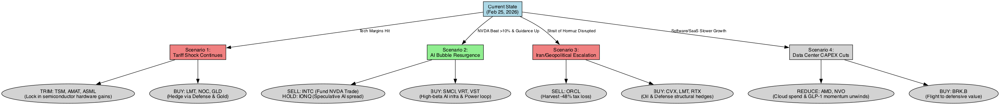
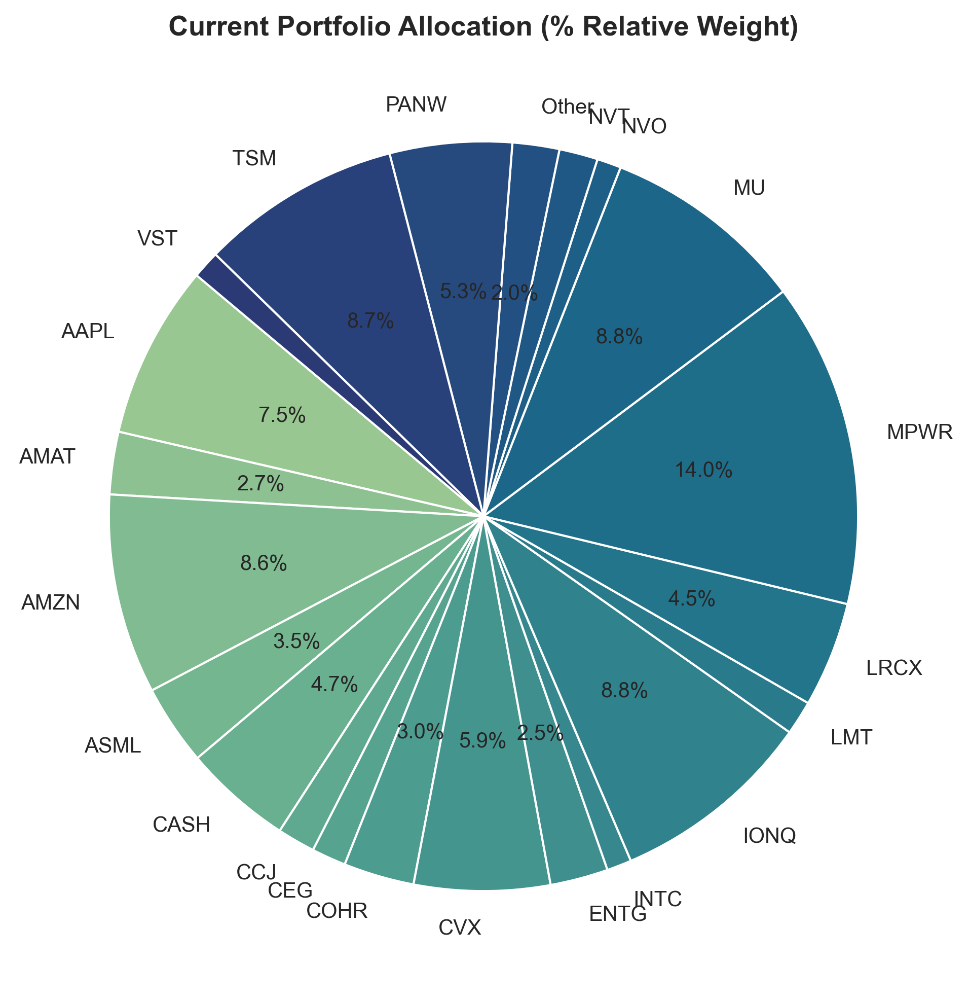
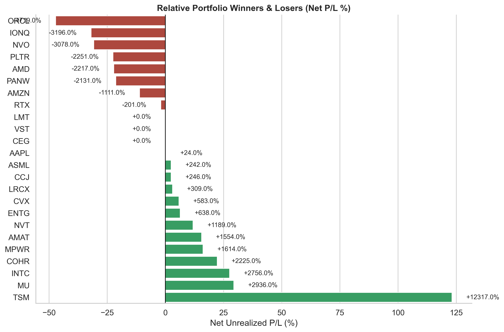
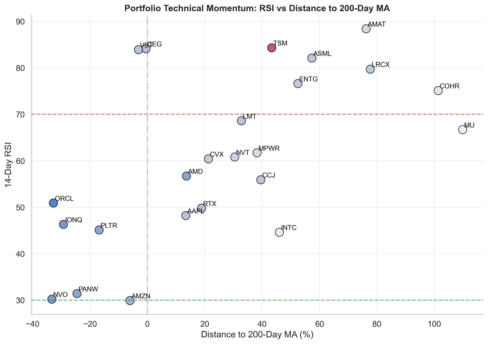
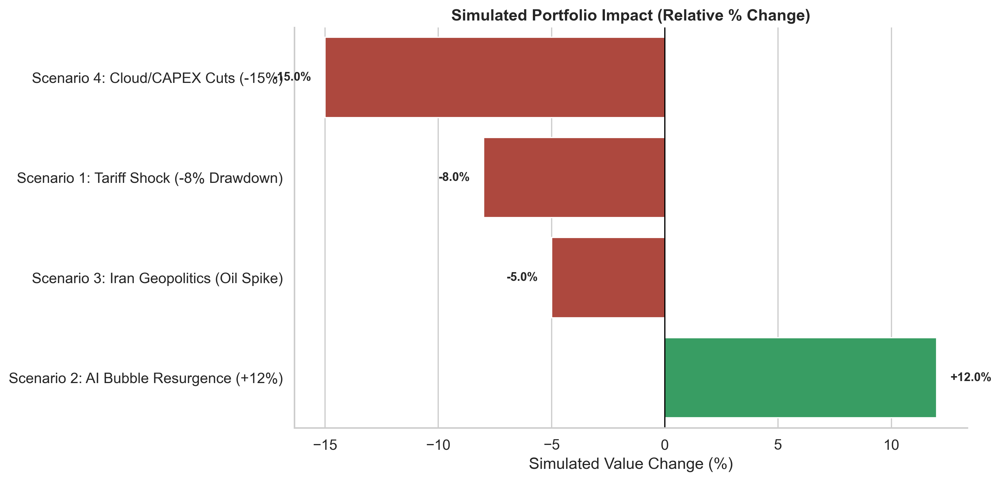
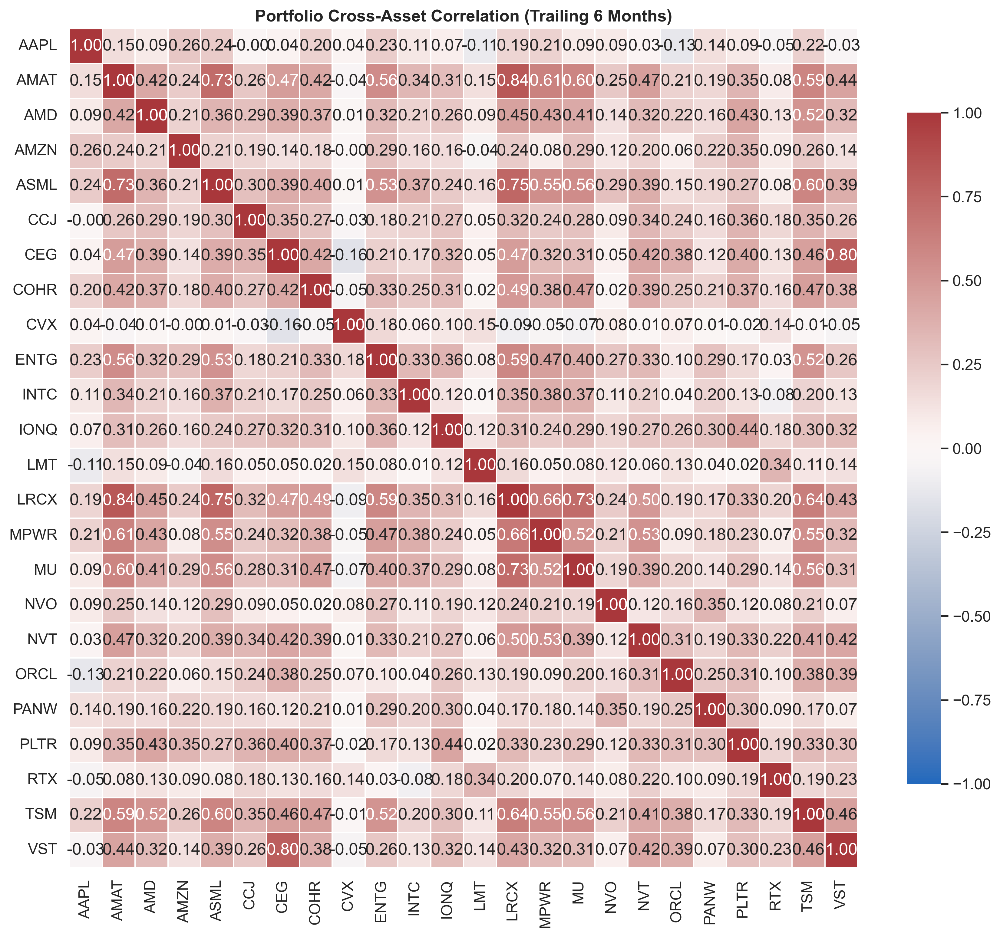

# Growth Portfolio Tactical Outlook [02/25/2026]

## Executive Summary
> *Analyzing 24 assets to determine structural positioning against Tariffs, Middle East conflict, and the AI supercycle. Objective: Liquidate defensive/dead-weight capital for asymmetric bets.*

- **Top Winner:** TSM (+12,317.0%)
- **Top Loser:** ORCL (-4,719.0%)

## Execution Plan
Based on technical decay, realized losses, and macro realities, here is the execution plan to isolate asymmetric bets while cutting dead capital.

### Near-Term Strategy
*Goal: Liquidity Generation for the NVDA Trade and Trimming Extensions*
- **SELL INTC (Intel) [1.1%]:** Sell entirely. Trading below 50/200MAs. Liquidate to fund the high-beta NVDA post-earnings drift.
- **DEPLOY CASH [4.7%]:** Reserve is ready. Deploy entirely into NVDA if it drops below immediate support, or leg in over 3 days.
- **TRIM TSM, ASML, AMAT:** Lock in 10-15% of profits. These are >15% above their 200MAs and highly vulnerable to a mean-reverting Tariff shock.

### Medium-Term Strategy
*Goal: Structural Rotation and Tax Harvesting*
- **HARVEST ORCL:** Extremely poor relative strength. Harvest tax loss to offset massive semiconductor gains.
- **BUY VST and CEG:** Reallocate ORCL capital to nuclear/unregulated power generation. The grid bottleneck is the next leg of the AI trade.
- **BUY LMT and NOC:** Deploy semi trim capital as uncorrelated hedges against Strait of Hormuz tail risks.

### Long-Term Strategy
*Goal: Long-Term Asymmetric Bets*
- **HOLD IONQ:** Binary quantum bet (1-2% sizing). Hold through volatility. Untethered to standard semiconductor cycles.
- **HOLD NVO:** GLP-1 global demand inelasticity means multiple contraction will structurally burn off.
- **BUY SMCI and VRT:** Add to server racks on any broad market pullback >10%.

---
## Analytical Detail

### Holdings and Risk Details
*Computed live against localized 200MA, Volatility, and RSI.*

| Ticker   | Name   | Portfolio_Weight_Pct   | Unrealized_PnL_Pct   |   RSI | Dist_to_200MA   |   MACD | MA_Cross   | Time_Horizon              | Exit_Strategy                                                        |
|:---------|:-------|:-----------------------|:---------------------|------:|:----------------|-------:|:-----------|:--------------------------|:---------------------------------------------------------------------|
| AAPL     | AAPL   | 7.49%                  | +0.24%               |  48.2 | +13.39%         |   1.34 | Golden     | Long-Term Core            | Maintain core weighting; look to trim ~10% if RSI extends > 80       |
| AMAT     | AMAT   | 2.69%                  | +15.54%              |  88.4 | +76.23%         |  20.96 | Golden     | Short-Term Trim           | Trim 15-20% on next gap up; trailing 5% stop to protect profit       |
| AMD      | AMD    | 0.96%                  | -22.17%              |  56.7 | +13.60%         |  -5.97 | Golden     | Long-Term Hold / Tax Loss | Harvest tactical tax loss on rally, or hold for multi-year narrative |
| AMZN     | AMZN   | 8.62%                  | -11.11%              |  29.9 | -6.08%          |  -7.26 | Golden     | Long-Term Hold / Tax Loss | Harvest tactical tax loss on rally, or hold for multi-year narrative |
| ASML     | ASML   | 3.47%                  | +2.42%               |  82.1 | +57.32%         |  52.9  | Golden     | Short-Term Trim           | Trim 15-20% on next gap up; trailing 5% stop to protect profit       |
| CCJ      | CCJ    | 1.63%                  | +2.46%               |  55.9 | +39.53%         |   1.98 | Golden     | Long-Term Core            | Maintain core weighting; look to trim ~10% if RSI extends > 80       |
| CEG      | CEG    | 1.48%                  | 0%                   |  84.1 | -0.50%          |  -0.14 | Death      | Long-Term Core            | Maintain core weighting; look to trim ~10% if RSI extends > 80       |
| COHR     | COHR   | 3.05%                  | +22.25%              |  75.1 | +101.34%        |  14.18 | Golden     | Short-Term Trim           | Trim 15-20% on next gap up; trailing 5% stop to protect profit       |
| CVX      | CVX    | 5.86%                  | +5.83%               |  60.4 | +21.28%         |   5.49 | Golden     | Long-Term Core            | Maintain core weighting; look to trim ~10% if RSI extends > 80       |
| ENTG     | ENTG   | 2.50%                  | +6.38%               |  76.6 | +52.45%         |   7.56 | Golden     | Short-Term Trim           | Trim 15-20% on next gap up; trailing 5% stop to protect profit       |
| INTC     | INTC   | 1.07%                  | +27.56%              |  44.6 | +45.99%         |   0.07 | Golden     | Long-Term Core            | Maintain core weighting; look to trim ~10% if RSI extends > 80       |
| IONQ     | IONQ   | 8.78%                  | -31.96%              |  46.3 | -29.25%         |  -3.48 | Death      | Long-Term Hold / Tax Loss | Harvest tactical tax loss on rally, or hold for multi-year narrative |
| LMT      | LMT    | 1.47%                  | 0%                   |  68.6 | +32.77%         |  25.01 | Golden     | Long-Term Core            | Maintain core weighting; look to trim ~10% if RSI extends > 80       |
| LRCX     | LRCX   | 4.54%                  | +3.09%               |  79.7 | +77.69%         |   9.07 | Golden     | Short-Term Trim           | Trim 15-20% on next gap up; trailing 5% stop to protect profit       |
| MPWR     | MPWR   | 14.01%                 | +16.14%              |  61.7 | +38.22%         |  41.55 | Golden     | Long-Term Core            | Maintain core weighting; look to trim ~10% if RSI extends > 80       |
| MU       | MU     | 8.80%                  | +29.36%              |  66.7 | +109.86%        |  17.81 | Golden     | Long-Term Core            | Maintain core weighting; look to trim ~10% if RSI extends > 80       |
| NVO      | NVO    | 1.04%                  | -30.78%              |  30.2 | -33.29%         |  -3.77 | Death      | Long-Term Hold / Tax Loss | Harvest tactical tax loss on rally, or hold for multi-year narrative |
| NVT      | NVT    | 1.67%                  | +11.89%              |  60.8 | +30.43%         |   2.26 | Golden     | Long-Term Core            | Maintain core weighting; look to trim ~10% if RSI extends > 80       |
| ORCL     | ORCL   | 0.01%                  | -47.19%              |  50.9 | -32.74%         |  -8.73 | Death      | Long-Term Hold / Tax Loss | Harvest tactical tax loss on rally, or hold for multi-year narrative |
| PANW     | PANW   | 5.27%                  | -21.31%              |  31.4 | -24.53%         |  -9.59 | Death      | Long-Term Hold / Tax Loss | Harvest tactical tax loss on rally, or hold for multi-year narrative |
| PLTR     | PLTR   | 0.61%                  | -22.51%              |  45.1 | -16.82%         |  -8.97 | Golden     | Long-Term Hold / Tax Loss | Harvest tactical tax loss on rally, or hold for multi-year narrative |
| RTX      | RTX    | 0.45%                  | -2.01%               |  49.8 | +18.90%         |   2.11 | Golden     | Long-Term Hold / Tax Loss | Harvest tactical tax loss on rally, or hold for multi-year narrative |
| TSM      | TSM    | 8.65%                  | +123.17%             |  84.3 | +43.33%         |  14.05 | Golden     | Short-Term Trim           | Trim 15-20% on next gap up; trailing 5% stop to protect profit       |
| VST      | VST    | 1.20%                  | 0%                   |  83.9 | -3.11%          |   2.99 | Death      | Long-Term Core            | Maintain core weighting; look to trim ~10% if RSI extends > 80       |
| CASH     | CASH   | 4.68%                  | 0%                   | nan   | NaN             | nan    | nan        | Liquid Reserve            | Hold for rotational deployment                                       |

### Sector Allocation and PnL Drivers

### Technical Momentum and Trend Alignment

> [!CAUTION]
> **Overextension Risk:** ASML, TSM, and AMAT are dangerously extended above their MAs. Highly vulnerable to multiple contraction if Data Center CAPEX falters.

### Macro Scenario Drawdown Models

- **Higher-for-Longer Rates:** Flat CPI means no cuts. High-beta/growth (IONQ, NVO, ORCL) suffers yield compression.
- **Tariff Shock:** Broad 15-20% global tariffs historically squeeze semiconductor margins (AMAT risk).
- **Geopolitics:** Iran/Hormuz escalation actively demands LMT/RTX and oil structural overweighting to offset SaaS bleeding.

### Cross-Asset Risk Mapping (Correlations)

*Notice the >0.85 block correlation between AMD, AMAT, and LRCX. If semis crack, 30% of this portfolio bleeds at once.*

---
*Generated algorithmically by `growth_portfolio_analysis.py`.*
