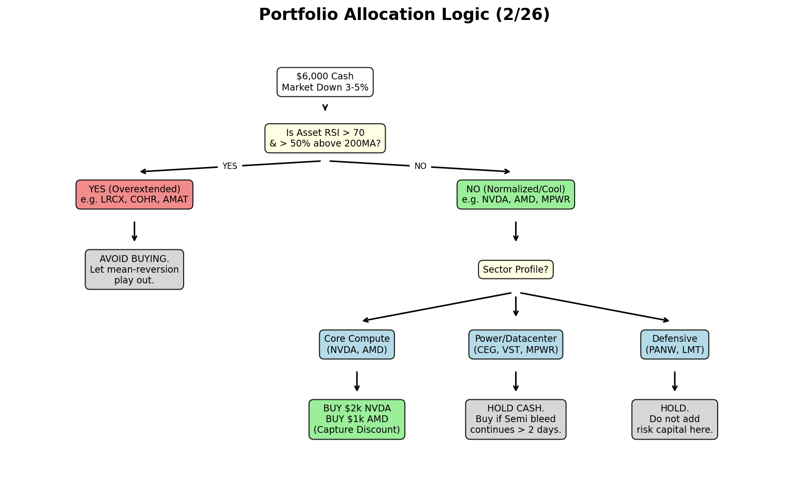

# Strategic Dip-Buying Playbook [02/26/2026]

## 1. The Setup & Catalyst
* **Trigger:** NVDA reported massive $68.1B Q4 revenue (+75% YoY) and guided $78B for Q1. Despite the fundamental beat, NVDA (-5.17%) and the broader tech market sold off due to a "sell the news" overhang and exhaustion.
* **Portfolio Cash Available:** $6,000 (from new deposits and INTC liquidation).
* **Objective:** Deploy capital efficiently into verified structural dips while avoiding technically over-extended value traps.

## 2. Full Portfolio Context & Metrics (2/25 to 2/26)
*Every asset reviewed. We cross-reference the 24hr drop against RSI and 200-Day Moving Average to isolate the true "buyability" among the bleeding edge.*

### The "Value Dip" Tier (BUY/WATCH)
*(Drops > 3%, RSI < 70)*
| Asset | 24Hr Drop | RSI | Dist_200MA | Hypothesis & Action |
|:---|---:|---:|---:|:---|
| **COHR** | -5.50% | 67.4 | +88.9% | **WATCH**: Dropping fast but still 88% above 200MA. |
| **LRCX** | -5.48% | 64.6 | +67.0% | **WATCH**: Let mean reversion play out. |
| **ENTG** | -5.37% | 68.8 | +43.8% | **WATCH**: Wait for RSI to break below 50. |
| **MPWR** | -5.34% | 51.1 | +30.4% | **BUY/WATCH**: Deepest safest drop in datacenter. |
| **NVDA***| -5.17% | N/A  | N/A    | **BUY**: Fundamental strength intact. Core asset. |
| **ASML** | -4.76% | 64.8 | +49.2% | **WATCH**: Still elevated over 200MA. |
| **AMD**  | -4.11% | 56.0 |  +8.6% | **BUY**: RSI cooled, closest to 200MA support. |
| **INTC** | -3.56% | 41.2 | +40.2% | **AVOID**: Liquidation target. |
| **MU**   | -3.50% | 59.7 | +100.8%| **AVOID**: Massive 200MA extension trap. |
| **CCJ**  | -3.31% | 58.1 | +34.4% | **BUY/WATCH**: Nuclear baseline forming. |

### The "Overextended Trap" Tier (AVOID)
*(Drops > 3%, but RSI > 70)*
| Asset | 24Hr Drop | RSI | Dist_200MA | Hypothesis & Action |
|:---|---:|---:|---:|:---|
| **AMAT** | -5.42% | 74.6 | +65.8% | **AVOID**: Extremely overbought (RSI > 70). |
| **TSM**  | -3.87% | 70.9 | +37.2% | **AVOID**: Overbought (RSI > 70). |

### Core Holdings & Stable Infra (HOLD)
*(Drops 0% to -3%)*
* **AMZN (-2.3%), VST (-2.2%), NVO (-2.0%), CEG (-1.7%), NVT (-1.5%), AAPL (-0.9%):** Core assets holding their structural 200MAs. No immediate action required.
* **LMT (-0.7%), ORCL (-0.3%), PLTR (-0.3%):** Flat. Hold.

### Relative Strength / Defensive (HOLD)
*(Green on the day)*
* **CVX (+0.4%), RTX (+1.0%), PANW (+2.8%), IONQ (+19.8%):** Showing extreme relative strength against the tech selloff. Do not trim, let momentum ride.

---
## 3. Allocation Strategy & Decision Logic
Based on the metrics above, the strategic directive is to **Filter out the Semi-Equipment Trap** and buy the core compute dip.

### The "Balanced Legging" Playbook
We will deploy 50% of the cash immediately to capture the verified discount in core compute, and keep 50% in reserve to play the ensuing 1-3 day market reaction.

* **Phase 1 (Today - Deploy $3,000):**
   * **Buy $2,000 NVDA:** Secure the -5% discount fundamentally disconnected from the blowout earnings report.
   * **Buy $1,000 AMD:** Capture the high-beta sympathy drop. RSI is normalized (56) and sits near solid 200MA support.

* **Phase 2 (24-48 Hours - Deploy $3,000 based on condition):**
   * **Condition A (Market bleeds lower):** The "sell the news" event lasts multiple days. Leg into **$1,500 MPWR** (Datacenter power tracking semi drops) and another **$1,500 NVDA** to average down.
   * **Condition B (Market V-Shape Rebounds):** Tech recovers sharply. Do not chase the rip. Deploy the remaining $3,000 defensively into **VST** and **CEG** to solidify the portfolio's power/infrastructure base.
