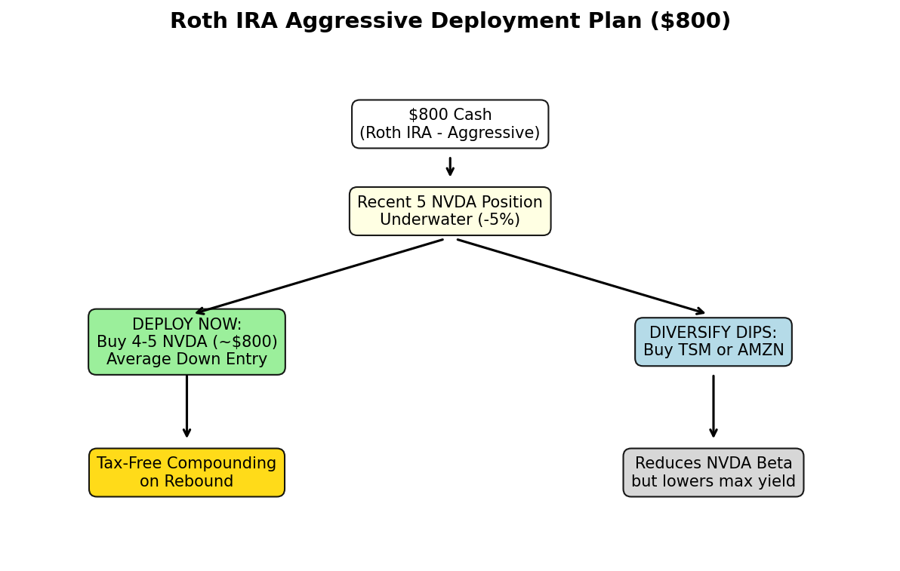

# Roth IRA Tactical Plan [02/26]

## 1. Parameters
* **Account:** Roth IRA (Tax-Free Gains)
* **Capital:** $800 Cash
* **Condition:** 5 NVDA shares bought yesterday, directly prior to the -5.17% earnings drop.

## 2. Full Portfolio Context & Metrics (2/25 to 2/26)
*Every asset in the Roth IRA reviewed. Filtering the steepest 24-hr drops to identify immediate value versus structural traps.*

### The Deep Drop Tier (BUY/WATCH)
| Ticker | 24Hr Drop | RSI | Dist_200MA | Verdict & Hypothesis |
|:---|---:|---:|---:|:---|
| **BMNR** | -6.88% | N/A | N/A | **AVOID**: Low liquidity / untracked drop. |
| **WDC**  | -5.50% | 54.8 | +108.8% | **AVOID**: Structural over-extension trap (>100% above 200MA). |
| **NVDA** | -5.17% | 63.2 | +6.16% | **BUY**: Fundamental strength, technically cooled. Closest to 200MA. |
| **INTC** | -3.56% | 41.2 | +40.2% | **AVOID**: Structurally broken. |
| **MU**   | -3.50% | 59.7 | +100.8% | **AVOID**: Overextended valuation trap. |
| **CCJ**  | -3.31% | 58.1 | +34.4% | **WATCH**: Solid baseline but NVDA takes immediate priority. |

### The Overextended Trap Tier (AVOID)
| Ticker | 24Hr Drop | RSI | Dist_200MA | Verdict & Hypothesis |
|:---|---:|---:|---:|:---|
| **TSM** | -3.87% | 70.9 | +37.2% | **AVOID**: Still technically hot (RSI > 70). |

### Core Mutual Funds & Stable Base (HOLD)
* **AMZN (-2.3%):** Holding strong relative to semis.
* **VIGAX, VTSAX:** Core index funds providing macro portfolio stability. No action required.

### Relative Strength (HOLD)
* **META (+0.1%), CVX (+0.4%), RTX (+1.0%), PANW (+2.8%), IONQ (+19.8%):** Green on the day. Momentum is strong. Hold positions.

## 3. The Hypothesis
The recent NVDA sell-off (-5.17%) is a transient "sell the news" event disconnected from its flawless $68B revenue Q4 beat. While other assets dropped similarly (WDC, MU), they are technically bloated (>100% above 200MA). NVDA is the safest, least extended, and highest probability rebound vehicle.

## 4. Execution
**Deploy 100% of $800 cash into NVDA today.**
1. **The Math:** Buying ~4.3 shares of NVDA at ~$185 averages down the cost basis of the 5 shares bought yesterday.
2. **The Tax Advantage:** Because this is a Roth IRA, you skip the capital gains tax. Aggressively resetting the cost basis at the algorithmic low maximizes the tax-free compounding when the stock inevitably mean-reverts upward. Trying to overly diversify $800 into a statistically weaker asset (like WDC) diffuses the recovery trajectory.

