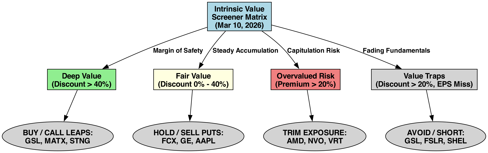
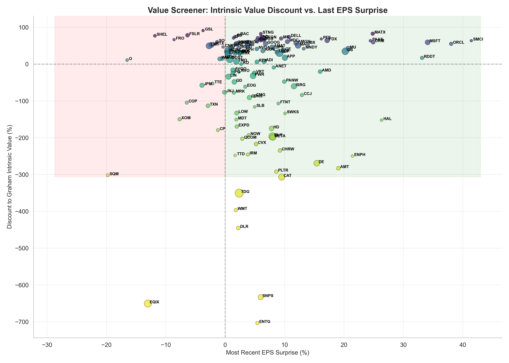

# Algorithmic Value Strategy - Screener Output

## Executive Summary
> *Analyzed **168 equities** utilizing Benjamin Graham's revised Intrinsic Value formula, substituting contemporary bond yields and trailing EPS. Objective: Identify deep-value dislocations in the market where growth estimates have not kept pace with pricing reality.*

- **Highest Margin of Safety:** GSL (Trading at a 91.1% discount)

## Data Quality & Potential Issues
> **Pipeline Diagnostics:** Out of `168` tickers analyzed, there are some data gaps that may affect metric coverage:
> - Missing Intrinsic Value (Often lacking Forward EPS/Growth projection): **31** tickers
> - Missing EPS Surprise (Missing quarterly expectations): **0** tickers
> - Missing Current Price data: **0** tickers

## Execution Matrix
Based on raw pricing efficiency against terminal growth estimates, the following dynamic decision matrix dictates capital flow.

---
## Analytical Output

### 📉 Dislocation Curve (Value vs Earnings Surprise)
The following scatter plot maps theoretical discount against actual corporate earnings execution. Equities in the **upper-right quadrant** represent the holy grail of value investing: severely undervalued companies that are consistently beating consensus earnings.

> [!CAUTION]
> **The Value Trap:** High-discount equities residing in the *lower-left* quadrant are actively missing earnings, suggesting their 'cheap' valuation is a direct function of collapsing forward guidance rather than market inefficiency.

### 🏆 Top Deep Value Targets
*Filtered for positive execution (Surprise > 0) and high margin of safety (Discount > 0).*

| Ticker   | Name   | Portfolio_Weight_Pct   | Unrealized_PnL_Pct   | Graham_Value   | Discount_to_Intrinsic_Value_Pct   |   RSI | Dist_to_200MA   |   MACD | MA_Cross   | Time_Horizon       | Exit_Strategy                |
|:---------|:-------|:-----------------------|:---------------------|:---------------|:----------------------------------|------:|:----------------|-------:|:-----------|:-------------------|:-----------------------------|
| MATX     | MATX   | 0%                     | 0%                   | $860.70        | +82.69%                           |  37.1 | +29.76%         |   1.64 | Golden     | Value Hold (Years) | Mean Reversion to Fair Value |
| STNG     | STNG   | 0%                     | 0%                   | $438.14        | +82.59%                           |  69.9 | +41.60%         |   4.07 | Golden     | Value Hold (Years) | Mean Reversion to Fair Value |
| BAC      | BAC    | 0%                     | 0%                   | $223.74        | +78.59%                           |  29.5 | -4.12%          |  -1.25 | Golden     | Value Hold (Years) | Mean Reversion to Fair Value |
| ES       | ES     | 0%                     | 0%                   | $284.20        | +74.12%                           |  57.3 | +11.03%         |   1.43 | Golden     | Value Hold (Years) | Mean Reversion to Fair Value |
| DELL     | DELL   | 0%                     | 0%                   | $541.60        | +73.59%                           |  75.9 | +13.48%         |   7.4  | Death      | Value Hold (Years) | Mean Reversion to Fair Value |
| DAC      | DAC    | 0%                     | 0%                   | $382.77        | +71.05%                           |  62   | +20.15%         |   3.03 | Golden     | Value Hold (Years) | Mean Reversion to Fair Value |
| D        | D      | 0%                     | 0%                   | $216.27        | +71%                              |  34.8 | +7.67%          |   0.47 | Golden     | Value Hold (Years) | Mean Reversion to Fair Value |
| MS       | MS     | 0%                     | 0%                   | $527.77        | +69.60%                           |  38.7 | +1.78%          |  -4.39 | Golden     | Value Hold (Years) | Mean Reversion to Fair Value |
| REGN     | REGN   | 0%                     | 0%                   | $2522.46       | +69.39%                           |  46.9 | +21.78%         |   1.94 | Golden     | Value Hold (Years) | Mean Reversion to Fair Value |
| PFE      | PFE    | 0%                     | 0%                   | $84.76         | +68.37%                           |  42.3 | +9.65%          |   0.16 | Golden     | Value Hold (Years) | Mean Reversion to Fair Value |
| LDOS     | LDOS   | 0%                     | 0%                   | $506.58        | +64.92%                           |  69.4 | +1.04%          |  -2    | Golden     | Value Hold (Years) | Mean Reversion to Fair Value |
| FDX      | FDX    | 0%                     | 0%                   | $994.80        | +64.44%                           |  40.3 | +37.42%         |   8.97 | Golden     | Value Hold (Years) | Mean Reversion to Fair Value |
| SMCI     | SMCI   | 0%                     | 0%                   | $85.38         | +63.66%                           |  56.3 | -22.57%         |   0.13 | Death      | Value Hold (Years) | Mean Reversion to Fair Value |
| PAAS     | PAAS   | 0%                     | 0%                   | $159.55        | +63.45%                           |  59.2 | +49.25%         |   1.16 | Golden     | Value Hold (Years) | Mean Reversion to Fair Value |
| IBM      | IBM    | 0%                     | 0%                   | $693.67        | +63.42%                           |  47.2 | -8.46%          |  -9.42 | Golden     | Value Hold (Years) | Mean Reversion to Fair Value |
| ZIM      | ZIM    | 0%                     | 0%                   | $75.25         | +61.95%                           |  58.8 | +62.19%         |   1.62 | Golden     | Value Hold (Years) | Mean Reversion to Fair Value |
| WDC      | WDC    | 0%                     | 0%                   | $658.77        | +61%                              |  42.4 | +88.52%         |   2    | Golden     | Value Hold (Years) | Mean Reversion to Fair Value |
| CRM      | CRM    | 0%                     | 0%                   | $486.13        | +59.40%                           |  62.2 | -18.49%         |  -4.05 | Death      | Value Hold (Years) | Mean Reversion to Fair Value |
| MSFT     | MSFT   | 0%                     | 0%                   | $996.57        | +59.19%                           |  60.6 | -15.13%         |  -7.2  | Death      | Value Hold (Years) | Mean Reversion to Fair Value |
| AMGN     | AMGN   | 0%                     | 0%                   | $885.63        | +57.43%                           |  52.6 | +22.05%         |   6.63 | Golden     | Value Hold (Years) | Mean Reversion to Fair Value |
| NOC      | NOC    | 0%                     | 0%                   | $1723.28       | +56.21%                           |  62.3 | +28.09%         |  22.25 | Golden     | Value Hold (Years) | Mean Reversion to Fair Value |
| CSCO     | CSCO   | 0%                     | 0%                   | $173.26        | +55.99%                           |  47.8 | +6.72%          |  -0.05 | Golden     | Value Hold (Years) | Mean Reversion to Fair Value |
| ADBE     | ADBE   | 0%                     | 0%                   | $633.88        | +55.71%                           |  68.2 | -17.51%         |  -3.1  | Death      | Value Hold (Years) | Mean Reversion to Fair Value |
| NEE      | NEE    | 0%                     | 0%                   | $205.67        | +55.67%                           |  49.8 | +17.66%         |   1.39 | Golden     | Value Hold (Years) | Mean Reversion to Fair Value |
| GOOG     | GOOG   | 0%                     | 0%                   | $673.10        | +55.35%                           |  53.4 | +20.43%         |  -5.2  | Golden     | Value Hold (Years) | Mean Reversion to Fair Value |

---
*Generated algorithmically by `intrinsic_value_report.py`.*
