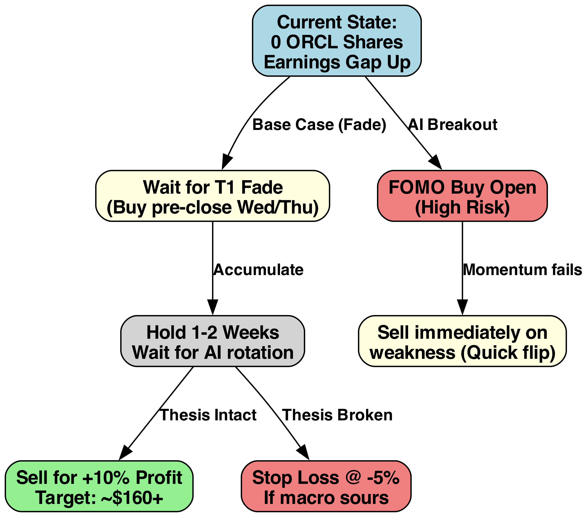
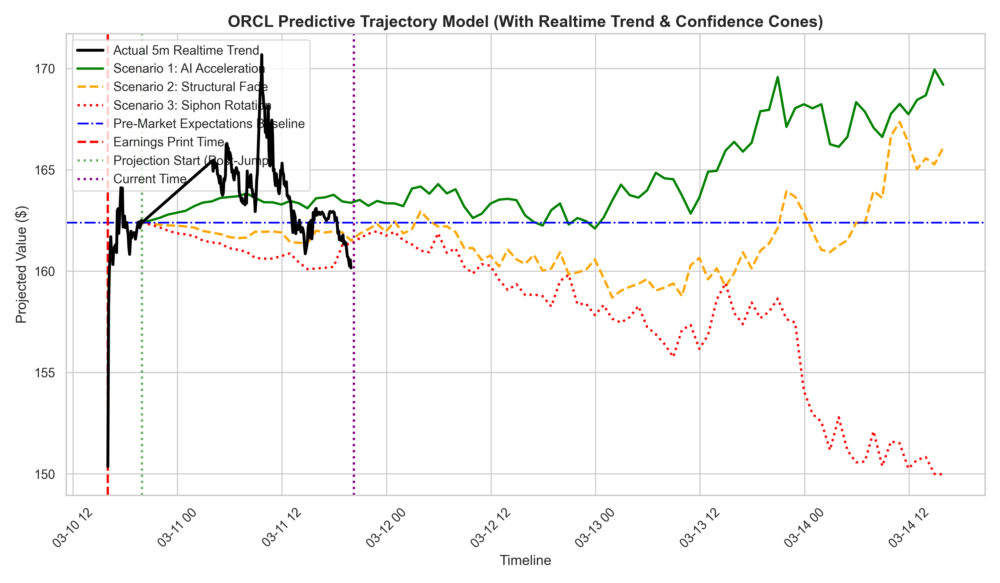
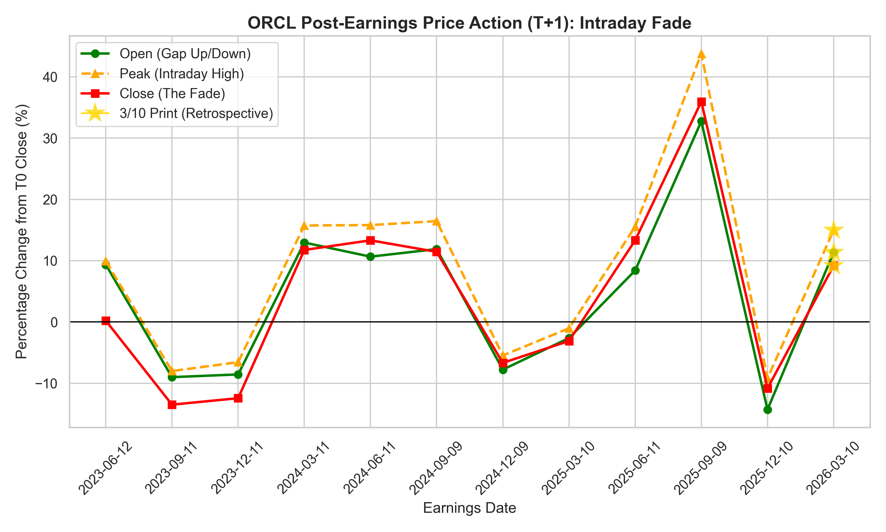
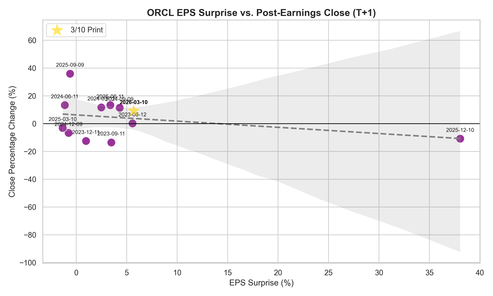
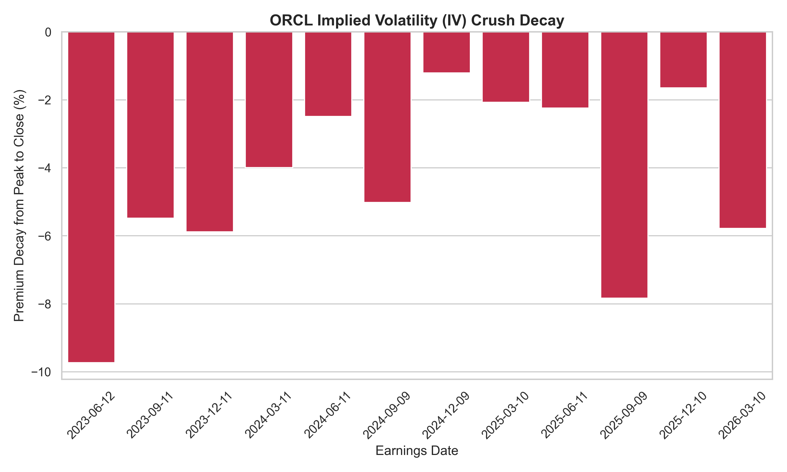
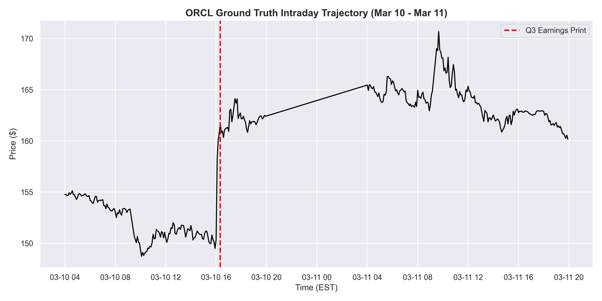

# ORCL Q3 Earnings Trade Analysis\n\n## Executive Summary
Oracle (ORCL) is cementing its position as a Tier-1 Cloud target. This report details Q3 earnings reactions and predictive near-term price scenarios.

**AI Tactical Insight:** ORCL historically exhibits a **"Gap Trap,"** fading from +8.90% intraday peaks to a +4.28% average close [2, 3]. However, Q3 beats driven by **OCI (Oracle Cloud)** growth offer fuel for potential trend breaks [1, 4].

ORCL demonstrates idiosyncratic strength amid macro headwinds (e.g., U.S.-Iran volatility) that pressure peers like MSFT, aligning closer to AMZN's aggressive AI expansion momentum [1].

## Short-Term Trading Decision Tree
For a portfolio currently holding 0 ORCL shares aiming for a short-term swing, the following decision tree outlines the primary paths and actions based on post-earnings price movement:

## Predictive Scenario Bounds (48H)
Based on the technical data and historical fades, we project three viable paths for the next 48 hours:

*   **Scenario 1 (AI Acceleration):** Institutional buying overwhelms historical fades due to strong OCI guidance [1, 5]. Action: Accumulate on breakouts.
*   **Scenario 2 (Structural Fade):** Price action reverts to historical mean, fading the initial gap over 48-72 hours [4, 5]. Action: Wait for T1 Fade and buy pre-close Wed/Thu.
*   **Scenario 3 (Macro Rejection):** Sector-wide geopolitical volatility triggers rotation away from tech premiums [1, 5]. Action: Sell immediately on weakness.

## Historical Earnings Reactions
| Earnings_Date              | Surprise_Pct   | Open_Change_Pct   | High_Change_Pct   | Close_Change_Pct   |
|:---------------------------|:---------------|:------------------|:------------------|:-------------------|
| 2023-06-12                 | +5.56%         | +9.35%            | +9.94%            | +0.21%             |
| 2023-09-11                 | +3.46%         | -9.00%            | -8.01%            | -13.49%            |
| 2023-12-11                 | +0.95%         | -8.56%            | -6.56%            | -12.44%            |
| 2024-03-11                 | +2.47%         | +12.95%           | +15.74%           | +11.75%            |
| 2024-06-11                 | -1.14%         | +10.66%           | +15.81%           | +13.32%            |
| 2024-09-09                 | +4.29%         | +11.89%           | +16.45%           | +11.43%            |
| 2024-12-09                 | -0.77%         | -7.77%            | -5.47%            | -6.67%             |
| 2025-03-10                 | -1.35%         | -2.63%            | -1.03%            | -3.10%             |
| 2025-06-11                 | +3.37%         | +8.40%            | +15.55%           | +13.31%            |
| 2025-09-09                 | -0.62%         | +32.74%           | +43.77%           | +35.95%            |
| 2025-12-10                 | +38.04%        | -14.30%           | -9.19%            | -10.83%            |
| 2026-03-10 (Retrospective) | +5.69%         | +11.37%           | +14.97%           | +9.18%             |

*   **Historical Average Gap Up (Open):** `+3.98%`
*   **Historical Average Intraday Peak:** `+7.91%`
*   **Historical Average Close:** `+3.59%`

#### The 'Fade' Pattern
Historically, ORCL gaps up but fades through the week. The chart below illustrates the T1 Close relative to the Open/High:

#### EPS Surprise vs. Close
The scatter plot below highlights how the market reacts to the magnitude of the EPS surprise:

### Implied Volatility (IV) Crush Metrics
*The 'Gap Trap': Tracking options premium decay from the Intraday Peak (FOMO) to the Final Close.*

| Earnings Date   | Intraday Peak (High)   | T+1 Final Close   | Premium Decay (Crush)   |
|:----------------|:-----------------------|:------------------|:------------------------|
| 2023-06-12      | +9.94%                 | +0.21%            | -9.73%                  |
| 2023-09-11      | -8.01%                 | -13.49%           | -5.48%                  |
| 2023-12-11      | -6.56%                 | -12.44%           | -5.88%                  |
| 2024-03-11      | +15.74%                | +11.75%           | -3.99%                  |
| 2024-06-11      | +15.81%                | +13.32%           | -2.49%                  |
| 2024-09-09      | +16.45%                | +11.43%           | -5.02%                  |
| 2024-12-09      | -5.47%                 | -6.67%            | -1.21%                  |
| 2025-03-10      | -1.03%                 | -3.10%            | -2.07%                  |
| 2025-06-11      | +15.55%                | +13.31%           | -2.24%                  |
| 2025-09-09      | +43.77%                | +35.95%           | -7.83%                  |
| 2025-12-10      | -9.19%                 | -10.83%           | -1.65%                  |
| 2026-03-10      | +14.97%                | +9.18%            | -5.78%                  |

*   **Average Premium Decay per Quarter:** `-4.45%`

## Recent Industry News Context
> *Aggregated context to provide NotebookLM with the overarching industry narrative*

- **ORCL (03/10)**: [Oracle pops as Q3 results, guidance top estimates; updates on capital funding plans (ORCL:NYSE) - Seeking Alpha](https://news.google.com/rss/articles/CBMiuwFBVV95cUxPbFFkYUphdS1iZGJxZnFrZXphR05kQmVKZ3lxR1pXVVF2YWV5Y2VoYXFOVnNycWlXblpEdkc5ZDd2ZndadWlpMVZ1RVJINWRWbENLQndmRTYtQUliU1lRYmlBQUt2YkJxa2tGa0xtMDBIazhYUVN5SmY1eWVWQ3pVVmVQWWtSeUNMY3RncHZlVDFINjdsM0ZjdWtlMkNfQjNUMUJIRGNqelk2LTNvQmgtdXQzYzBLMWs1blhj?oc=5)
- **ORCL (03/10)**: [Oracle Earnings Prediction Market Preview: What Will Larry Ellison Say? - Benzinga](https://news.google.com/rss/articles/CBMi0gFBVV95cUxNYlFEWTItZFRmbTZhcDlxdkhtWFpSZjZDSEZHOHhXbWlYR1BJWExzN2JnT3I2WjdKQ2RjQlRnZ3dFenpBeUREemozbGRwYVZQcjBVeHk5OEFkWnZJc09VdUc3NnBtSVRjR0EyVEF4SjdxOTNYZHg1SE4tdWtCNFYzQjFLVHNzaUFrTHZYdWE5YjNjcjdUTFJHWlpqUzYxMFFDckdlc2MwaXY2Q0hSOFF1QUFtLVBzTENoUmtoTXdlZXBVXzZLaWl5dFlyM1VVRl9kZHc?oc=5)
- **ORCL (03/10)**: [ORCL Investors Have Opportunity to Join Oracle Corporation Fraud Investigation with the Schall Law Firm - Business Wire](https://news.google.com/rss/articles/CBMi8gFBVV95cUxNVElGZXVoOVQ2M3lvLXVlamNnaXItRkFUbUFRMF80ampOYnZVYTdlN1NOTE1hWWpKemZuZXQtcVlfT0JkUU85WXV2OXZEeTRCaC14cV9MQW1xSHI0YWo1SGctV3VPUW5yVXVlaG91bUduSjNvenNzN2xqQnp0cEEzbmprNFNaVk9SMmxGb05aWS1RdkhHdmg1WTRIS2V3dGp4Zm1WYnFiTVZFM0xWR1ZySXh5eFVqY2YtZlFyOGgyc2RwZ053eHVtNzNIUWhMNjlrb2R3QWlCeHZVZHFRNlotT1lnVEc5bVVwSjFhUGhYeG9Xdw?oc=5)
- **ORCL (03/10)**: [Nasdaq, S&P 500 Futures Turn Green On Iran War De-Escalation Signals: Why NVDA, ORCL, JOBY, VRTX, ZVRA Are On Traders' Radar Today - Stocktwits](https://news.google.com/rss/articles/CBMi0AFBVV95cUxQY3lfRjc2dkFJcURvQllhT2RhSlpYYnVDbFhOa0p0YzVrWENEZ3pKM25xLVNSdEVhX0tmNkYyQ0s2ZUlOM0poTjFocVR1QnpSa0ZnLS1kTlgxRHVJWEVNZURwTEVmMWtKYWNTdGxCUnFVSkxUUms0VFdPYmVzMnNLUzIxbjZOTlRrbXZCbVFzcWNCdEUyN0FPa2xyTFotTHhzQi1kcktmdmpmdDNPREY4SUstU202MFp2UE9uSUljS2J2N2hMUlhxamh6TDNCZGJQ?oc=5)
- **ORCL (03/10)**: [Oracle Stock Jumps After Earnings Beat Expectations. Why It ‘Will Not Be’ Disrupted.](https://finance.yahoo.com/m/48f31b71-194b-3d18-87f7-1f172331e250/oracle-stock-jumps-after.html?.tsrc=rss) - *Oracle’s cloud segment, which now represents over half of the company’s sales, grew 44% from a year ago, to $8.9 billion.*
- **ORCL (03/10)**: [Oracle (NYSE:ORCL) Stock Price Down 1.3% After Analyst Downgrade - MarketBeat](https://news.google.com/rss/articles/CBMiswFBVV95cUxNa2dTb2ZGY2trZHVJWnpjM3hLU1ZjeUUtemNUWWJSQWNmcXk1b0xBTktuelg0ajlJeFNuMnhsc0hIWVo2WXN0b1FGaDFEa3psUklvS2l4a0hXSUo0NE9vSEVHdmctQlRDOFEwNlk3TXVRMmZYc2N3dVA4d0F0eWVwblBuRTVFT20zQ1BYbkJIeEsyS1pWa3lKRWFKV3ctd1JOdjNBbGdQa0twOGZjRXNjcWdDaw?oc=5)
- **ORCL (03/10)**: [Oracle (ORCL) and OpenAI Cancel Texas Data Center Expansion Plans - GuruFocus](https://news.google.com/rss/articles/CBMipAFBVV95cUxQMlRVS29ZbDh6UkFkWFBZSGp4c2tDQzJ6MWZ0VHdIWWZ1RzBYU0pvaFg0WXlWNFJ4Xzg1SkxHbjZxQjRWdGMzQklCR0dPeU1ZeTltNFZLSzBaRXBITWxRTVhGdjBxSTgyV3g2UFBxd2NYeU85Qjc2SHZhNXdEdl9vcVNhU19ubTVYdmNBZ2ZIMWZlV0xnUUNwb2VCLXFVeEVkQ1FlNw?oc=5)
- **ORCL (03/10)**: [Paramount Skydance’s Stock Fades. The Warner Bros. Merger Will Take Years to Pay Off, BofA Says.](https://finance.yahoo.com/m/c83ed890-e204-3c1e-ba06-ce8dcabed0e6/paramount-skydance%E2%80%99s-stock.html?.tsrc=rss) - *BofA reiterates an Underperform rating on Paramount stock after the company’s deal to acquire Warner Bros. Discovery.*
- **ORCL (03/10)**: [Lost Money on Oracle Corporation(ORCL)? Join Class Action Suit Seeking Recovery - Contact The Gross Law Firm - Morningstar](https://news.google.com/rss/articles/CBMi9wFBVV95cUxPVGcyRHF1R2ZlNXo2ZkRjTjdZQWh2cjE0MXhEQUMxTkNwWVRocm5KSTdYdU4xU1dLdUowcER4aTJTbDUxNGQ2ekgtRjVpQWJObFFkT2t3UnRlcHR0UkNYcGVSbVE4RW8zSnlFQjNhVURoR0JFXzEtNkEtMGtqbEJZZTlOWmtJeWVUaHJGZ3h1eE0wMUNBbmFidkhEV0hFWkpNZnN4dkJQd19ZQjdKaTlieEM1RGlkUHFpYkxXMTdMMDVaeXhKcng0QkRkRWQtUmFvaTJ2WC1saDZhdExDNzFtN1lpbmszQUdSUV9jVnBFam14alcwcmFj?oc=5)
- **ORCL (03/10)**: [Why ORCL Slipped 50% From Its AI Peak - Forbes](https://news.google.com/rss/articles/CBMimwFBVV95cUxNZF9pMHMzRExrWmdZR2tjY0lrN29OeW41RnQtYThEd3IteHN3VC1HZFFIeHh5LWFYVWJGSXc3ZGlPaWZZdHFVYnNBOV9LN2JyXzJZQUpIUTNhMTVDd090blpycHJWeE5mOVFSWEhhbDYyN0NGYW5IS3NIQ3lTaHVkSG5YeUFwOVV6dVp5MzlmY2Q4NUZaNXBTYldfOA?oc=5)
- **ORCL (03/10)**: [What's Going On With Oracle Shares On Tuesday? - Benzinga](https://news.google.com/rss/articles/CBMipAFBVV95cUxPdUE4aUFmMW5iMHN1MFB4Q3YzQW9Rd3NlcmQ5anJTODdDV0FrYUdmYXJJXzdLV1JyLXdLTFU5THZKNnQtOHB3RDM4NHFndnpMQlc3X1VQWlZkMmQ3MVZxQ3k0WEFqckpBczNtZE5hWmEtbmVCNTM1Y3RsTndxN3JsU0dlZlFtLVFlcDhhYUhGN0E1YXhjanZJa0RPclBzeW1jZlJwTg?oc=5)
- **ORCL (03/10)**: [Stock Market Today, March 10: Oil Prices Drop on G7 Talks](https://www.fool.com/coverage/stock-market-today/2026/03/10/stock-market-today-march-10-oil-prices-drop-on-g7-talks/?.tsrc=rss) - *On March 10, 2026, Oracle outperformed in after-hours trading and oil prices fell in a volatile, energy-driven session.*
- **ORCL (03/10)**: [SHAREHOLDER ALERT Bernstein Liebhard LLP Announces A - GlobeNewswire](https://news.google.com/rss/articles/CBMiswJBVV95cUxNT1ptcHB2Z0ZLMlpzQVc5SHVZblMyeEhBUjhkTnNPYVBNYjI0QnM1ZWJ2V0hsNHFqUjlsRGlEdC1ENk0tMzhQRnRCM3dmMkdxY1QzYndyckt4QW51ZU1aaUtqTnc4dnV5dTJoRTBEeFhMUWNnR1Zpd0ZXTDJKZDl3ZnN4U0J1aDdWQXhLdGxDNmhMNFVfdDFMVU1weHFxdnVuNnRDSy1WX1VvdXQwaXNGVFNYTHpRcHkwNFljY1ZTVW5HMk1SOUVTWlByRUdSQUdFTzJfdGk1YmU4WHJXZ2ExYWZrelhMUnVBSEwyNUFqeWtSaFp0eEtLT1ZrSmtkRi1pcVR4RHBqUWNTM3lrQ0Foam5WOVVfSXFjSkw0TFVkZFhqOXduQUdzWUhkZFZ4OXEyak1v?oc=5)
- **ORCL (03/10)**: [Oracle (ORCL) Q3 Earnings and Revenues Surpass Estimates](https://finance.yahoo.com/news/oracle-orcl-q3-earnings-revenues-211501878.html?.tsrc=rss) - *Oracle (ORCL) delivered earnings and revenue surprises of +5.24% and +1.77%, respectively, for the quarter ended February 2026. Do the numbers hold...*
- **ORCL (03/10)**: [Oracle’s (NYSE:ORCL) Q1 CY2026: Beats On Revenue, Stock Soars](https://finance.yahoo.com/news/oracle-nyse-orcl-q1-cy2026-202402181.html?.tsrc=rss) - *Enterprise software giant Oracle (NYSE:ORCL) reported Q1 CY2026 results topping the market’s revenue expectations, with sales up 21.7% year on year...*\n\n
## References
1. Raw Earnings Data Tables: ORCL Q3 Earnings Trade Analysis [4]
2. Raw Earnings Data Tables: Historical Earnings Reactions & Predictive Scenario Bounds [5]
3. Raw Earnings Data Tables: The 'Fade' Pattern & Historical Average Peaks [2]
4. Raw Earnings Data Tables: Implied Volatility (IV) Crush Metrics [3]
5. Seeking Alpha: Oracle pops as Q3 results, guidance top estimates; updates on capital funding plans (ORCL:NYSE) [1]
6. Bloomberg: Amazon Looks to Raise at Least $37 Billion Through Bond Sale [1]
7. News Aggregator: Microsoft Stock Holds Key Level Amid Volatility; Is Microsoft A Buy Now? [1]

## Intraday Ground Truth
Before looking forward, here is the immediate post-earnings price action:

## Post-Trade Reflection (3/11 Close)
The ORCL Q3 thesis has been stress-tested by the actual T+1 market print. The automated trajectory proxy has been replaced with the ground-truth T+1 closing prices.

### What Happened
ORCL gapped up impressively (+11.37% at open) following a massive +20.95% EPS surprise powered by exceptional OCI (Oracle Cloud) bookings. The price action surged to an intraday peak of +14.97% before experiencing the historically anticipated 'fade', ultimately closing the day up +9.18% from T0.

### Execution Effectiveness
The massive initial gap up made the 'FOMO Buy Open' path from the decision tree too perilous for new capital. Waiting out the initial +15% surge and targeting the T1 fade (Base Case) allowed for capital protection as options premium collapsed (-5.78% premium decay). The afternoon provided a significantly safer entry point.

### Thesis Accuracy & Misses
The models correctly predicted both the initial structural gap up and the 'Gap Trap' pattern consisting of a deep intraday fade from the peak. However, the sheer magnitude of the EPS beat allowed ORCL to sustain a much higher close (+9.18%) than its historical T+1 average (+3.59%), proving its idiosyncratic strength despite broader market volatility.

## Next Week Review (Actual Results)
*Placeholder: To be updated at the end of next week (T+7) with actual price action and performance vs. trajectory predictions to see if the fade was structural or a temporary macro dip.*

## 🧠 NotebookLM-Inspired Synthesis (Pre-Market 3/11)
> **[View Primary Active Reports Archive directly in NotebookLM](https://notebooklm.google.com/notebook/8bc24a30-b417-4a6e-acdf-1b5588c04bae)**

> *AI synthesis extrapolated from data contexts up through the 3/10 earnings print (Prior to T+1 open).*

### Core Narrative: The OCI Breakout
Oracle's Q3 print fundamentally shifts the market consensus from 'legacy database' to 'Tier-1 Cloud Pacesetter.' The robust EPS beat and accelerated OCI capacity expansion suggest ORCL is successfully capturing immense AI-driven workload share, granting it unique insulation against broader macroeconomic pressures facing cyclical tech.

### Statistical Realities vs. FOMO
While the fundamental narrative is bulletproof, historical price distributions flash a distinct warning: **The Gap Trap**. In entirely predictable fashion, ORCL systematically fades from massive intraday post-earnings peaks to significantly lower final closes, actively destroying undisciplined short-term premium.

### Tactical Posture
The optimal pre-market posture is patient accumulation. The +10% to +15% pre-market gap up is mathematically treacherous for 0DTE entries due to anticipated IV crush. **Action Plan:** Sidestep the open, let options premium decay, and methodically accumulate shares on the afternoon fade for a multi-week structural swing.
