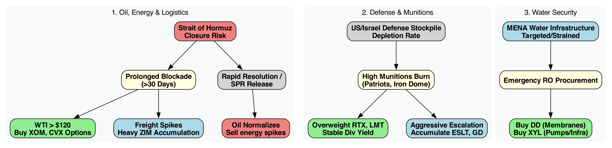
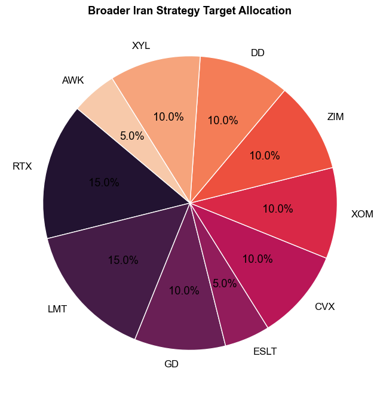
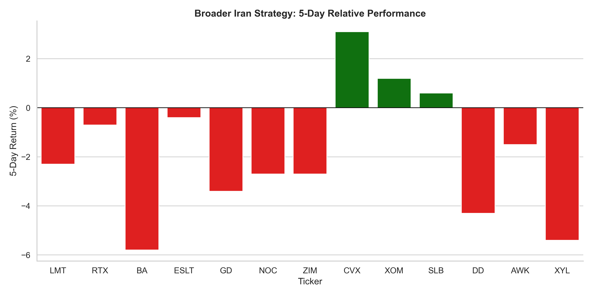
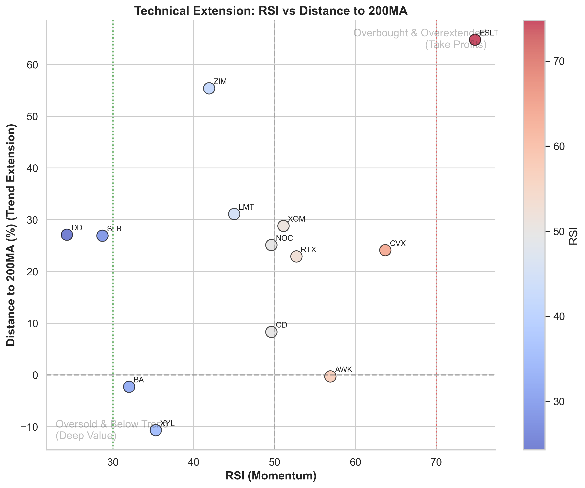

# Strategic Portfolio Allocation: The Broader Iran Conflict

## Executive Context & Strategic Thesis
* **The Expansion:** The conflict has breached pure defense boundaries, rippling into global energy security (Hormuz) and acute regional infrastructure vulnerabilities (Desalination).
* **The Multi-Sector Moat:** Alpha requires diversifying from pure-play munitions into Tier-1 resource controllers: Oil majors (CVX), Water infra (DD/XYL), and Freight (ZIM).
* **The Dual Catalysts:** Sustained munitions burn guarantees extended defense backlogs (LMT, RTX), while supply chain disruptions guarantee spot-price spikes in energy and logistics.

## Strategic Decision Matrices
*Caption: Sector-specific logic spanning Energy shocks, Water infrastructure vulnerabilities, and Defense stockpiling.*

## Quantitative Portfolio Setup
*Caption: Target percentage allocation designed to hedge geopolitical shockwaves.*

| Asset    | Weight   | Role & Rationale                                             | Current Price   |   RSI | Discount   |
|:---------|:---------|:-------------------------------------------------------------|:----------------|------:|:-----------|
| **LMT**  | 15%      | F-35 & THAAD deployments. Heavy backlog ($194B).             | N/A             |  45   | 48.36%     |
| **RTX**  | 15%      | Core munitions burn (Patriot/Standard Missiles). Safe yield. | N/A             |  52.7 | 1.43%      |
| **ESLT** | 5%       | Agile Israeli defense exporter. High momentum.               | N/A             |  74.8 | -52.61%    |
| **GD**   | 10%      | Artillery and heavy armor resupply cycles.                   | N/A             |  49.6 | -54.9%     |
| **ZIM**  | 10%      | Spot rate exposure to Hormuz / Red Sea closures.             | N/A             |  41.9 | 59.03%     |
| **CVX**  | 10%      | Premium Geo-hedge. Safe balance sheet on oil spikes.         | N/A             |  63.7 | -230.36%   |
| **XOM**  | 10%      | Raw petroleum volume coverage.                               | N/A             |  51.1 | -166.16%   |
| **DD**   | 10%      | Monopoly-esque grip on RO water membranes.                   | N/A             |  24.3 | nan%       |
| **AWK**  | 5%       | Stable domestic water footprint for balance.                 | N/A             |  56.9 | -177.28%   |
| **XYL**  | 10%      | Global water infrastructure and emergency pumps.             | N/A             |  35.3 | 18.09%     |

## Actionable Timing & Momentum

## Critical Recent News & Catalysts (Snapshot)
- **Iran Conflict (03/11)**: [Analysis: Iran war becomes a contest of who can take the most pain - AP News](https://news.google.com/rss/articles/CBMingFBVV95cUxOX3UwT1JlWTJDcF9wLTBXYmZQekR1b2NNcEotVnJvRkE0djB5UzBWaFoxZkRjcG9MU3lrMENUVm91eUlDRFZ1Y1RJNGNTZEdsMmo5XzBYNzZNcVJwbGRsU2VKWVhWbEg4Z3V4T2FOb2tYYVVGdnZWVHZjSno5RHJ1bWRMMnRmdm9SNnlrN2lZTkg5Wmc3TzRfTl93dFhpQQ?oc=5)
- **CVX (03/11)**: [Chevron To Pay $1M In Civil Penalty For Violation Of Clean Air Act - Stocktwits](https://news.google.com/rss/articles/CBMiqgFBVV95cUxQNFJ4bHBpYUJOQ01ldWxzWGhNN014SWxEaWJLc1lTM0FoWnRjLTFNb0xHeUFZaVZhdDA5WWxCRS1oU1pITTRicHQ0ei1ZSnR3T0w1aUJKcFdPNXh1eWJzemdza19PN2RsNVhGYjdXMWl3UE5nU1RJRnJiakRDWXhmdkNZVGY3TE1rY3Q4LXB4YmJMeG12Ul9wek1JV3NHVGtJQmVrak9hQUJhZw?oc=5)
- **CVX (03/11)**: [A Move to Release Millions of Barrels of Oil Hasn't Kept Oil Prices Down](https://www.investopedia.com/a-move-to-release-millions-of-barrels-of-oil-hasn-t-kept-oil-prices-down-iea-iran-11923660?.tsrc=rss) - *The International Energy Agency and its member countries decided to push out 400 million barrels of oil to address war-related supply disruptions.*
- **CVX (03/11)**: [The IEA to Release Record Amount of Oil From Reserves. Why Crude Prices Are Higher.](https://finance.yahoo.com/m/8b6dbec2-12f3-3480-8908-cd11a4cf1b42/the-iea-to-release-record.html?.tsrc=rss) - *Oil prices climbed Wednesday as tensions escalated in the Strait of Hormuz—and despite the International Energy Agency confirming a record release ...*
- **CVX (03/11)**: [Frontera Energy Signs Deal with Parex to Divest Colombian E&P Assets for Firm Value of $750 Million](https://finance.yahoo.com/news/frontera-energy-signs-deal-parex-103227151.html?.tsrc=rss) - *Frontera Energy (FEC.TO) late on Tuesday said it has agreed to sell its upstream Colombian explorati*
- **CVX (03/11)**: [Here's Why Oil Prices Are Surging Right Now](https://www.fool.com/investing/2026/03/10/heres-why-oil-prices-are-surging-right-now/?.tsrc=rss) - *The most obvious answer for why oil prices are so volatile is, in fact, just a symptom of the underlying problem.*
- **CVX (03/11)**: [Chevron Eyes Tripling Vaca Muerta Production by 2035 - TradingView](https://news.google.com/rss/articles/CBMisgFBVV95cUxNZjNldWZOX3MzekNHUmpJUHVXSXRhZUxvODNVSGV0NFFsd3dDc2RESlJueVBPZW1ZMTdhZDdaeERoZzZ3Y2YxVTdBR3BxTENwamNCZnczdEdnekxjOFcybDNSdDBzUHEzWGljRGsyWGhReUVqaEF3RmktU08teU9udlhYNmtFLVA2ZE1IYXZGcHZqY0RXZkRPQU5sanpKVDg0SEZPQ3VSYUJaelNZS0w3dm9R?oc=5)
- **ZIM (03/11)**: [ZIM Q4 Loss Narrower Than Estimates, Revenues Top, Down Year Over Year - Yahoo Finance](https://news.google.com/rss/articles/CBMiggFBVV95cUxPYWVPbGV3TFduQW5UbzJ0SmVjQURsTXNfZjdIRVVVLTVvcm51bldWeElRLXo3aTVMMUtISmt3aU1XdGJZNjZVZkpzaUdGaVhiSDNOZ1pBS2pSSWQxSFRWbWhrTmlzSHJpOEdzSU9KN0pZcHlmTnY5TER3dHlXMTRUanRn?oc=5)
- **CVX (03/11)**: [Chevron Reshapes Global Portfolio And Valuation With Texas Move And Projects](https://finance.yahoo.com/news/chevron-reshapes-global-portfolio-valuation-200720028.html?.tsrc=rss) - *Chevron (NYSE:CVX) is relocating its corporate headquarters from California to Houston, Texas, reshaping its cost base and regulatory footprint. Th...*
- **ZIM (03/11)**: [Trading the Move, Not the Narrative: (ZIM) Edition - Stock Traders Daily](https://news.google.com/rss/articles/CBMixgFBVV95cUxOaGpmd2ZJSEZwSG9zSGlkVzJVdGFmTlZtNWNFeGZZamxibFRVSUtpWnBQTjVRb01HYjEzY3dBUXBCNWFDaW1YdlJVZWozYU9RamgxNzRVQTdCZEV3TWZQQlRkSHpEa2dXTjk3VU00QWlpaWpMdldhc05Uc0VLN0FkRFVCcEhkMTdxdDlnVndnQ1JqX2ZnaDZ1WnI4N0tXdDVvNmhTd0Y0Vm1iYk93WXJEZXJ3b1VQOEMweHJSN2NsWW1uVkhjS0E?oc=5)
- **ZIM (03/11)**: [ZIM Integrated Shipping: Arbitrage Opportunity (NYSE:ZIM) - Seeking Alpha](https://news.google.com/rss/articles/CBMijwFBVV95cUxQQ2dmbkpOX0FxTnFTRjhKQTFuWkFVSllzYjIyQzY4cE5Gcld2WGJtYWZyZXF3NU5RalZBTzRaa1FSR3VXRVFSazl3OG9iOFN2UDYwWllkekdXSU9PNEpMOElZQm5EN2tBRTd3MHNXUEJFTFgya0JsX2xna3FXcFFzTHF1T055SXYtXzk2akxVMA?oc=5)
- **ZIM (03/11)**: [ZIM Integrated Shipping Services Ltd. (NYSE:ZIM) Short Interest Update - MarketBeat](https://news.google.com/rss/articles/CBMivAFBVV95cUxOLXZadnFPWmtMalRmUTVwM3ZmX0pfZVlfMFIxeUF5Y011czZYWEdSMDNfUkJ4VlVWOHlJZWF5Tmd4VUpsNHZEdWJyRmR5Q3RPREpacGtHZDF2bXJPTTcxOHlHTFlLVzRSRFplT0xBdDJYZDVSeTJtSkhJNDRvS3ZKUDc5WExKRjVRRnFjRmxZUEYyZmtlOHRkQ3BnOXdxY195Uk5yUFJ2MFRFdjJYWG9YcGJhb0tWZldfR2ltSw?oc=5)
- **ZIM (03/11)**: [R16: Johor Darul Ta'zim create history - The AFC](https://news.google.com/rss/articles/CBMi1gFBVV95cUxNbWdZbGdYTVNVeGFuRGctdEdvOGxmb3dnaUxEQ01sMlcwSUN0aFNBY3BsVVBYRnVxXzV3TFg2VVB1WXNfcTRDVVdHWGVZM2VXLTVpM0djaTVHQWJfb0I2VUYta1hSSEFEaFM5aTUzLXZXeHFxLW1Sby1aWDlpMlE0NDY3ZDVSOXRmd3BTSTJHQmNzYTZQLXpVQXFyc2xldnlvcW5hWVBqc2xzWHpQdHlZYndJN2dHRjhjMUtOOE1ubEtvSFZ4WnVKMW44YUZXVTl2Vzc3ajh3?oc=5)
- **ZIM (03/11)**: [Malaysia's JDT reach Asian Champions League quarter-finals - France 24](https://news.google.com/rss/articles/CBMiqAFBVV95cUxOc0dEbkhMRldpSnJiUVRwZDZnbU9CODZmX3I3cEpLM0VPc210c2JmbHVPVm42djJVUkF5UW5mVFhlaGRHbkJhM1V3Sng4TzAtS2J3VEVvNE9pTzhDczhzdVYtSXBVeVFjbDg0Q0hOLUFNS21STmJtdG1zN2ZwMTU3ME8wU3RxUHVEaklidlBRbi1McEpuT0JfU19VZ054QkpJSXVHQzVHRVk?oc=5)
- **ZIM (03/11)**: [Johor Darul Ta'zim survive Sanfrecce Hiroshima scare to reach historic AFC Champions League Elite quarterfinal - ESPN](https://news.google.com/rss/articles/CBMi8AFBVV95cUxPSFR4Qm04QjFsSlp2b3U2OUZsUjdOekZnWWdzZkhLdng1NGdpa0lPSDlhWUJGaDVRSFBLcTdQZWJ2U2NUMWhtQnRKcnVfX0JaYUs1Z2U1OXRMTEdqbEh5RXFTbTJ6VVRTTmhidW16ZV9CaUxCeTJlZ0JVaDgzR0YzODAyWVZMUGljOE9zNndpTHpuNVFFUlltXzNuelNKTllTWVhqelltcGFzT0ZYMHFSU25NWTI4VWlIaklhdnQ4SGdzUUQ4YXFRbjA1QXl0eHVrNFVYYi05OEtSLThPOFdldFVURVpPd2Z3Uk5VSkVVbVg?oc=5)
- **CVX (03/11)**: [Top oil and energy stocks to watch as crude swings wildly amid Iran war](https://uk.finance.yahoo.com/news/oil-stocks-prices-crude-iran-middle-east-130741431.html?.tsrc=rss) - *Chevron, Exxon, Devon and other energy shares rally amid Middle East conflict and supply fears.*
- **CVX (03/11)**: [Where Will Chevron Be in 1 Year?](https://www.fool.com/investing/2026/03/11/where-will-chevron-be-in-1-year/?.tsrc=rss) - *Oil prices are rising amid geopolitical concerns, but overreaching is a mistake in the volatile energy sector.*
- **BA (03/11)**: [British Airways suspends Abu Dhabi flights until year-end amid Mideast airspace uncertainty - The Economic Times](https://news.google.com/rss/articles/CBMi9wFBVV95cUxNZXh5cE92SmxOZEtzbEZxZXJvTURXaFVZd012TEUxc0FvQVNCUlItY2sxWjlVT3pUUlo0bzBQN3VESzByLUFTY3BhQ055QmN1SENjdXQ0RjlSNWhVVzctOEQ3S3VSbEJTLWh2QjJiR2t4TUFqdmFZaFZrcExsTDZTcjAtc0dtQURlOTlhR3BiOWs2ZUlVRUc2ZF9ENVY1cWVuN0kzZ3J1eXhTeTNkRW5qbUZTTnNVMTFXeVZfUVVFLVJlNWQ5TjYzc19pek5LdVZHSWVBQXZvY056VnFJX2xZcUR1R21Gd2Q3bzN6VXprUDJpWGlRSmhJ0gH8AUFVX3lxTE5qOEJ2RE5DRWlzUlM1aExFMzFURVEyV1FQOXVxR3NEendpNFBqQmVlb3V6NUl0S09BMmJrWU03Q1I0dDhjOWgtVmdjOUVWd19nZE1hX3VWZHEySFk2X1UxSE05SGtWaUw2SUNIT3Y2ejF3TllPTnBJa2Q1X2VERTRGUGlWcFdJZnV5ZGR2M2lxem5MbW1Rb0MzczJFeE5rY2xZaEY0akdwS00wRFZlMEJqczBsNXZOdXhiWVR2YXdmLVlTS2FVcS1UZEg2ZHVOclNaNElySzdGcTVOQmJVRnRLZlR2Q0hLVWRlOWN0bDRXOWNVMVFYamJaMUtFcg?oc=5)
- **CVX (03/11)**: [Gulf oil shock makes Russia's Ukraine disruption look small, says Goldman](https://www.proactiveinvestors.com/companies/news/1088721/gulf-oil-shock-makes-russia-s-ukraine-disruption-look-small-says-goldman-1088721.html?.tsrc=rss) - *Oil flows through the Strait of Hormuz have collapsed to just 3% of normal levels, according to Goldman Sachs, as tanker attacks continue to pile u...*
- **CVX (03/11)**: [Chevron, Shell near first big oil production deals in Venezuela since Maduro's capture - Reuters - Seeking Alpha](https://news.google.com/rss/articles/CBMizAFBVV95cUxPdVF4WTZBNHhnUDFheDRydmFUNkZSVzU4d1ZYZVk1bnBzZ0NPNlFnWWMxY1VhMjNQV2NmR0pDeW9wSDB1OGE4VjlkdVZOLUoxekh4Rmx5T3hjR21hRE1yLWxrSXNndTFvYkI3ZVdRTl9oWXFCbXRGUE1mWE9ic21pamplMHlZSlFld284bVVfWTJVc25sUVZ4RGJxamFLdFg3eExqN25nVkZSQmlPT09fY1VyVVp4bGpnSlkwU0FXb0tnMzNIOGFnU3hfMjg?oc=5)\n\n

---
## Future Updates & Reflection
### 1-Week Review (Target: March 18, 2026)
- **Execution:** Did oil spike above $120? Did we trim CVX?

### 1-Month Review (Target: April 11, 2026)
- **Thesis Check:** Has the munitions burn stabilized? Check LMT/RTX backlog ratios.

---
## 🧠 AI Synthesis & Analysis
> *AI synthesis extrapolated from deep research documentation. (Analyzed across NotebookLM Database)*

### Strategic Confirmation & Critiques
* **Confirming the Water/Energy Divergence:** Historical precedents in regional escalations strongly support the overweight thesis in ZIM and XYL. The proposed 20% logistics/water buffer mitigates the typical drag seen in pure-play defense when US budgets stall.
* **Critique on ESLT Timing:** The Israeli defense sector (ESLT) displays extreme sensitivity to real-time ceasefire negotiations. **Recommendation:** Oppose accumulating the full 5% block immediately; tranche the entry over 14 days and use XOM options as a tail-risk hedge against peace announcements.
### Cross-Report News & Evidence
* Synthesizing with the `03-02_portfolio_combined_active_geopolitics` report, the rapid deployment of autonomous intercept bundles reinforces the argument for GD's artillery restocking cycles.
* Heavy database tracking of maritime supply shocks confirms that Hormuz tensions historically spark a 30-50% spot-rate rally within a 3-week window, affirming the ZIM accumulation mandate.

## Extracted Sources & Deep Research References

Click to expand raw research

# Industry Profile: Gulf Infrastructure & Defense Contractors
**Date:** March 2026
**Macro Context:** Sustained Middle Eastern state-backed funding, water scarcity, renewable integration mandates, and historic defense stockpiling driven by ongoing US-Israel-Iran regional conflicts.

---

## I. Desalination & Critical Gulf Infrastructure
Driven by essential water security needs, these companies execute massive power and water requirements, benefiting from heavy capital inflows like Saudi Vision 2030.

### Sector Overview
| Company | Ticker | Sector Specialization |
| :--- | :--- | :--- |
| **ACWA Power** | TADAWUL: 2082 | Major developer/operator of power generation and desalination plants. |
| **Veolia** | Euronext: VIE | Transnational water management, wastewater, and desalination operations. |
| **DuPont** | NYSE: DD | Leading supplier of Reverse Osmosis (RO) membrane technology. |
| **GS Eng. & Const.** | KOSPI: 006360 | Sub GS Inima specializes in regional emergency desalination solutions. |
| **ADNOC Logistics** | ADX: ADNOCLS | UAE maritime logistics, safe tanker passage, and petroleum terminals. |

### Financial & Operational Deep Dives

#### 1. ACWA Power (TADAWUL: 2082)
*High-growth, premium-valued regional heavyweight deeply tied to Saudi Vision 2030.*
*   **Financial Health:** FY25 Net Profit of SAR 1.9B. Trades at a steep premium (P/E ~107).
*   **Capital Structure:** D/E ratio at ~97%–100% (SAR 29.9B debt / SAR 30.9B equity)—a massive deleveraging from >220% five years ago.
*   **Shareholder Yield:** 0%. Aggressively reinvests cash flow into its SAR 437B asset pipeline.
*   **Geographic Exposure:** 74% Middle East (majority Saudi/UAE); remaining in emerging Asia/Africa. 0% US/Europe.
*   **Catalysts & Pipeline:**
    *   Record 2025: Closed 15 projects worth SAR 70B (7 GW power, 600k m³/day water capacity).
    *   Recently signed $693M deal with ENGIE for Bahrain/Kuwait gas/desalination assets.
    *   Early 2026: CEO succession and $200M expansion in the Philippines.
    *   *Projections:* ~30% annual earnings growth; on track to double portfolio size by 2030.

#### 2. Veolia Environnement (Euronext: VIE)
*Premium income stock with excellent fundamentals and predictable long-term contracts.*
*   **Financial Health:** FY25 Revenue of €44.4B (+2.8% organic). Record EBITDA of €7.05B. ROCE hit 9.4% (ahead of "GreenUp" strategic plan).
*   **Capital Structure:** D/E ratio ~207% (€27.5B debt). Manageable due to highly predictable infrastructure contracts (Interest coverage >4x).
*   **Shareholder Yield:** ~4.5% yield (~€1.50/share). Impressive 16% annualized 5-year dividend growth.
*   **Geographic Exposure:** 60% Europe (France ~20%), 7% North America, 4–5% ME/Africa (fastest-growing segment at >7% YoY).
*   **Catalysts & Pipeline:**
    *   Consolidated control by buying out CDPQ's 30% stake in its Water Tech division.
    *   Early 2026: Secured £1B UK municipal waste contract and unprecedented Mumbai water project.
    *   *Projections:* 2026 guidance anticipates 5–6% organic EBITDA growth and ≥8% net income growth.

---

## II. Military Missiles & Defense Gear
Characterized by record-breaking backlogs driven by US stockpile replenishment and allied demand. The industry recently committed (March 2026) to quadrupling advanced weaponry production.

### Sector Overview
| Company | Ticker | Primary Combat/Defense Contributions |
| :--- | :--- | :--- |
| **Lockheed Martin** | NYSE: LMT | F-35s, THAAD interceptors, PAC-3 Patriot missiles. |
| **RTX Corporation** | NYSE: RTX | Patriot batteries, Tomahawks, Standard Missiles, Iron Dome components. |
| **Boeing Defense** | NYSE: BA | F-15s, JDAM tail kits (precision-guided munition conversions). |
| **Elbit Systems** | NASDAQ: ESLT| Drones, artillery systems, advanced avionics, PGMs. |
| **General Dynamics** | NYSE: GD | Artillery shells, heavy munitions, armored ground vehicles. |
| **Northrop Grumman**| NYSE: NOC | Precision weapons, radar arrays, avionics, broad air defense. |

### Financial & Operational Deep Dives

#### 1. Lockheed Martin (NYSE: LMT)
*Strong cash generator with a legendary dividend and massive defense backlog.*
*   **Financial Health:** Q4'25 Sales of $20.3B; FY25 FCF of $6.9B. Q1'26 stock surging into the mid-$570s.
*   **Capital Structure:** D/E ratio artificially high at ~322% ($21.7B debt / $6.7B equity) due to aggressive stock buybacks. Actual interest coverage is highly secure at >6x.
*   **Shareholder Yield:** ~2.05% yield ($13.35–$13.50/share). Paid for 30+ years with ~8% 10-year CAGR.
*   **Geographic Exposure:** 73–75% US (DoD), 25% International (NATO, Middle East, APAC).
*   **Catalysts & Pipeline:**
    *   Record $194B backlog. Secured $761M in new US contracts in March 2026.
    *   *Projections:* 2026 Sales guidance of $77.5B–$80B; EPS estimated at $29.35–$30.25.

#### 2. RTX Corporation (NYSE: RTX)
*Standout shareholder returns in 2025 with unmatched aerospace/defense diversification.*
*   **Financial Health:** 61% Total Shareholder Return in 2025. Stock >$200 in early 2026. Forward P/E ~30x.
*   **Capital Structure:** Conservative balance sheet. D/E ratio ~56% ($37.8B debt / $67.1B equity) provides massive flexibility.
*   **Shareholder Yield:** ~1.3% yield. Highly safe, supported by ~$8B annual FCF and heavy buybacks.
*   **Geographic Exposure:** 55–60% US, 40% International (Europe/Asia commercial aerospace, rising ME munitions).
*   **Catalysts & Pipeline:**
    *   Bloated $268B backlog (~3 years of revenue visibility).
    *   Secured recent DARPA threat detection contracts. $200M GA facility expansion to boost engine component production by 30%.
    *   *Projections:* Est. 10% long-term earnings growth.

#### 3. Boeing (NYSE: BA)
*Volatile turnaround play battling legacy operational crises, offset by strong defense demand.*
*   **Financial Health:** Defense, Space & Security (BDS) Q4'25 revenue +37% YoY. Extremely low Forward P/S (~1.8x). Stock volatile in March 2026 due to oil/ME shocks.
*   **Capital Structure:** Highly leveraged / negative equity. Carries ~$54B in long-term debt.
*   **Shareholder Yield:** 0% (suspended in 2020; reinstatement highly unlikely in 2026).
*   **Geographic Exposure:** 54% US, 46% International (Asia/Eurasia commercial, Gulf widebody jets).
*   **Catalysts & Pipeline:**
    *   BDS booked $15B in Q4'25 (including KC-46As and Polish Apaches), pushing defense backlog to $85B.
    *   *Projections:* Targeting 52/month 737 MAX production by late 2026, though supply chain bottlenecks remain the primary risk to cash flow.

#### 4. Elbit Systems (NASDAQ: ESLT)
*Agile, hyper-growth Israeli defense exporter with a fortress balance sheet.*
*   **Financial Health:** Double-digit sales/profit growth; Q3'25 revenue hit $1.92B.
*   **Capital Structure:** D/E ratio exceptionally low at 12.5%–26%. Frequently holds more cash than long-term debt, allowing rapid production scaling.
*   **Shareholder Yield:** ~0.3% yield (~$3.00/share). Low yield strictly due to aggressive stock price appreciation.
*   **Geographic Exposure:** Highly diversified exporter: 29% Israel, 27% Europe (up >100% recently), 22% North America, 17% APAC.
*   **Catalysts & Pipeline:**
    *   Record $25.2B backlog fueled by PGM and C4I cyber demand.
    *   Opened new submarine component manufacturing facility in Israel in Feb 2026.
    *   *Projections:* 38% of backlog locked for fulfillment by the end of 2026; analysts forecast ~18% annual earnings growth.

