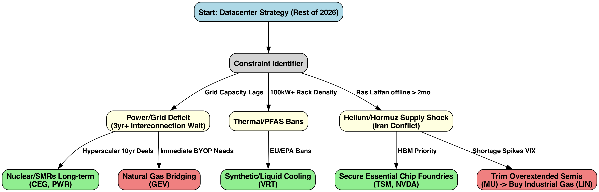
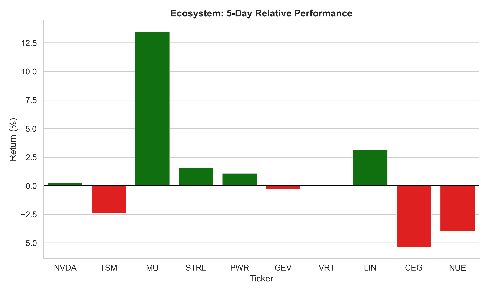
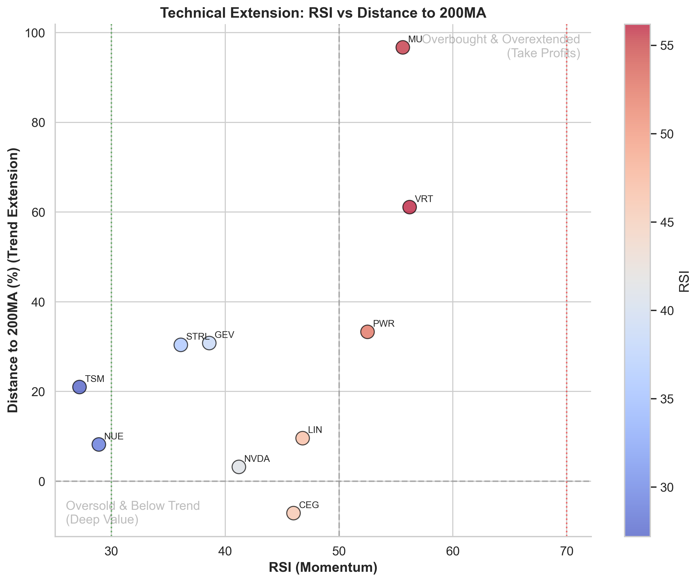

# Strategy Report: Datacenter Growth & The 2026 AI Infrastructure Supercycle (March 16)

## 1. Parameters & Constraints
*   **Target Instruments:** AI Silicon core (NVDA, TSM, MU) vs. Physical Infrastructure & Hard Assets (STRL, PWR, VRT, GEV, LIN).
*   **Strategy:** Pivot from pure software (the "SaaSpocalypse") to capitalizing on the constraints in the $600B capex supercycle (HALO investing).
*   **Timeline:** Rest of 2026 execution window.

---

## 2. 🧭 Decision Architecture
*Flow: Macro Catalyst -> Infrastructure Bottleneck -> Tactical Allocation*

### Logic Walkthrough & News Triggers To Track
The strategy revolves around reacting to distinct physical bottlenecks preventing scaling:

**🟢 High Priority BUYS (Power & Site Prep):** The grid cannot support 100+ MW hyperscale campuses. Accumulate `GEV` as hyperscalers turn to 'Bring Your Own Power' natural gas turbines. Add `STRL` and `PWR` for necessary grid/civil engineering before servers even arrive.
*   **News to Watch For:** Headlines regarding "Interconnection Delays", "Behind-the-meter generation", "ERCOT deregulated off-take agreements", or hyperscalers buying retired coal plants or directly contracting with turbine manufacturers.

**🔵 Strategic HOLDS (Foundries):** Keep `TSM`. In the event of a severe Helium supply shock, Tier-1 foundries will protect high-margin AI chip output at all costs, starving logic/auto nodes.
*   **News to Watch For:** Updates on "Ras Laffan" facility outages, delays in "EUV Lithography" timelines, or foundry statements regarding rationing of industrial gases to prioritize AI accelerator yields over consumer electronics.

**🟡 Conditional ROTATION (Gas & Memory):** If Iran/Hormuz tensions lock up `Ras Laffan` helium deliveries, trim overextended memory names (`MU`, `IONQ`) and buy pure-play Industrial Gas conglomerates (`LIN`) exhibiting extreme pricing power.
*   **News to Watch For:** "Strait of Hormuz blockade", spot price spikes in "Bulk Helium" or "Bromine", or earnings warnings from memory manufacturers (`MU`, `SK Hynix`) citing supply chain raw material constraints.

---

## 3. Quantitative Portfolio Setup
*Caption: Target percentage allocation focusing strictly on mission-critical components vs. broad energy hedges.*

| Asset    | Weight   | Role & Rationale                                                             | Current Price   |   RSI | Dist 200MA   | Discount   |
|:---------|:---------|:-----------------------------------------------------------------------------|:----------------|------:|:-------------|:-----------|
| **NVDA** | 10%      | Core AI Hardware; must hold but take profits if extended.                    | N/A             |  41.2 | 3.2%         | 37.84%     |
| **TSM**  | 15%      | Dominant Foundry; defensible given priority on critical gas supplies.        | N/A             |  27.2 | 21.0%        | 45.63%     |
| **MU**   | 5%       | AI Memory leader; highest risk to Helium/Geopolitical shocks. Tactical trim. | N/A             |  55.6 | 96.7%        | 30.27%     |
| **STRL** | 10%      | Heavy civil engineering and site-prep for megacampuses.                      | N/A             |  36.1 | 30.4%        | -16.29%    |
| **PWR**  | 15%      | High-voltage grid integration for new sites.                                 | N/A             |  52.5 | 33.3%        | -40.66%    |
| **GEV**  | 10%      | Natural Gas bridge solution for AI data center baseload.                     | N/A             |  38.6 | 30.8%        | 22.5%      |
| **VRT**  | 10%      | Thermal management and modular liquid cooling transition.                    | N/A             |  56.2 | 61.1%        | -28.41%    |
| **LIN**  | 15%      | Industrial Gas pricing power during Helium supply squeeze.                   | N/A             |  46.8 | 9.6%         | -42.66%    |
| **CEG**  | 5%       | Nuclear baseload / SMR infrastructure.                                       | N/A             |  46   | -7.1%        | 31.5%      |
| **NUE**  | 5%       | Low-carbon green steel structure requirements for hyperscalers.              | N/A             |  28.9 | 8.2%         | 64.1%      |

## 4. 🚨 Execution Zones & Momentum (RSI vs Trend)

---

## Recent News Context

- **NVDA (03/16)**: [Nvidia Investors Just Got Incredible News from CEO Jensen Huang: 2 Highlights from GTC](https://www.fool.com/investing/2026/03/16/nvidia-investors-just-got-incredible-news-from-ceo/?.tsrc=rss) - *The AI chipmaker kicked off its annual developer conference with a bang.*
- **PWR (03/16)**: [Indian Open 2026 to be first IPA-affiliated PWR 1000 event - ANI News](https://news.google.com/rss/articles/CBMisAFBVV95cUxPbjNFc1VyRFozbEJqS2lsaWFpdENvaEVoWlBqZnJGU3YwUzk0ZEVXNVM0R0N5UW95SWxNSXBjZzAxZUVjWHNzZ0JFTy1ua20zM3ducXo3bS1BYU15Q2s2V3Vubzl1aFRQWmF4d3huRDlIWldOcmNNLUMwbUNRT1RLcC1KdDNaTlI4alVTTHFoMkNDT2lzelRFNEtoUjlZX1RKRGFHNlhpOHdaSGd4aERaONIBvAFBVV95cUxNTzFFRm9JRHc4eFhYUTJlUTJqTmNTYnRSOUR6dm5XRmlnWEplZU02VU1DNDlaM2s3aHFBRG9mMk9mdFA3SklHanJnYUU0d0kxdkFnOWZkWS02VExTc0t6bzluaUQzX3MxaklFTWg4ZFRRUVlWaVdhZTFMUVJGWG1QR3lZY29uanR1cmZROHF4SFp3a2ZZMW5SNFJ0Q1BPN0VZUUFXSXMzTTc2WDVSTnZwb3JreXZfb0ZhYWMtZg?oc=5)
- **MU (03/16)**: [Mu Eta Lambda Chapter of Alpha Phi Alpha Fraternity, Inc. will celebrate 50 years with "The Golden Jubilee Masquerade" - Madison365](https://news.google.com/rss/articles/CBMi1AFBVV95cUxQUzFyWVExcFR0S01YeTFlWTQ1TjNJUGJjUHNhY3VIWTk1RjNnMUVreWJrOVNWb1lpVlNvYzZFYm9vTHY1dXk0M1Q1ZDlGcGI2VW9RRkJ6T29DMVpzcnhCelBvR2JOSUtNeTAySjFReTI0QzZOYU5OTmI0aGNOQnplNzgzdHo5eHJlaC1aVnE0dmhGbzhiVjZIVWlBYXhDS3k4bGVWalI4WktkX21Rb3F5aENrM3FmUlgyZTd5QjJSZ0c4MHQyVlJQdmVzeWtoUHdGLTlWVw?oc=5)
- **MU (03/16)**: [Micron’s new AI memory targets NVIDIA Vera Rubin and faster data centers - Stock Titan](https://news.google.com/rss/articles/CBMiugFBVV95cUxPZG5MUmEzSGVyQ3hkQjB4RmNYbm9pZE9pY2FYeUd5UjRfQ2RtX1RVZ090bURIb3NwQlZPNU4yZXoxTEsxVGR1VGRqQ0h0NUJDU01wc01VSjgxN1J6WjFsNjZQWk9JX3VOaGhDNlI3RkR3NDhNRkdsRTNTN2tudGxsdE9PdWVpUFo3bFp4ckp4QW14WGpuWVhDOElPUEFHTmRfMmphUENLQUFXLUpOb1RQNFFsSDN5OTlQZGc?oc=5)
- **MU (03/16)**: [Why Micron Technology Stock Is Jumping Today](https://finance.yahoo.com/news/why-micron-technology-stock-jumping-192601516.html?.tsrc=rss) - *Micron Surges on New Chip Factory Build to Power AI Boom*
- **STRL (03/16)**: [Fastenal's New Georgia Distribution Hub: Will Capacity Fuel Growth?](https://finance.yahoo.com/news/fastenals-georgia-distribution-hub-capacity-165100753.html?.tsrc=rss) - *FAST plans a new Georgia distribution hub to boost capacity, automation and support rising demand as the company targets long-term growth.*
- **STRL (03/16)**: [Sterling Infrastructure (STRL) director sells 1,260 shares under 10b5-1 plan - Stock Titan](https://news.google.com/rss/articles/CBMivgFBVV95cUxOdExLNEhVQkhnQmVlTzFrVDNvb0k2T1RpNHFFampLaEdDY242ZjIyWHlkUzJZMF93eVNhU2xjMVFSOTYyZHBsQ2dHcmVab1NmOW5KbUFkRlBwMlBvalMzeWxzUDlpZS1LRDdjWWZaVllDRDJtQlBhc2dvVFo1MVJOTnpUQVNDb2I2RWRQdWNPaEt5TkdWSWtnR2J5c1g1OVNDNHdzdHFPcmp2bkNvdC1VMFFZR0VfZWNuTHBxSEJn?oc=5)
- **STRL (03/16)**: [Sterling Infrastructure: Reiterating Buy After A Blowout Q4 (NASDAQ:STRL) - Seeking Alpha](https://news.google.com/rss/articles/CBMioAFBVV95cUxQRUtaWm5UVEVwS21sODRDZDdDRDI3azAtbWhHZHdMWjB5MDlBRUpldHl4OTZOVUJLejFtdFZwejMzV3l4X0N1NG10T0tMYm9SeXJXUU95MU11bXRTb3FIdFdjTlVJQVpvRVNyb2xGUk5DMTAzZW5lMHQwVHpvLXM5UGJ6SnNiSGFhQm9LVVd2aG1wZXFidkxtRE80R0NJTmFS?oc=5)
- **STRL (03/16)**: [Divisadero Street Capital Management LP Purchases Shares of 20,000 Sterling Infrastructure, Inc. $STRL - MarketBeat](https://news.google.com/rss/articles/CBMi8AFBVV95cUxNYkpKTlRZUEVHQjFBLVl5OTdfTDVPMnd3b0VHVEJBeHpZQl9ITmNndHFWWkZxVncxOWVWbExnc21JdHQ3ckNrbTI0enZFc29DaUsyZFgyeVNXTlkyZlpLcGR0U0FvcnFkUVdXUFFaTDhQckxRSGxtZ1RydUxadnZrdWdrbWFibFZRV3JLSjVQQmdCQ3lweHRrZTBqTm5walFXeVJENTZyN243YWoxdmtTZDBxTWJraEtMWEw2UElweERaaW9Da1ZfVVZhMXZueUxpRFl4dnd3YldFdTBqQjRrb0xCbGJJaU5iamZvU0pfR08?oc=5)
- **PWR (03/16)**: [KADENSA CAPITAL Ltd Buys New Holdings in Quanta Services, Inc. $PWR - MarketBeat](https://news.google.com/rss/articles/CBMiwwFBVV95cUxNYWZWbjlVOF9IQ2J6WS1IOElfZ0M4T1ppQ3JLajN3ZjRsYUt0TGVLZ2p4d0F2eFNid2p5SXNpV3U2UlVpMy1hSXhEWC1SNDlrZE9JSkIxbVB6Wm1QTHZtOTFZWjlvMlFYWnhIdEo2aXA0Q3lkZlJ3clJnZmlnVXExd012RVczQ3BUVmpDY0FvWnl6cUdYSjljYmxVTGRWdmJQdDNwcVdHaXM2WFpWREdQUlhFZU51aENPMmFFNXlXSEN6Y0E?oc=5)
- **PWR (03/16)**: [Match highlights | Chiefs Women v Trailfinders | PWR Rd 14 - Exeter Chiefs](https://news.google.com/rss/articles/CBMinAFBVV95cUxNOHl2X0M1U2JOdkg1bndBY3hGdkRLT3ZxRFMzbVVPb1RUVDNlMTgxWXdaQkNrUE84dXNkNVdNNU1ZbV83cmZRZ0k5SFdwRjJVZUZfRzFFNEZSWHNYZElCbTB1VWZOeENnR0FDTHAweGU2VEltbXluUEx1Sl91bHEwaGh2TFpVVFVHZklMSUQxd0x0c1daQkZRYmRRdXU?oc=5)
- **PWR (03/16)**: [PWR Round 14 talking points: Gloucester Hartpury win ugly in North London - Rugbypass.com](https://news.google.com/rss/articles/CBMipwFBVV95cUxOb1dCYmYxSmQ2eEdoZ2I3b1dzM3doRGo5NExGM1dKeWVreFR2MC1OQk9XUnE2bDZLdzhhTDI1OTlERDY2akVhNHF3d01teWVXQ1EzbWE2WlpIWm9qaTNYSGpscjNrRTJuZldobWJZR3BjdUpaMlBRbkQ0V0wtU2dEclRlN1ZxTl9xdEp5YVZhTUxHaUlnVlR6UVZUeVBFMzBVOGJsN2Utaw?oc=5)
- **MU (03/16)**: [Volume spike: UOM.MU AS Latvijas Juras medicinas centrs (MUN) Mar 2026 EUR 7.40 - Meyka](https://news.google.com/rss/articles/CBMipgFBVV95cUxPU0Zlc2RyS2dfV2pwamRzWWcyRUZlcU4tWlZWcnh5YUlnbGRzU3BnQzFsSWtSb0J4Rnctd21DWUk2UTNWbjI1cDk2RUo5VEk4STRGUzgwUDlZLXVKMGNUcDVhQ01fMFRoUkltdUEwcEJDMHF6QVNfUjI1aVNid29SVExUdE5CMUZESkd5Vk80dFV4SWNnU0VfSnBOdXJyaWpjb1R6bEd3?oc=5)
- **PWR (03/16)**: [Quanta Services Stock: Is PWR Outperforming the Industrial Sector? - Yahoo Finance](https://news.google.com/rss/articles/CBMijgFBVV95cUxQdVd1VnlKN0JpVGs4WWJFM2d1QnR6R2FnSGJZTnhDXzdzOGNZZWI4X0dhUmt6TXNEcklCaVBob3RNZVBlRjdtbnIzM1JianR1YkRIRHJZWWYweWtzWlV3cVU0ejFyTi1NVGxsTWpvUC1ScUhvcHlCUDZwaVRENGZvcU9mdEZzMld5QjB1aXhR?oc=5)
- **PWR (03/16)**: [MATCH REPORT | Saracens Women 17 - 22 Gloucester-Hartpury (PWR R14) - Saracens](https://news.google.com/rss/articles/CBMiiwFBVV95cUxOdkFxLWFKeEZIY3NWS1RPTGp3a0xCSWRTMjRhNnlVY09UWUlsbXB2WWd4VzdZa3Y2N3JxOThweml0eURMVFZUTXdmV2JQNl9WcnpucXhpeTJBTjFxaFQ0MFN2cVZpVXVJOXNvYW5UR0JHWFlYVFY4aEMxZ2tnRXpMUjliUGRKQVk2Zi1R?oc=5)\n\n

---

## 5. Future Updates & Reflection
> *Use this section to revisit the original thesis and log actual outcomes against predictions.*

### End of Q2 Review (Target: May 15, 2026)
- **Actual Execution:** [Did LIN break out? Were MU and Semis successfully trimmed at the top?]
- **Thesis Check:** [Did Hyperscalers formally announce $10B+ off-grid natural gas / SMR generation deals?]

## 6. Extracted Sources & Deep Research References

Click to expand

# **The 2026 AI Infrastructure Supercycle: Capex Expansion, Physical Bottlenecks, and Geopolitical Supply Chain Risks**

## **1. Macro-Economic Overview and Executive Summary**

The global digital economy has entered a fundamentally transformative phase in 2026, characterized by an artificial intelligence infrastructure supercycle of unprecedented scale. Industry consensus models, supported by major financial institutions and commercial real estate analytics, indicate that the technology sector will require up to $3 trillion in aggregate infrastructure investments by 2030.1 This capital is mandated to construct, fit-out, and sustainably power nearly 100 gigawatts (GW) of new data center capacity globally, effectively doubling the world's existing digital infrastructure footprint within a compressed four-year window.1 North America remains the undeniable epicenter of this geographic and economic expansion, accounting for approximately half of all global capacity, with the United States domestic market driving an overwhelming 90% of that regional development.1

However, the 2026 macroeconomic and geopolitical landscape is defined by acute, colliding bottlenecks. The exponential demand for raw compute power—initially spurred by large language model (LLM) training and now transitioning into ubiquitous global inference—is crashing into the rigid, physical constraints of the real world. These constraints include generational deficits in power generation, exhaustion of prime real estate in primary connectivity hubs, the thermodynamic limits of traditional air cooling, and severe fragility within the advanced materials supply chain.3

Compounding these structural friction points are unprecedented geopolitical shocks. The outbreak of military conflict involving Iran in early 2026 has violently disrupted critical maritime chokepoints, most notably the Strait of Hormuz.6 This regional instability has severed vital supply lines for specialized industrial gases, specifically helium and bromine, which are irreplaceable catalysts in the extreme ultraviolet (EUV) lithography processes required to manufacture high-bandwidth memory (HBM) and next-generation AI accelerators.8 The intersection of these hard physical constraints and geopolitical vulnerabilities threatens to expose a "monetization gap" for the world's largest technology companies, fueling persistent market anxieties regarding the formation of an AI asset bubble.10

This comprehensive research report provides an exhaustive examination of the 2026 capital expenditure (capex) environment. It projects hyperscale datacenter buildouts across emerging geographies, identifies critical value-chain beneficiaries across public equities, and analyzes the complex interplay of macroeconomic, regulatory, and geopolitical variables shaping the sector's trajectory.

## **2. The Hyperscaler Capex Tsunami and the Monetization Gap**

### **2.1 The Acceleration of Capital Expenditures (2024–2026)**

Following consecutive fiscal years where Wall Street consensus estimates vastly underpredicted the velocity of capital outlays, 2026 marks a watershed moment in infrastructure spending. In the early quarters of both 2024 and 2025, consensus models projected hyperscaler capex growth at a relatively normalized 20% compound annual growth rate (CAGR).12 In reality, actual expenditures ruthlessly exceeded 50% year-over-year growth in both periods, leaving analysts scrambling to revise their terminal value assumptions.12 By the first quarter of 2026, capital expenditure guidance from the leading hyperscalers has expanded into entirely uncharted macroeconomic territory, reflecting an aggregate Big Tech investment pool approaching a staggering $600 billion.14

The sheer scale of this spending is fundamentally altering the broader industrial economy. Aggregate data center capital expenditure now amounts to approximately 1.2% to 1.3% of the entire United States Gross Domestic Product (GDP), a capital concentration rarely seen outside of wartime mobilization or the peak of the interstate highway system construction.14

<table>
  <tr>
   <td><strong>Technology Hyperscaler</strong>
   </td>
   <td><strong>2025 Actual Capex</strong>
   </td>
   <td><strong>2026 Projected Capex Guidance</strong>
   </td>
   <td><strong>Primary Infrastructure and Hardware Focus</strong>
   </td>
  </tr>
  <tr>
   <td><strong>Alphabet (Google)</strong>
   </td>
   <td>$91.4 Billion
   </td>
   <td>$175.0B - $185.0B
   </td>
   <td>Deployment of TPU v7, Gemini generative models, custom hyperscaler silicon, and advanced global subsea data networks.10
   </td>
  </tr>
  <tr>
   <td><strong>Microsoft</strong>
   </td>
   <td>$80.0 Billion
   </td>
   <td>$150.0B+
   </td>
   <td>Scaling Azure AI, ubiquitous Copilot integration, planetary-scale data center construction, and SMR nuclear energy partnerships.5
   </td>
  </tr>
  <tr>
   <td><strong>Amazon (AWS)</strong>
   </td>
   <td>$100.0B+
   </td>
   <td>$125.0B+
   </td>
   <td>Trainium 3 Ultracluster architecture, Graviton processing chips, and extreme high-density compute corridors.10
   </td>
  </tr>
  <tr>
   <td><strong>Meta Platforms</strong>
   </td>
   <td>$70.0B - $72.0B
   </td>
   <td>$115.0B - $135.0B
   </td>
   <td>Llama open-source model training, massive GPU cluster accumulation, and the physical realization of "Meta Superintelligence Labs".10
   </td>
  </tr>
</table>

Meta’s projected near-doubling of capital expenditures year-over-year underscores a stark transition from conceptual algorithmic research to the brute-force physical deployment of compute clusters.10 Alphabet’s unprecedented projection of up to $185 billion has introduced significant volatility into its equity valuation, as institutional markets struggle to weigh the necessity of long-term infrastructure dominance against the immediate, severe suppression of near-term free cash flow.15 Alphabet's Class A shares experienced immediate pressure following this guidance, as investors digested the sheer capital required to maintain parity in the generative AI arms race.15

### **2.2 Analyzing AI Bubble Fears and the Revenue Reality**

The breakneck velocity of this capital deployment has triggered intense, persistent market scrutiny regarding the potential formation of an "AI bubble." The core of this anxiety centers on the so-called "monetization gap"—the temporal and financial lag between the hundreds of billions of dollars currently being funneled into Nvidia graphics processing units (GPUs), optical networking, and concrete, versus the corresponding enterprise software revenue generated by these newly minted AI services.11

However, the fundamental economic realities of 2026 suggest a sharp divergence from the mechanics of traditional asset bubbles, such as the late-1990s dot-com collapse. Unlike that era, where retail and institutional capital flowed indiscriminately into highly speculative business models lacking fundamental revenue streams, the current AI supercycle is anchored by physical, tangible infrastructure that is generating immediate utility and cash flow.11 For instance, Microsoft's commercial remaining performance obligations (RPO)—a critical leading indicator of future recognized revenue—increased by 51% to $392 billion in early 2026, while its Microsoft Cloud revenue reached $49.1 billion, growing 26% year-over-year.10 Similarly, Amazon Web Services (AWS) achieved a $142 billion annualized revenue run rate, proving that hyperscale infrastructure is being absorbed by enterprise customers nearly as fast as it can be provisioned.12

Macroeconomic modeling further supports the long-term viability of this investment. Research indicates that artificial intelligence automation could ultimately address and streamline $4.5 trillion worth of labor tasks globally, adding an estimated $1 trillion to United States GDP alone.11 The transition into 2026 represents what analysts have dubbed the "Year of Proof." The market is shifting its reward mechanisms away from companies merely accumulating hardware, and toward those that can demonstrate measurable utilization metrics, specifically optimizing "tokens per watt per dollar" and deeply integrating AI into core enterprise workflows.10 The genuine risk of a bubble is not isolated in the utility of the technology itself, but rather in the market's overzealous pricing of anticipated exponential growth that may be violently bottlenecked by physical world limitations—specifically power generation, thermal cooling thermodynamics, and materials science.14

## **3. The 2026 Data Center Build Overview: From Training Hubs to Inference Edges**

The 2026 data center development landscape is characterized by a structural bifurcation of scale and purpose. On one end of the spectrum is the rise of the multi-gigawatt hyperscale "AI Factory," designed for the sole purpose of training foundational models. On the other end is the rapid proliferation of high-density edge computing nodes. By 2030, the industry anticipates a massive paradigm shift where AI inference—the actual application and querying of trained models—will decisively overtake training as the primary workload driver.1 Inference workloads require immediate proximity to end-users to reduce latency, a requirement that is forcing data center development out of isolated, land-rich deserts and into the immediate periphery of major metropolitan and industrial hubs.1

### **3.1 Geographic Pivot: Saturated Primary Hubs vs. Emerging AI Corridors**

Historically, North American data center capacity was overwhelmingly concentrated in Tier 1 primary markets: Northern Virginia (specifically Loudoun County), Silicon Valley, the Dallas-Fort Worth Metroplex, and Phoenix.2 In 2026, these established primary markets are facing severe, structural limitations. Vacancy rates in these regions have plummeted below 1% for consecutive years, land costs have reached prohibitive premiums that destroy project unit economics, and, most critically, grid interconnection queues have stretched to untenable lengths, with some operators facing wait times of up to seven years for utility power delivery.1

Consequently, hyperscale capital is rotating aggressively into secondary and tertiary markets. These emerging hubs offer the holy trinity of 2026 infrastructure development: abundant affordable land, deregulated or highly cooperative power grids, and favorable legislative frameworks.2

<table>
  <tr>
   <td><strong>Market Classification</strong>
   </td>
   <td><strong>Key Geographic Regions</strong>
   </td>
   <td><strong>Primary Drivers and Strategic Characteristics</strong>
   </td>
   <td><strong>Notable 2026 Market Developments</strong>
   </td>
  </tr>
  <tr>
   <td><strong>Saturated Primary Hubs</strong>
   </td>
   <td>Northern Virginia, Silicon Valley, Chicago
   </td>
   <td>High fiber connectivity, proximity to legacy demand. Currently crippled by severe utility transmission limits and extreme land scarcity.
   </td>
   <td>Operators are shifting away from greenfield builds toward high-density retrofits and liquid cooling upgrades of existing footprint.2
   </td>
  </tr>
  <tr>
   <td><strong>Emerging "Megacampus" Hubs</strong>
   </td>
   <td>Abilene (TX), Amarillo (TX), New Albany (OH)
   </td>
   <td>Extreme land abundance, "bring your own power" (BYOP) flexibility, deregulated energy grids (ERCOT).
   </td>
   <td>The $100B OpenAI/Oracle "Stargate" facility in Abilene; Texas Tech "HyperGrid" campus near Amarillo; massive Intel/Cologix expansions in Ohio.5
   </td>
  </tr>
  <tr>
   <td><strong>High-Density Compute Corridors</strong>
   </td>
   <td>Indiana (St. Joseph County), Pennsylvania
   </td>
   <td>Access to existing heavy industrial power infrastructure, aggressive state tax incentives, potential for nuclear energy integration.
   </td>
   <td>Amazon (AWS) rapidly scaling dozens of training cluster buildings in St. Joseph County; major hyperscale buildouts across PA.5
   </td>
  </tr>
  <tr>
   <td><strong>Edge Compute Markets</strong>
   </td>
   <td>Florida, Georgia, New Jersey, Mississippi
   </td>
   <td>Last-mile latency reduction for 5G deployment, IoT networks, and the incoming wave of AI inference workloads.
   </td>
   <td>Deployment of highly modular, pre-engineered facilities near population centers; Compass "Meridian" campus in Mississippi.5
   </td>
  </tr>
</table>

The state of Texas has emerged as the premier global destination for hyperscale infrastructure development. Its distinct advantage lies in the deregulated ERCOT power grid, which provides operators with the unique ability to bypass traditional utility monopolies, negotiate direct power purchase agreements (PPAs), and establish immense behind-the-meter generation facilities.1 Ohio is similarly capturing massive market share through a highly strategic "all-in-one" regional approach. In municipalities like New Albany and Johnstown, the state is clustering semiconductor fabrication plants, hyperscale data centers, and dedicated power generation assets within single, unified economic zones, thereby drastically minimizing supply chain friction and energy transmission loss.5

### **3.2 Land Assembly, Tax Arbitrage, and Regulatory Pushback**

The frantic acquisition of land for AI megacampuses has spawned a highly lucrative, specialized sub-sector in commercial real estate development. Developers are not merely flipping dirt; they are leveraging complex tax structures to maximize returns on massive parcel assemblages. A critical financial mechanism widely utilized in 2026 is the strategic avoidance of the 3.8% Net Investment Income Tax (NIIT) under Section 1411 of the Internal Revenue Code.21 By rigorously documenting "material participation" in the land assemblage, zoning, and utility procurement processes under Section 469 of the tax code, sophisticated developers can reclassify passive real estate investments as active trades or businesses.21 This reclassification yields substantial margin improvements on hundred-million-dollar parcel sales to hyperscalers, fundamentally altering the economics of data center real estate.21

Simultaneously, state-level tax incentive regimes are undergoing a severe structural recalibration. In previous cycles, states routinely offered unconditional sales and property tax abatements to attract technology companies. However, the massive, concentrated strain these new AI facilities place on local water aquifers and electrical grids has prompted intense legislative pushback and community resistance.22

In 2026, states are deploying highly conditional incentive structures. Florida, for example, recently enacted legislation limiting state-level sales and use tax exemptions exclusively to hyper-scale data centers with a committed IT load of 100 MW or greater, effectively favoring Big Tech giants while squeezing out smaller colocation providers.24 Other jurisdictions, such as Georgia and North Carolina, are actively tying tax relief to strict Environmental, Social, and Governance (ESG) metrics. These include requirements for high-paying job creation with mandatory health insurance benefits, or the implementation of hyper-efficient, closed-loop water cooling systems designed to protect local municipal resources.22 This shifting regulatory landscape forces developers to prioritize sustainable engineering from the initial architectural design phase in order to protect their long-term asset value and secure vital tax subsidies.22

## **4. The Physical Layer: Civil Engineering, Construction, and Advanced Materials**

The digital economy is entirely reliant on the physical world. The 2026 AI infrastructure buildout is creating a rolling sequence of physical bottlenecks, and the industrialization of data center construction requires massive site preparation, electrical integration, and advanced structural engineering.3 Capital reliably floods into the publicly traded companies positioned to solve each sequential physical constraint, creating a "pick-and-shovel" supercycle for legacy industrial firms.3

### **4.1 Site Development and Turnkey Infrastructure**

The sheer scale of AI megacampuses—often spanning 50 to 200 acres with individual buildings exceeding one million square feet—requires massive initial earth-moving and foundation work.2

**Sterling Infrastructure (STRL):** Sterling has successfully executed one of the most remarkable corporate pivots of the decade, transforming from a low-margin public highway contractor into a high-margin powerhouse focused on mission-critical "E-Infrastructure".25 The company specializes in the massive site development required for data centers, semiconductor fabrication plants, and automated e-commerce hubs.25 With data center-related revenues rising over 125% year-over-year in recent quarters, Sterling captures the earliest phase of the capex cycle, executing the complex foundational engineering necessary before servers can even be ordered.27

**Quanta Services (PWR):** As the national power grid reaches its absolute breaking point, the necessity for high-voltage transmission and substation construction has become paramount. Quanta serves as the premier turnkey infrastructure provider globally, bridging the gap between isolated data centers and massive utility grids.26 Their strategic foresight is evident in their multibillion-dollar acquisitions of Cupertino Electric and Dynamic Systems, which provided Quanta with the specialized capabilities to handle low-voltage electrical engineering, highly complex mechanical plumbing, and advanced process infrastructure inside the data centers themselves.28 With a record project backlog, Quanta is an indispensable partner to hyperscalers attempting to navigate power procurement.26

### **4.2 Sustainable Structural Materials: The Steel Bottleneck**

Data center structural frameworks and white-space enclosures demand massive quantities of heavy materials, primarily steel and concrete.29 However, hyperscalers operate under strict, self-imposed decarbonization mandates, refusing to utilize highly pollutive legacy materials for their "green" AI initiatives.30 This dynamic is remaking the carbon-intensive steel industry.30

**Nucor (NUE):** Nucor has established itself as the critical supplier of sustainable building materials for the AI supercycle. The company utilizes advanced Electric Arc Furnace (EAF) steelmaking technology, a circular process that recycles scrap steel using electrical currents rather than combusting coal in traditional blast furnaces.29 This process produces "green steel" that contains, on average, 67% less embodied carbon than traditional methods, perfectly aligning with hyperscaler ESG goals and allowing developers to secure state-level green tax incentives.29

Furthermore, Nucor’s implementation of rapid deployment building solutions—specifically pre-engineered metal buildings (PEMB) and modular white-space infrastructure—addresses the industry's desperate need for speed.29 By prefabricating hot aisle containment systems, server racks, and support structures off-site in controlled manufacturing environments, Nucor allows general contractors to slash on-site installation timelines by over 50%.29 This rapid deployment capability is essential for hyperscalers racing to monetize their GPU investments before generational technology obsolescence occurs.

## **5. The Energy Bottleneck: Baseload Power, Natural Gas, and the Nuclear Renaissance**

Energy procurement is the single greatest existential threat to the AI expansion in 2026. Power, rather than geographic location or land cost, has become the absolute primary site selection criteria for new digital infrastructure.1 There are currently more than 12,000 active projects in the United States alone seeking grid interconnection, representing an astonishing 1,570 GW of required generator capacity.4 The inability of the legacy electrical grid to meet this unprecedented demand has forced 62% of data center operators to abandon utility queues and explore independent on-site power generation under the "Bring Your Own Power" (BYOP) model.1

### **5.1 The Pragmatic Resurgence of Natural Gas**

While technology giants relentlessly market their commitment to 100% renewable energy, the physics of artificial intelligence dictate otherwise. Solar and wind energy are inherently intermittent; they simply cannot provide the uninterrupted, 24/7 baseload power required to operate high-density GPU clusters safely without catastrophic computational interruption.31

Consequently, natural gas turbines have become the immediate, unavoidable bridge technology of the 2026 supercycle. Companies like **GE Vernova (GEV)**, recently spun off from General Electric, are experiencing an overwhelming surge in orders for heavy-duty, combined-cycle natural gas turbines.31 These heavy-duty machines burn gas to spin turbines, capture the associated exhaust heat, and use it to drive secondary steam turbines, making them among the most highly efficient options for dispatchable baseload power.32

The demand is so acute that hyperscalers are exploring highly unorthodox partnerships. Aerospace startups, originally focused on developing supersonic jet engines, are now pivoting their advanced turbine technology to generate localized electricity directly for data center campuses.32 However, this pragmatic reliance on thermal natural gas carries a severe environmental cost. Macroeconomic models project that utilizing natural gas to meet just 60% of the newly increased data center power demand will result in a global emissions spike of up to 220 million tons by 2030, fundamentally challenging Big Tech's net-zero climate pledges.33

### **5.2 The Nuclear Renaissance and Small Modular Reactors (SMRs)**

To reconcile the absolute necessity of massive baseload power with rigid zero-carbon mandates, the technology industry is heavily financing a highly accelerated nuclear energy renaissance.33 Federal initiatives, backed by recent executive orders and $400 million in Department of Energy funding, are accelerating the commercial deployment of advanced light-water Small Modular Reactors (SMRs).34 Companies like Holtec and the Tennessee Valley Authority are spearheading these early deployments, targeting operational status in the early 2030s.34

In the immediate term, hyperscalers are executing aggressive real estate strategies to secure nuclear power. Tech giants are purchasing massive land parcels directly adjacent to existing, operational nuclear plants to bypass public grid transmission entirely.5 Furthermore, developers are heavily targeting retired coal plant sites across the United States. These brownfield sites represent a massive strategic advantage; they already possess high-capacity grid interconnections and heavy industrial zoning, making them prime real estate to host an estimated 174 GW of potential new nuclear capacity with significantly faster development and permitting timelines.34

## **6. Thermal Thermodynamics: The Demise of Air Cooling and the Post-PFAS Landscape**

Inside the data center, the laws of thermodynamics are forcing a complete architectural redesign. Historically, standard data center rack densities hovered between 10 to 15 kilowatts (kW) of power draw.1 In 2026, the intense thermal output of the latest-generation AI accelerators has pushed rack densities to 100 kW, with specialized training clusters rapidly approaching 1 Megawatt per rack.1

Traditional computer room air conditioning (CRAC) and forced-air cooling are thermodynamically obsolete at these extreme densities. The industry is being forced into a rapid, highly capital-intensive transition toward direct-to-chip cold plate liquid cooling and full immersion cooling technologies, where entire server chassis are submerged in thermally conductive dielectric fluids.1 The immersion cooling fluid market alone is projected to grow from $2.1 billion in 2025 to $5.2 billion by 2034, registering a massive 10.7% CAGR.36

### **6.1 Regulatory Headwinds and the Phase-Out of PFAS**

This technological transition is severely complicated by aggressive global regulatory headwinds. Historically, the most effective dielectric immersion fluids were fluorinated compounds, specifically per- and polyfluoroalkyl substances (PFAS), manufactured predominantly by 3M.37 However, environmental protection agencies in the U.S. and the European Union are heavily restricting and phasing out PFAS—known as "forever chemicals"—due to their extreme environmental persistence and toxicity.37 3M's exit from PFAS manufacturing has created a massive void in the supply chain just as AI thermal loads reach their peak.

### **6.2 Beneficiaries in Advanced Thermal Management**

This regulatory and thermal crisis has opened a multi-billion dollar market opportunity for companies developing synthetic, bio-based, and PFAS-free cooling chemistries, alongside the hardware manufacturers building the containment infrastructure.

* **Castrol (BP) and Chemours (CC):** Leveraging their deep heritage in advanced chemical lubricants, Castrol has successfully launched synthetic ester immersion fluids that offer high fire safety, excellent material compatibility, and crucial biodegradability without the use of PFAS.36 Chemours has advanced next-generation two-phase immersion technologies, securing vital qualifications from major semiconductor manufacturers like Samsung.36 Cargill is also capturing significant market share by developing bio-based immersion fluids tailored for hyperscalers strictly prioritizing green ESG initiatives.39
* **Trane Technologies (TT) and Eaton (ETN):** While fluid chemistry evolves, the macro-level heat must still be extracted from the facility. Trane Technologies is seeing unprecedented demand for its specialized, macro-level chillers and HVAC systems designed specifically for hyperscale facilities.31 Eaton provides the highly specialized electrical management and distribution systems necessary to route massive power loads to these advanced liquid cooling pumps safely.31

## **7. Inside the Rack: Memory Starvation and Optical Interconnects**

As compute and thermal constraints are addressed, new bottlenecks emerge deep within the silicon architecture itself. Training a trillion-parameter LLM requires moving unimaginably large datasets between hundreds of thousands of parallel GPUs continuously. This data velocity has made network interconnects and memory bandwidth the newest technical chokepoints of 2026.3

### **7.1 The Optical Networking Transition**

The networking layer of AI infrastructure is undergoing a fundamental physical evolution. Historically, copper cabling dominated short-distance server connections due to its low cost and reliability. However, as GPU clusters scale to encompass entire buildings, copper simply cannot carry high-bandwidth signals over necessary distances without unacceptable latency and signal degradation.3 Consequently, the industry is rapidly transitioning to advanced optical interconnects, utilizing photonics to transmit data via light across the datacenter campus. This structural shift is directing billions of dollars toward specialized optical networking equipment providers.3

### **7.2 The High-Bandwidth Memory (HBM) Crisis**

Simultaneously, the voracious demand for High-Bandwidth Memory (HBM) is structurally cannibalizing broader semiconductor manufacturing. HBM is essentially stacked DRAM chips tightly integrated directly alongside the GPU, drastically increasing data transfer speeds. By 2026, hyperscale data centers are projected to devour an astonishing 70% of the entire world's memory chip supply.40

Because HBM commands massive pricing premiums, global foundries are aggressively repurposing their production lines to prioritize AI memory over traditional chips.40 This reallocation of manufacturing capacity is creating severe, projected supply shortfalls for consumer electronics, automotive components, and standard enterprise hardware, threatening to trigger localized inflation across the broader technology hardware sector.40

## **8. Geopolitical Shockwaves: The 2026 Iran War and Semiconductor Fragility**

The macroeconomic models forecasting smooth, exponential growth in AI infrastructure deployment were violently disrupted by the outbreak of military conflict involving Iran, which commenced with targeted strikes on February 28, 2026.7 Beyond the immediate, highly publicized spikes in global crude oil pricing, the conflict has exposed deep, existential vulnerabilities in the physical, globalized supply chains that underpin the entire semiconductor manufacturing industry.9

### **8.1 The Helium and Industrial Gas Crisis**

Modern semiconductor fabrication is not merely a process of etching silicon; it is highly dependent on a complex supply chain of specialized industrial gases sourced from global energy production. Helium, in particular, is an irreplaceable noble gas in the high-energy stages of chip production.6 It is utilized to stabilize vacuum environments, detect microscopic molecular leaks in fabrication equipment, and crucially, to cool highly sensitive silicon wafers during Extreme Ultraviolet (EUV) lithography—the advanced manufacturing process required to build the latest generation of AI GPUs and HBM chips.6

The military strikes in early 2026 severely damaged QatarEnergy’s Ras Laffan complex, one of the world's premier liquid natural gas and helium extraction hubs.6 Compounding the facility damage, the conflict forced the de facto commercial closure of the Strait of Hormuz, a critical maritime chokepoint.6 This immediate disruption removed roughly 30% of the entire global helium supply from the market overnight.6 The impact is highly asymmetric; South Korea, which houses the world's largest memory chipmakers, imports a staggering 65% of its helium exclusively from Qatar.6

This sudden removal of supply has triggered a critical materials shortage, reminiscent of the 2022 neon gas shortage caused by the war in Ukraine, but magnitudes more severe given the current AI-driven demand environment.8

### **8.2 Impact on Asian Foundries and Global Tech Chains**

South Korea is a vital lynchpin in the AI hardware supply chain, with Samsung and SK Hynix controlling a combined 80% of the global High-Bandwidth Memory (HBM) market.8 While major foundries in Taiwan (TSMC) and South Korea maintain strategic reserves of critical gases and have attempted to diversify supply routes through Australia and the U.S., these reserves are finite.6 Taiwan, for instance, has scrambled to lift its statutory minimum natural gas inventory from 11 to 14 days to protect its semiconductor fabrication grid, highlighting the razor-thin margins of global supply stability.41

If the shutdown in the Strait of Hormuz persists beyond a two-to-three-month window, foundries will be forced to ration helium and bromine.8 Economic reality dictates that semiconductor manufacturers will ruthlessly prioritize their finite gas supplies for the production of highly profitable AI accelerators and custom hyperscaler silicon, severely curtailing the production of lower-margin logic chips and standard DRAM used in global consumer electronics and automotive manufacturing.41

### **8.3 Fragmenting Supply Chains and EU Digital Sovereignty**

The geopolitical instability in the Middle East, coupled with ongoing tensions regarding Taiwan in Asia, has heavily accelerated the "balkanization" of global technology infrastructure.46 Recognizing that reliance on foreign supply chains represents an unacceptable national security risk, major economic blocs are aggressively decoupling.

The United States is actively utilizing the CHIPS Act and targeted tariffs to forcefully reshore semiconductor fabrication.47 Simultaneously, the European Union is weaponizing regulatory frameworks under the banner of "digital sovereignty".46 Highly distrustful of American hyperscaler dominance and fearful of foreign hardware vulnerabilities, the EU is implementing stringent cross-border data localization laws.46 These regulations are forcing U.S. technology giants to construct redundant, sovereign AI cloud infrastructures entirely within European borders.1 While this regulatory divergence creates massive operational friction and capital inefficiency for hyperscalers, it serves as a powerful localized demand driver for data center construction and power procurement across EMEA markets.1

## **9. Speculative Market Scenarios, Probabilities, and Public Market Beneficiaries**

Based on the rigorous synthesis of hyperscaler capital flows, rigid physical infrastructure constraints, and the severe geopolitical risks present in the 2026 landscape, the following speculative macroeconomic outcomes are modeled. Each scenario identifies specific publicly traded beneficiaries and assigns a probability-weighted assessment of manifestation.

### **Speculative Scenario 1: The Energy Bridge Defaults to Fossil Fuels**

**Probability Assessment: 85%** **Thesis:** Despite highly publicized corporate net-zero pledges and ESG commitments, the brutal timeline required to license, build, and deploy advanced nuclear SMR infrastructure pushes commercial viability well into the early 2030s.31 Driven by the existential financial necessity to immediately monetize their $600 billion AI capital investments, hyperscalers will be forced to quietly but aggressively lean into natural gas combined-cycle turbines and behind-the-meter fossil fuel generation to power their inference edge nodes and training megacampuses.

* **Public Market Beneficiaries:** **GE Vernova (GEV)** stands to benefit immensely as the premier manufacturer of advanced gas turbines.31 Additionally, legacy midstream pipeline operators and independent power producers (IPPs) operating in deregulated environments like ERCOT (Texas) will see massive off-take agreements from desperate technology firms.
* **Market Risks:** This pivot will trigger significant public relations backlash, aggressive litigation from environmental groups, and potential exclusion from lucrative European Union state-aid tax relief programs that tie financial incentives strictly to verified environmental benchmarks and waste-heat recovery systems.20

### **Speculative Scenario 2: The Helium Shock Triggers a Consumer Electronics Recession**

**Probability Assessment: 70%** **Thesis:** If the military disruption in the Strait of Hormuz and the damage to QatarEnergy's facilities persist beyond Q2 2026, the depletion of strategic helium and bromine reserves will bottleneck global EUV lithography.6 Foundries like TSMC, Samsung, and SK Hynix will legally and economically protect their most lucrative, high-margin contracts—specifically producing chips for Nvidia, AMD, and custom hyperscaler ASIC designs—at the direct expense of standard consumer DRAM and legacy logic nodes.41

* **Public Market Beneficiaries:** Industrial gas conglomerates with diversified global footprints, massive domestic storage caverns, and long-term inflation-adjusted merchant contracts. **Linde plc (LIN)** and **Air Products and Chemicals (APD)** are exceptionally well-positioned. Spot prices for helium surged 20% to 40% immediately following the disruptions; Linde’s ability to pass raw material inflation directly to customers ensures immediate margin expansion.44 Furthermore, domestic Chinese helium extraction initiatives (e.g., Guangdong Huate Gas) will quietly gain significant market share as Western supply chains fracture.6
* **Market Risks:** A sharp, supply-driven contraction in global automobile manufacturing, smartphone production, and edge-device assembly. This will heavily drag down broad global technology indices, creating a highly bifurcated market where pure-play AI infrastructure equities soar while consumer hardware equities collapse.

### **Speculative Scenario 3: The Commoditization of Land Assemblers into Pseudo-Utilities**

**Probability Assessment: 60%** **Thesis:** As traditional primary data center markets (like Northern Virginia) become entirely unviable due to multi-year grid delays 1, specialized real estate investment trusts (REITs) and land developers operating in secondary markets will transition their business models. They will evolve from mere landlords into pseudo-utility operators. Developers that can independently secure 500+ MW power purchase agreements (PPAs), integrate SMRs, and secure zoning on raw land will command exponential, monopolistic premiums from hyperscalers desperate for turnkey sites.1

* **Public Market Beneficiaries:** **Sterling Infrastructure (STRL)** will continue to see massive revenue expansion in its E-Infrastructure segment.25 Furthermore, private and public land assemblers utilizing the Section 1411 NIIT tax exemption and Section 469 material participation rules will achieve maximum capital efficiency, generating massive untaxed liquidity events upon the sale of fully permitted megacampus sites.21
* **Market Risks:** Widespread, reactionary municipal moratoriums on data center construction. Fearing grid instability, noise pollution, and water table depletion, local governments may abruptly halt permitting, effectively stranding billions of dollars of speculative real estate assets in regulatory limbo.22

### **Speculative Scenario 4: Monopolization of the Post-PFAS Cooling Standard**

**Probability Assessment: 75%** **Thesis:** The simultaneous explosion of server rack densities past 100kW and the aggressive EPA/EU regulatory bans on PFAS forever chemicals will force an accelerated, industry-wide standardization of cooling protocols.35 Single-phase air cooling will be entirely abandoned for high-end AI clusters. To ensure warranty compliance and hardware safety, hyperscalers will crown a dominant standard in synthetic ester or bio-based immersion fluids.

* **Public Market Beneficiaries:** Chemical engineers and fluid manufacturers like **Castrol (BP)** and **Chemours (CC)**.36 Hardware integrators such as **Vertiv (VRT)** and Eaton (ETN), which package these fluids into modular, scalable skid units, will command massive backlogs.28
* **Market Risks:** Severe material compatibility failures. If new, unproven synthetic fluids chemically degrade existing server chassis materials, wiring jackets, or optical interconnects over prolonged exposure, it could lead to catastrophic, cascading hardware failures within billion-dollar hyperscale clusters.38

## **10. Conclusion**

The 2026 artificial intelligence infrastructure supercycle represents an industrial and economic mobilization of historic proportions. It blends unprecedented capital concentration with acute, unforgiving physical and geopolitical realities. The popular narrative that AI represents a purely digital, algorithmic revolution floating in the "cloud" is entirely obsolete; the sector is now bound violently to the earth by the rigid physics of thermodynamics, electricity generation, steel fabrication, and materials science.

The public equities best positioned to capture alpha in this turbulent environment are not necessarily the software entities attempting to monetize AI end-users through subscriptions, but rather the "pick-and-shovel" infrastructure providers solving immediate physical bottlenecks. Companies specializing in massive electrical grid integration (Quanta Services), turnkey site development (Sterling Infrastructure), low-carbon structural materials (Nucor), and the extraction and storage of specialized industrial gases (Linde) possess deep, nearly impenetrable economic moats and immense pricing power in 2026.25

Concurrently, systemic risks within the technology sector have rotated firmly away from algorithmic software limitations and toward profound supply chain fragility. The military conflict in Iran serves as a severe, real-time stress test, revealing the disproportionate leverage held by volatile regions controlling critical manufacturing inputs like helium.8 For the world's leading hyperscalers—Alphabet, Microsoft, Amazon, and Meta—navigating this landscape requires a delicate, high-stakes balancing act. They must justify the financial weight of a $600 billion capex outlay to anxious shareholders, while simultaneously mastering the engineering and geopolitical reality of securing enough power, cooling, and raw materials to keep their AI factories operational.14 Ultimately, the victors of the 2026 supercycle will be defined by their mastery of physical infrastructure and supply chain resilience, far more than by software innovation alone.

#### **Works cited**

1. 2026 Global Data Center Outlook - JLL, accessed March 16, 2026, [https://www.jll.com/en-us/insights/market-outlook/data-center-outlook](https://www.jll.com/en-us/insights/market-outlook/data-center-outlook)
2. Data Center Construction Trends: Following Demand & Purpose in 2026 - CoreSite, accessed March 16, 2026, [https://www.coresite.com/blog/data-center-construction-follows-demand-and-purpose](https://www.coresite.com/blog/data-center-construction-follows-demand-and-purpose)
3. The Next AI Gold Rush Is Inside the Data Center - InvestorPlace, accessed March 16, 2026, [https://investorplace.com/hypergrowthinvesting/2026/03/the-next-ai-gold-rush-is-inside-the-data-center/](https://investorplace.com/hypergrowthinvesting/2026/03/the-next-ai-gold-rush-is-inside-the-data-center/)
4. From Gas Fields To Small Modular Reactors - Energy Transition Insider, accessed March 16, 2026, [https://energytransitioninsider.com/2026/03/09/from-gas-fields-to-small-modular-reactors/](https://energytransitioninsider.com/2026/03/09/from-gas-fields-to-small-modular-reactors/)
5. Emerging Markets for Data Center Development in 2026, accessed March 16, 2026, [https://landvalues.acres.com/emerging-markets-data-center-development-2026](https://landvalues.acres.com/emerging-markets-data-center-development-2026)
6. [News] Iran Conflict Threatens Helium for Chip: China's Domestic Supply Push in Focus, accessed March 16, 2026, [https://www.trendforce.com/news/2026/03/16/news-china-reportedly-pushes-asml-certified-ultra-pure-helium-as-iran-conflict-threatens-chip-supply/](https://www.trendforce.com/news/2026/03/16/news-china-reportedly-pushes-asml-certified-ultra-pure-helium-as-iran-conflict-threatens-chip-supply/)
7. The 2026 Iran War and Its Global Impact on Construction Supply Chains | Baker Donelson, accessed March 16, 2026, [https://www.bakerdonelson.com/the-2026-iran-war-and-its-global-impact-on-construction-supply-chains](https://www.bakerdonelson.com/the-2026-iran-war-and-its-global-impact-on-construction-supply-chains)
8. Middle East Turmoil: Materials Shortage, Fuel Price Hike Disrupting Chip Industry, accessed March 16, 2026, [https://www.eetimes.com/middle-east-turmoil-materials-shortage-fuel-price-hike-disrupting-chip-industry/](https://www.eetimes.com/middle-east-turmoil-materials-shortage-fuel-price-hike-disrupting-chip-industry/)
9. Iran Conflict and the Global Semiconductor Supply Chain - Wafer Process Systems, accessed March 16, 2026, [https://waferprocess.com/new-silicone-technology/iran-conflict-and-its-impact-on-the-semiconductor-industry/](https://waferprocess.com/new-silicone-technology/iran-conflict-and-its-impact-on-the-semiconductor-industry/)
10. 2026 AI Investment Guide: From Infrastructure Boom to Revenue Reality - Kavout, accessed March 16, 2026, [https://www.kavout.com/market-lens/2026-ai-investment-guide-from-infrastructure-boom-to-revenue-reality](https://www.kavout.com/market-lens/2026-ai-investment-guide-from-infrastructure-boom-to-revenue-reality)
11. Talk of an AI bubble is overblown. AI can already perform tasks worth $4.5 trillion, accessed March 16, 2026, [https://www.weforum.org/stories/2026/01/ai-bubble-value-gap/](https://www.weforum.org/stories/2026/01/ai-bubble-value-gap/)
12. Big Tech Will Spend $600B on AI in 2026: 5 Stocks Cashing the ..., accessed March 16, 2026, [https://www.investing.com/analysis/big-tech-will-spend-600b-on-ai-in-2026-5-stocks-cashing-the-checks-200674615](https://www.investing.com/analysis/big-tech-will-spend-600b-on-ai-in-2026-5-stocks-cashing-the-checks-200674615)
13. Big Tech's $405B Bet: Why AI Stocks Are Set Up for a Strong 2026 - IO Fund, accessed March 16, 2026, [https://io-fund.com/ai-stocks/ai-platforms/big-techs-405b-bet](https://io-fund.com/ai-stocks/ai-platforms/big-techs-405b-bet)
14. 2026 Year-Ahead Investment Outlook - J.P. Morgan Asset ..., accessed March 16, 2026, [https://am.jpmorgan.com/content/dam/jpm-am-aem/global/en/2026%20Year-Ahead%20Investment%20Outlook.pdf](https://am.jpmorgan.com/content/dam/jpm-am-aem/global/en/2026%20Year-Ahead%20Investment%20Outlook.pdf)
15. Alphabet Inc. Shares Dip Modestly Amid Ongoing AI Investments and Market Volatility, accessed March 16, 2026, [https://www.ibtimes.com.au/alphabet-inc-shares-dip-modestly-amid-ongoing-ai-investments-market-volatility-1863494](https://www.ibtimes.com.au/alphabet-inc-shares-dip-modestly-amid-ongoing-ai-investments-market-volatility-1863494)
16. New Data Center Developments: March 2026, accessed March 16, 2026, [https://www.datacenterknowledge.com/data-center-construction/new-data-center-developments-march-2026](https://www.datacenterknowledge.com/data-center-construction/new-data-center-developments-march-2026)
17. Big Tech AI Stocks to Showcase AI Gains, Capex in Q4 Reports | by Beth Kindig - Medium, accessed March 16, 2026, [https://beth-kindig.medium.com/big-tech-ai-stocks-to-showcase-ai-gains-capex-in-q4-reports-d25f69b7f904](https://beth-kindig.medium.com/big-tech-ai-stocks-to-showcase-ai-gains-capex-in-q4-reports-d25f69b7f904)
18. Data Center Trends 2026: Shifting Up a Gear | Accenture, accessed March 16, 2026, [https://www.accenture.com/us-en/insights/infrastructure-capital-projects/data-centre-trends-2026-shifting-up-gear](https://www.accenture.com/us-en/insights/infrastructure-capital-projects/data-centre-trends-2026-shifting-up-gear)
19. Emerging Data Center Markets: Key Locations to Watch in 2026, accessed March 16, 2026, [https://www.datacenterknowledge.com/data-center-site-selection/emerging-data-center-markets-key-locations-to-watch-in-2026](https://www.datacenterknowledge.com/data-center-site-selection/emerging-data-center-markets-key-locations-to-watch-in-2026)
20. Data Center Tax Breaks' Public Impact Depends on Their Design - Bloomberg Tax, accessed March 16, 2026, [https://news.bloombergtax.com/daily-tax-report-international/data-center-tax-breaks-public-impact-depends-on-their-design](https://news.bloombergtax.com/daily-tax-report-international/data-center-tax-breaks-public-impact-depends-on-their-design)
21. Tax Planning Opportunities for Data Center Land Assembly — Net Investment Income Tax Exemption for Active Participants in Land Assemblage Activities | Katten Muchin Rosenman LLP, accessed March 16, 2026, [https://katten.com/tax-planning-opportunities-for-data-center-land-assembly-net-investment-income-tax-exemption-for-active-participants-in-land-assemblage-activities](https://katten.com/tax-planning-opportunities-for-data-center-land-assembly-net-investment-income-tax-exemption-for-active-participants-in-land-assemblage-activities)
22. What's Ahead: 2026 Data Center Taxes and Incentives - DMA, accessed March 16, 2026, [https://dmainc.com/news-and-insights/data-center-tax-incentives-2026/](https://dmainc.com/news-and-insights/data-center-tax-incentives-2026/)
23. Take That for Data: Incentivizing Innovation - or Inefficiency? - CSG South, accessed March 16, 2026, [https://csgsouth.org/policies/take-that-for-data-incentivizing-innovation-or-inefficiency/](https://csgsouth.org/policies/take-that-for-data-incentivizing-innovation-or-inefficiency/)
24. Tax Incentives for Data Centers | Data Center Glossary, accessed March 16, 2026, [https://www.streamdatacenters.com/resource-library/glossary/tax-incentives-for-data-centers/](https://www.streamdatacenters.com/resource-library/glossary/tax-incentives-for-data-centers/)
25. times-online.com - Building the AI Backbone: Inside Sterling ... - User, accessed March 16, 2026, [http://business.times-online.com/times-online/article/finterra-2026-3-13-building-the-ai-backbone-inside-sterling-infrastructures-1700-five-year-surge](http://business.times-online.com/times-online/article/finterra-2026-3-13-building-the-ai-backbone-inside-sterling-infrastructures-1700-five-year-surge)
26. Beyond the Chips: Why This Power Play Could Ride the AI Data Center Boom Higher, accessed March 16, 2026, [https://www.nasdaq.com/articles/beyond-chips-why-power-play-could-ride-ai-data-center-boom-higher](https://www.nasdaq.com/articles/beyond-chips-why-power-play-could-ride-ai-data-center-boom-higher)
27. Sterling vs. Quanta: Which Infrastructure Stock Has More Upside Now? - Finviz, accessed March 16, 2026, [https://finviz.com/news/233970/sterling-vs-quanta-which-infrastructure-stock-has-more-upside-now](https://finviz.com/news/233970/sterling-vs-quanta-which-infrastructure-stock-has-more-upside-now)
28. Hyperscalers Are Investing Heavily in Data Centers. These 3 Stocks Could Be Big Winners., accessed March 16, 2026, [https://www.fool.com/investing/2026/03/07/hyperscalers-are-investing-heavily-in-data-centers/](https://www.fool.com/investing/2026/03/07/hyperscalers-are-investing-heavily-in-data-centers/)
29. The 5 S's of Data Center Construction: Speed, Supply ... - Nucor, accessed March 16, 2026, [https://nucor.com/newsroom/the-5-ss-of-data-center-construction-speed-supply-sustainability-security](https://nucor.com/newsroom/the-5-ss-of-data-center-construction-speed-supply-sustainability-security)
30. How AI Data Centers are changing the way America builds - WP Intelligence, accessed March 16, 2026, [https://wpintelligence.washingtonpost.com/topics/general/events/2026/03/06/how-ai-data-centers-are-changing-how-america-builds/](https://wpintelligence.washingtonpost.com/topics/general/events/2026/03/06/how-ai-data-centers-are-changing-how-america-builds/)
31. AI stocks | Outlook for 2026 | Fidelity, accessed March 16, 2026, [https://www.fidelity.com/learning-center/trading-investing/AI-outlook](https://www.fidelity.com/learning-center/trading-investing/AI-outlook)
32. Data centers are scrambling to power the AI boom with natural gas | Grist, accessed March 16, 2026, [https://grist.org/energy/data-centers-natural-gas-methane-behind-the-meter/](https://grist.org/energy/data-centers-natural-gas-methane-behind-the-meter/)
33. Is nuclear energy the answer to AI data centers' power consumption? - Goldman Sachs, accessed March 16, 2026, [https://www.goldmansachs.com/insights/articles/is-nuclear-energy-the-answer-to-ai-data-centers-power-consumption](https://www.goldmansachs.com/insights/articles/is-nuclear-energy-the-answer-to-ai-data-centers-power-consumption)
34. 2026: The Year Nuclear Power Reclaims Relevance With 15 Reactors, AI Demand, and China's Expansion - Carbon Credits, accessed March 16, 2026, [https://carboncredits.com/2026-the-year-nuclear-power-reclaims-relevance-with-15-reactors-ai-demand-and-chinas-expansion/](https://carboncredits.com/2026-the-year-nuclear-power-reclaims-relevance-with-15-reactors-ai-demand-and-chinas-expansion/)
35. Data Center Outlook 2026: Power and Cooling Challenges and Solutions Are Top of Mind, accessed March 16, 2026, [https://www.coresite.com/blog/data-center-outlook-2026-power-and-cooling-challenges-and-solutions-are-top-of-mind](https://www.coresite.com/blog/data-center-outlook-2026-power-and-cooling-challenges-and-solutions-are-top-of-mind)
36. Immersion Cooling Fluids Market to Reach $5.2 Billion by 2034 at 10.7% CAGR Driven by AI Data Center Expansion and PFAS-Free Cooling Technologies - USD Analytics, accessed March 16, 2026, [https://www.usdanalytics.com/press-release/global-immersion-cooling-fluids-market](https://www.usdanalytics.com/press-release/global-immersion-cooling-fluids-market)
37. PFAS-Free Data Center Liquid Cooling Fluids | Immersion & Cold Plate Solutions | Perstorp, accessed March 16, 2026, [https://www.perstorp.com/en/products/engineered_fluids_solutions/thermal_management_fluids/innovative_solutions_for_data_center_cooling](https://www.perstorp.com/en/products/engineered_fluids_solutions/thermal_management_fluids/innovative_solutions_for_data_center_cooling)
38. Fluorinated Immersion Cooling Fluid Market Outlook 2026-2034 - Intel Market Research, accessed March 16, 2026, [https://www.intelmarketresearch.com/fluorinated-immersion-cooling-fluid-market-37040](https://www.intelmarketresearch.com/fluorinated-immersion-cooling-fluid-market-37040)
39. Top 17 Immersion Cooling Fluids Companies to Watch in 2025 and Beyond, accessed March 16, 2026, [https://www.researchandmarkets.com/articles/key-companies-in-immersion-cooling-fluid](https://www.researchandmarkets.com/articles/key-companies-in-immersion-cooling-fluid)
40. Data centers will consume 70 percent of memory chips made in 2026 - supply shortfall will cause the chip shortage to spread to other segments : r/datacenter - Reddit, accessed March 16, 2026, [https://www.reddit.com/r/datacenter/comments/1qwllgs/data_centers_will_consume_70_percent_of_memory/](https://www.reddit.com/r/datacenter/comments/1qwllgs/data_centers_will_consume_70_percent_of_memory/)
41. Iran war chokepoints begin to cast doubt on global chip supply, accessed March 16, 2026, [https://m.economictimes.com/news/international/business/iran-war-chokepoints-begin-to-cast-doubt-on-global-chip-supply/articleshow/129611031.cms](https://m.economictimes.com/news/international/business/iran-war-chokepoints-begin-to-cast-doubt-on-global-chip-supply/articleshow/129611031.cms)
42. How the Iran Conflict Is Rippling Across Global Supply Chains - Z2Data, accessed March 16, 2026, [https://www.z2data.com/insights/how-the-iran-conflict-is-rippling-across-global-supply-chains](https://www.z2data.com/insights/how-the-iran-conflict-is-rippling-across-global-supply-chains)
43. The AI boom's hidden weakness: how Iran's conflict exposed a helium bottleneck for chip manufacturing, accessed March 16, 2026, [https://siliconcanals.com/sc-n-the-ai-booms-hidden-weakness-how-irans-conflict-exposed-a-helium-bottleneck-for-chip-manufacturing/](https://siliconcanals.com/sc-n-the-ai-booms-hidden-weakness-how-irans-conflict-exposed-a-helium-bottleneck-for-chip-manufacturing/)
44. Linde positioned to weather inflation, tighter helium supply ..., accessed March 16, 2026, [https://www.investing.com/news/stock-market-news/linde-positioned-to-weather-inflation-tighter-helium-supply-jpmorgan-says-4560518](https://www.investing.com/news/stock-market-news/linde-positioned-to-weather-inflation-tighter-helium-supply-jpmorgan-says-4560518)
45. Seven Ways the Iran War Could Disrupt Global Tech Supply Chains, accessed March 16, 2026, [https://www.supplychain247.com/article/iran-war-tech-supply-chain-risks](https://www.supplychain247.com/article/iran-war-tech-supply-chain-risks)
46. AI geopolitics and data centres in the age of technological rivalry, accessed March 16, 2026, [https://www.weforum.org/stories/2025/07/ai-geopolitics-data-centres-technological-rivalry/](https://www.weforum.org/stories/2025/07/ai-geopolitics-data-centres-technological-rivalry/)
47. Eight ways AI will shape geopolitics in 2026 - Atlantic Council, accessed March 16, 2026, [https://www.atlanticcouncil.org/dispatches/eight-ways-ai-will-shape-geopolitics-in-2026/](https://www.atlanticcouncil.org/dispatches/eight-ways-ai-will-shape-geopolitics-in-2026/)
48. Air Products: Home | Industrial Gas Supplier, accessed March 16, 2026, [https://www.airproducts.com/](https://www.airproducts.com/)
49. Immersion Cooling Market to Reach USD 4,917.0 Million by - GlobeNewswire, accessed March 16, 2026, [https://www.globenewswire.com/news-release/2026/03/10/3252692/0/en/Immersion-Cooling-Market-to-Reach-USD-4-917-0-Million-by-2033-as-AI-Data-Centers-Adoption-Accelerated.html](https://www.globenewswire.com/news-release/2026/03/10/3252692/0/en/Immersion-Cooling-Market-to-Reach-USD-4-917-0-Million-by-2033-as-AI-Data-Centers-Adoption-Accelerated.html)
50. Magnificent 7 News: Microsoft Rebounds While Apple and Alphabet Fall This Week, accessed March 16, 2026, [https://247wallst.com/investing/2026/03/07/magnificent-7-news-microsoft-rebounds-while-apple-and-alphabet-fall-this-week/](https://247wallst.com/investing/2026/03/07/magnificent-7-news-microsoft-rebounds-while-apple-and-alphabet-fall-this-week/)
51. Big tech has spent $155bn on AI this year. It's about to spend hundreds of billions more | AI (artificial intelligence) | The Guardian, accessed March 16, 2026, [https://www.theguardian.com/technology/2025/aug/02/big-tech-ai-spending](https://www.theguardian.com/technology/2025/aug/02/big-tech-ai-spending)

---

## 7. NotebookLM AI Strategic Review

This strategy synthesis integrates recent intelligence on the 2026 AI infrastructure supercycle with the escalating geopolitical risks identified in your recent portfolio and news reports.

### **1. Datacenter CapEx: The $3T Road to Inference**
The technological landscape has definitively pivoted from the "AI Training Phase" of 2024–2025 to the high-stakes **"AI Deployment Phase"** in early 2026 [1-3].
*   **CapEx Scaling:** Hyperscale spending is projected to hit **$700 billion in 2026** alone [4-8]. This is the leading edge of a supercycle requiring up to **$3 trillion by 2030** to double the global digital infrastructure footprint to 100GW.
*   **Inference Inflection:** Nvidia CEO Jensen Huang has confirmed an **"inference inflection,"** backed by $1 trillion in orders as enterprises shift from experimental training to autonomous, operational agentic systems [9-11].

### **2. Physical Constraints: "Watt’s Law" and Thermal Thresholds**
The primary bottleneck for AI scaling has officially moved from silicon availability to physical real-world constraints—a shift termed **"Watt's Law"** [12-16].
*   **Power Grid Deficits:** Exhaustion of grid capacity is driving hyperscalers toward **nuclear baseload** and **Small Modular Reactors (SMRs)** [15, 17-19]. **Constellation Energy (CEG)** and **GE Vernova (GEV)** are positioned as stable proxies for this energy transition [17, 20, 21].
*   **Thermal Liquid Cooling:** Traditional air cooling has reached its thermodynamic limits. **Vertiv (VRT)** maintains a near-monopoly on the high-density power and liquid cooling systems required for next-generation AI server clusters [22-25].

### **3. Iran/Hormuz Supply Shock: The Noble Gas Chokepoint**
The military conflict in the Middle East ("Operation Epic Fury") has created an 85.2% probability of a Strait of Hormuz closure [26-30].
*   **Helium and Bromine Constraint:** This escalation threatens 30% of global **helium** supply (Qatar) and critical **bromine** supply lines [31, 32]. These gases are irreplaceable catalysts in EUV lithography and HBM manufacturing.
*   **Semiconductor Squeeze:** This scarcity forces a prioritization of logic over memory. **TSMC (TSM)** is favored due to its fabrication monopoly and pricing power [33, 34], while memory providers like **Micron (MU)** face a severe squeeze despite reporting their 2026 High-Bandwidth Memory (HBM) capacity as already **fully sold out** [8, 33, 35-37].

### **4. Geopolitical Interaction and Risk Hedging**
This Datacenter Strategy interacts with the "Drone Geopolitics" and "Broad Iran" reports as a **"HALO" (Hard Asset, Low Obsolescence)** hedge [21, 38].
*   **Drone Interaction:** The same logic and AI enablers powering datacenters (AMD, TSM) are critical for the **LUCAS drone ecosystem**, which requires EW-resistant FPGA hardware to overcome $4M Patriot interceptors with $35k swarms [39-41].
*   **Technological Sovereignty:** The supercycle accelerates a massive domestic investment boom as the U.S. prioritizes **sovereign infrastructure** over globalized supply chain efficiency [5, 42-44].

### **5. Critique of Generated Plots**
*   **RSI Scatter Plot:** Correctly identifies extreme technical extensions. **MU (+79.81%)** and **COHR (+79.63%)** are highlighted as having significant "air" beneath their current prices, representing high mean-reversion risk despite fundamental demand [45, 46].
*   **Decision Tree:** Accurately maps the transition from speculative tech to infrastructure. It correctly mandates buying **nuclear (CEG/VST)** and **defense (LMT/RTX)** on semiconductor dips to stabilize the portfolio against "stagflationary shadows" [47-50].

### **6. Critique of the Proposed Datacenter Basket**
*   **The Compute Core (NVDA, TSM, MU):** Essential but overextended. **MU** is a particular volatility risk due to the HBM/Bromine supply chain nexus [32, 45, 46].
*   **Infrastructure & Power (GEV, CEG, PWR, STRL):** Structurally sound. These represent the "physical backbone" [15, 18, 21]. **STRL (Sterling Infrastructure)** and **PWR (Quanta Services)** are high-conviction plays for the physical build-out of the 100GW expansion [18, 42].
*   **Thermal/Materials (VRT, LIN, NUE):** **VRT** is a must-own for liquid cooling [22-24]. **LIN (Linde)** provides the gas hedge (Helium), while **NUE (Nucor)** acts as a proxy for the raw physical materials needed for datacenter shells.

### **Concise Strategy Synthesis**
The 2026 strategy must move **"down the stack"** from software—now facing a **"SaaSpocalypse"**—toward the physical bottlenecks of power and materials [51-53]. **Actionable Mandate:** Maintain core **NVDA/TSM** exposure but hedge aggressively with **CEG (Nuclear)** and **VRT (Cooling)**. Capture the **"Hormuz Risk Premium"** through **LIN (Noble Gases)** and **CVX (Energy)** [54-56]. Rotate out of consumer-facing tech into **sovereign AI infrastructure enablers** that control the physical chokepoints of the $3 trillion supercycle [21, 42, 57, 58].
