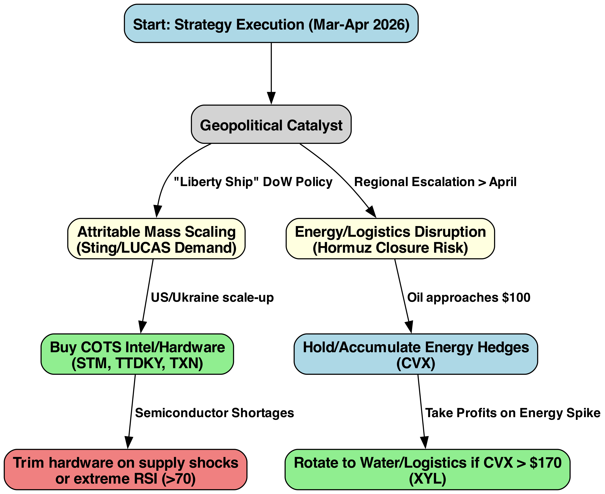
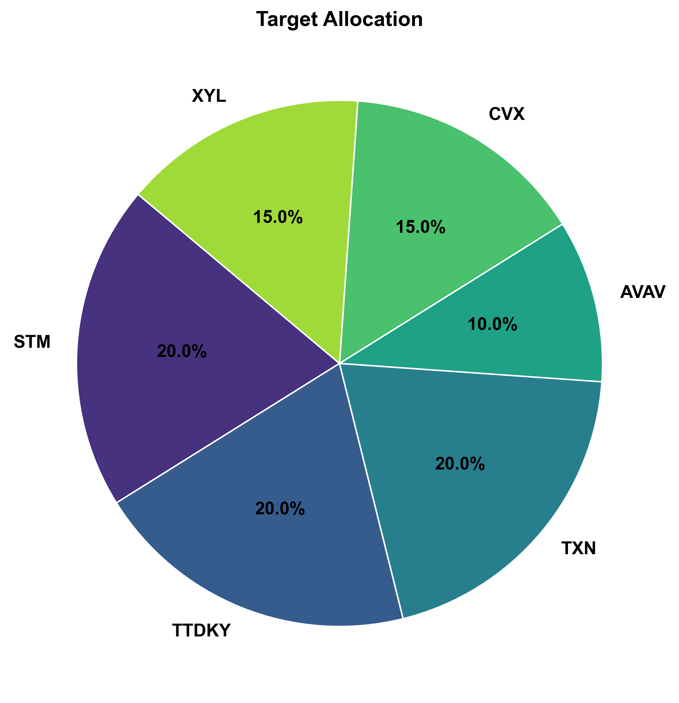
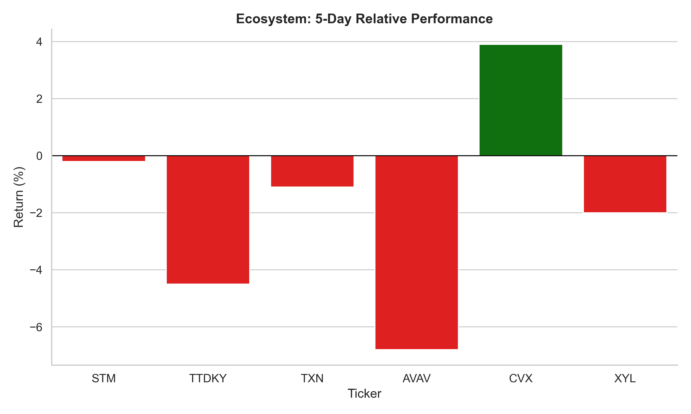
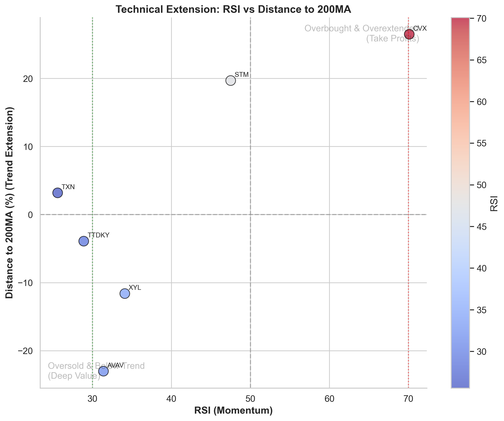

# Strategy Report: Sting Drone & Broad Geopolitics (March 16)

## 1. Parameters & Constraints
*   **Target Instruments:** Asymmetric warfare enablers (STM, TTDKY, TXN, AVAV) vs Macro Energy/Infrastructure Hedges (CVX, XYL).
*   **Strategy:** Combine the $2k Sting Drone hardware logic with the $100 Oil Paradigm generated by Hormuz tensions.
*   **Timeline:** March - April 2026 execution window.

---

## 2. 🧭 Decision Architecture
*Flow: Scaling Attritable Mass -> Energy Hedge Rotation*

### Logic Walkthrough
The overarching strategy bifurcates into hardware scaling (Left Branch) vs. macro hedging (Right Branch).

**🟢 High Priority BUYS:** Components necessary to build mass quantities of the $2,000 Sting Drone (STM, TXN, TTDKY). These processors and inertial sensors are agnostic to which airframe prime wins the DoD contracts.

**🔵 Strategic HOLDS:** CVX provides an essential macro hedge. The Strait of Hormuz conflict introduces a severe risk premium to global oil. If WTI eclipses $100 and CVX RSI goes critical, this will be rotated.

**🟡 Conditional ROTATION:** If CVX peaks ($170+), we trim to capture the shock value, and rotate proceeds defensively into domestic Water Infrastructure (XYL) to play the secondary effects of MENA energy-grid deterioration.

---

## 3. Quantitative Portfolio Setup
*Caption: Target percentage allocation focusing strictly on mission-critical components vs. broad energy hedges.*

| Asset     | Weight   | Role & Rationale                                               | Current Price   |   RSI | Dist 200MA   | Discount   |
|:----------|:---------|:---------------------------------------------------------------|:----------------|------:|:-------------|:-----------|
| **STM**   | 20%      | Key microcontrollers for logic processing in Sting drones.     | N/A             |  47.5 | 19.7%        | nan%       |
| **TTDKY** | 20%      | Inertial Measurement Units (IMUs) critical for stability.      | N/A             |  28.9 | -3.9%        | 61.5%      |
| **TXN**   | 20%      | Silicon provider for volume logic boards.                      | N/A             |  25.6 | 3.2%         | -122.44%   |
| **AVAV**  | 10%      | Direct exposure to tactical drone mass (LASSO program).        | N/A             |  31.4 | -23.0%       | nan%       |
| **CVX**   | 15%      | Geo-hedge against Hormuz blockade and oil supply risk.         | N/A             |  70.1 | 26.5%        | -239.03%   |
| **XYL**   | 15%      | Water infra and desal resilience against regional instability. | N/A             |  34.1 | -11.6%       | 21.66%     |

## 4. 🚨 Execution Zones & Momentum (RSI vs Trend)

---

## Recent News Context

- **Macro Geopolitics (03/16)**: [Iran War Lays Bare the Geopolitical Cost of Fossil Fuel Dependence - Modern Diplomacy](https://news.google.com/rss/articles/CBMiqAFBVV95cUxPMDB6S0ZWVHBUT2NnRFZCdXpCWk9WNUpTbml0WDhxMUw0YXlzRzNSbTFzSnZKR3p0c2FtRC1pN2NScmViTWh3bzNHOWdGRDRrM2pJZk9Pb3hVYkh6djlGVkdJVWFoOEZ6NUdlWDh6d1h6dmprNW5uczZuOUp1c3RKTDduY05vOEx0aGxwMFlzc0tMb2pjdTZnYThrdl9lTjBaRElDUWw4bmY?oc=5)
- **CVX (03/16)**: [Here's Why These Experts Say Buy Energy Stocks Rather Than the S&P 500 Right Now](https://www.investopedia.com/here-s-why-these-experts-say-buy-energy-stocks-rather-than-the-s-and-p-500-right-now-11926840?.tsrc=rss) - *Bank of America's equity and quant strategists says U.S. stocks look historically expensive relative to oil prices, except during Covid and the Tec...*
- **AVAV (03/16)**: [AV Acquires Empirical Systems Aerospace, Inc. - TradingView](https://news.google.com/rss/articles/CBMiswFBVV95cUxOcGNHbGR4al9KcUFHM0dNSWRfSmQ1bW1jNzVjNEtPelNIcTJlVVJ3ZU1NZV9sR3UzaGpTZDdPWmJVR1ZmS0FBNGc3cTlaMEpFQlM2LXJFcXVkRkNrUlc2dlVCd0l4WFQyaWZEdF9Vd1NBOWtsLUJxR294bF9uVE5GSE9KWjh2RXNRT3dINV81dnRUcXowb0hNQ3p6ZUVnYmdQazJ4QzRoVGNRaTVaaTZnZXhFdw?oc=5)
- **AVAV (03/16)**: [KADENSA CAPITAL Ltd Makes New $23.35 Million Investment in AeroVironment, Inc. $AVAV - MarketBeat](https://news.google.com/rss/articles/CBMi1wFBVV95cUxPb2pLTklZckd1Y1pGWFRQUlNJTEVEU0pTeEk1VE1fUFR4ZktKeVBEODd6amRYeVhGcHctVUxoTzJPc3FmYklJWmthVm5iYmxzY3JvSVNWUi1jMXQ3Qk5NXzhtR0ctZ0pjMEpaVjZHOC1WbWwyR1pLV09BVzc5azFHRFlYZVhzTUthejZDeF9KNjk4Q1Q1UHQ1ZFFlOTlyUWRFLTRrMXdEMURLdUMyM0o2bTFLWXA5SlZMYnJpbHZiUkVVTjhWZzhYZm1jbE03WkhJdFZxYVJGWQ?oc=5)
- **AVAV (03/16)**: [BTIG Cuts AeroVironment, Inc. (AVAV)’s Price Target To $330, Maintains Buy Rating](https://finance.yahoo.com/news/btig-cuts-aerovironment-inc-avav-110329745.html?.tsrc=rss) - *AeroVironment, Inc. (NASDAQ:AVAV) is among the 8 Best Drone Stocks to Buy for the Next 3 Years. On March 12, BTIG analyst Andre Madrid slashed the ...*
- **CVX (03/16)**: [AI Models Split on Chevron (CVX) as Valuation and Technicals Meet Strong Fundamentals - TipRanks](https://news.google.com/rss/articles/CBMizAFBVV95cUxNaGNGQ3FZYUpfT2ppRjNXaFYxalM0Zk9sWFhTYUctbGRJRk9wQ3BKaFIyZG5oX0FkNWIxU1g5elBJOVJoeEM0NXFfNTA4RG1WOWo1NVozeEFUdTRoQ2FXUFhZZmxJUTRGa3B3STRwVVVWRHVBbzZMcFBJeTNJOUNSRWwzOTJJcFVvWU1ELWctYl9zank2NXIzeDVVWHR2WUhKWmw5UkNkUUxwRHNFR251ZDZ4UXBGaDNzMldPbmN4NWl6UlpqSFhUdHotYjU?oc=5)
- **CVX (03/16)**: [Chevron Advances Cyprus' Aphrodite Gas Field Development](https://finance.yahoo.com/news/chevron-advances-cyprus-aphrodite-gas-122000437.html?.tsrc=rss) - *CVX moves the Aphrodite gas field closer to development after awarding Worley a FEED contract, marking another step toward unlocking Eastern Medite...*
- **CVX (03/16)**: [Sector Update: Energy Stocks Rise Monday Afternoon](https://finance.yahoo.com/news/sector-energy-stocks-rise-monday-183733167.html?.tsrc=rss) - *Energy stocks advanced Monday afternoon, with the NYSE Energy Sector Index up 0.6% and the State Str*
- **CVX (03/16)**: [This Biotech With a Breakout MS Drug Draws $8 Million Investment Amid 30% Stock Drop](https://www.fool.com/coverage/filings/2026/03/16/this-biotech-with-a-breakout-ms-drug-draws-usd8-million-investment-amid-30-stock-drop/?.tsrc=rss) - *This biopharma firm develops therapies for B-cell malignancies and autoimmune diseases, with a focus on oncology and immunology.*
- **CVX (03/16)**: [Energy Crisis Unleashed By Iran War Likely to Get Worse, Oil Execs Tell White House](https://finance.yahoo.com/m/87c70dc8-7f44-3f49-8479-9021ec07c929/energy-crisis-unleashed-by.html?.tsrc=rss) - *American oil executives delivered a bleak message to Trump officials in recent days: The energy crisis the Iran war has unleashed is likely to get ...*
- **CVX (03/16)**: [Chevron’s Libya Expansion And Iran War Shock Test Valuation And Risks - Yahoo Finance](https://news.google.com/rss/articles/CBMihAFBVV95cUxNbnJoR3duNEJrQW5QWTgzeXJ6cXFMYmVjbnVELXhmNEVJQl9ocjhMNDBwWmNPU0ZCcTdPY3JYQnZoS0tEaFYzcmg1ZC1VWjZUZDhULVU3bEtQbHRwX1JrdTQ3TGhleXFWZ2M3SnhZNHF2WW1vVHFHb2d2eWJXSWd3S2c0cEM?oc=5)
- **STM (03/16)**: [European markets in the green; Mib up with STM as Amplifon collapses - marketscreener.com](https://news.google.com/rss/articles/CBMivAFBVV95cUxNVV9RcWJuTFNfbnB4aENIM29zb0lSWkt2ekdwYUt2bnFrYTRKSVlUUWFtTGFZWU9tSmJLZkJpeWNRbzM2NVVJc0VSVmtqWjdHTllQendTbmhYMHJkQldqX3BqalhnTzBpWFBBMzZVOGQyaU8zZy14NTFJQmF3X25tWWhLRVB2dGdGLVpaZmloTTh2eWpCbFBlYVFsWGotVEpseWJlaG0tTmhLTEhRVExWNWl2LVZxckRPcnI4Mg?oc=5)
- **CVX (03/16)**: [Chevron Corporation $CVX Shares Acquired by Ausdal Financial Partners Inc. - MarketBeat](https://news.google.com/rss/articles/CBMizgFBVV95cUxQMFdiRHhJcHUxZl9SZXZKdEwtenVVaDZTUEc0YkJoMTN4QnFZWFBaVGwxTUoxZnFzSHZQREdZaW5qb0Jqdm92ZW1rbmNJcFB0ZGs1YVpoemVNOTZSNkJVUXhaTDVUX0I0QTAtaWpJVWh5ZXJ5R2xYX2g5QUIteVFuQjBMWlNKelJjLTFxb3ZESHhRVXZySTJnQzJ1emJSWE9OZFFkcmlrdm1XVGxhQ2VqLTBNSXF3VXd2TjI5aWVVRmU3bW5jS1FLYlN0TDY1Zw?oc=5)
- **CVX (03/16)**: [Elevation Point Wealth Partners LLC Raises Holdings in Chevron Corporation $CVX - MarketBeat](https://news.google.com/rss/articles/CBMi1gFBVV95cUxPYXNoR0hiUzg1S3lBQ09maEpMY2g0Zngya2RtVDNpRldxNzBnSkJrYjRwZVhLX0x3R0Rqd3hha2FveHJZOWY1UzhUd19iSzMzUDBzc0xzYkpaa1N1eWlJWjdFbmhNMDVvd25sTVRpNWZmWElGcThEb2ZIdTJpRzM1TzdOQW5BbTJIS014SjBWdVVvR2J3QkhHZWRlWmZwRU5DdktmdS1QZGIxei10bUVvcXJ2bVNjS3drN200OUxZSHNMSllodlp0a0RiVjhHZ3Rac0ZJQ3Fn?oc=5)
- **CVX (03/16)**: [Banco Bilbao Vizcaya Argentaria S.A. Grows Position in Chevron Corporation $CVX - MarketBeat](https://news.google.com/rss/articles/CBMi0wFBVV95cUxPMk1ISFVBc2VhX1FVSWtYaXE4c0FCUkRWRWxmbmRnNlBJc1JHVldvc05hMHRTck5xS1gyZjNSUU41UHBSS3E2TjlHVHYxVm5oeVVYdWdyel96Z0gzMmh5SEs4YlNWYk01MW5LdlhUVkdLM1ZpaUZ6ZHRSd0VXNFkzdlRwWlE5LUNGaFIwNTBpS1djV1FVekhYOGFrMDBCcTRwVUVWZWprV1laOFVJeWJaMFVjZjJqRElGM0VIaVhKclhzTG1YaHo3RGtsVlhtdmQ5cUF3?oc=5)

---

## 5. Future Updates & Reflection
> *Use this section to revisit the original thesis and log actual outcomes against predictions.*

### 1-Week Review (Target: March 23, 2026)
- **Actual Execution:** [Did STM/TXN dip below RSI 40? Did CVX run up past 75 RSI?]
- **Thesis Check:** [Is the Strait of Hormuz conflict still intact? Did CVX reach target sell zones?]

### 1-Month Review (Target: April 16, 2026)
- **Portfolio Performance:** [Insert basket return % vs SPY baseline]
- **Strategic Adjustments:** [What needs to be re-weighted based on new intelligence?]

> *NotebookLM upload disabled. Synthesis skipped.*

---

## 7. Extracted Sources & Deep Research References

# Deep Research: Sting Interceptors & The $100 Oil Paradigm

## Part 1: The Asymmetric Hardware Rebalancing

### "Sting" Drone Specifications and Logic
*   **The Problem:** Traditional defense economics are inverted. The US/Israel routinely expend $4M Patriot or Standard Missile interceptors to destroy $30,000 Iranian Shahed-136 loitering munitions. This is financially unsustainable in a protracted conflict.
*   **The Solution:** The "Sting" intercepts at a unit cost of approximately **$2,000 to $3,000**. It uses commercial-off-the-shelf (COTS) FPV (first-person view) racing drone technology.
*   **Scaling Requirements ("Liberty Ship" Model):** The DoD aims to produce upwards of 300,000 of these attritable units by 2027. Traditional prime contractors (LMT, RTX) cannot scale at this price point.

### The Silicon Moat (Tier-1 Enablers)
To achieve this scale, dependency shifts from aerospace integrators to mass-market semiconductor and electronics manufacturers.

#### 1. STMicroelectronics (STM)
*   **Role:** STM32 Microcontrollers (MCUs) are the undisputed industry standard for open-source flight controllers (like Betaflight and ArduPilot) used in FPV and autonomous systems.
*   **Moat:** They provide the high-frequency loop times required for aggressive dogfighting maneuvers without the export restrictions or costs of military-grade silicon.

#### 2. Texas Instruments (TXN)
*   **Role:** Analog ICs and power management systems.
*   **Moat:** Massive US-based fabrication capabilities. If a "China Ban" on components accelerates, TXN is fundamentally insulated and capable of supplying millions of logic boards to DoD contractors.

#### 3. TDK Corp (TTDKY / InvenSense)
*   **Role:** Gyroscopes and Inertial Measurement Units (IMUs).
*   **Moat:** GPS-denied environments (heavy Electronic Warfare/Jamming) require highly accurate dead-reckoning. TDK's InvenSense IMUs are the benchmark for flight stability and precision targeting when signal connection is lost.

#### 4. AeroVironment (AVAV)
*   **Role:** Primary assembly and tactical deployment (LASSO program / Switchblade).
*   **Risk:** Capable of scaling but highly sensitive to component availability. They are the "front end" while STM/TXN are the "back end."

---

## Part 2: The Macro Energy Shock (Iran / Hormuz)

Following a severe escalation in February 2026 involving Iranian leadership, global risk models have radically repriced energy supply.

*   **Chokepoint Vulnerability:** The Strait of Hormuz facilitates over 20 million barrels of oil per day (roughly 20% of global consumption).
*   **The "$100 Paradigm":** Options markets are pricing intense upside skew for WTI/Brent crude breaching $100-$120/barrel. If closures persist over 14 days, Goldman Sachs estimates $130 Brent.
*   **Inflation & Macro Ripple:** This creates a "stagflationary" shock. The Fed is forced to pause rate cuts, heavily punishing high-multiple software and consumer discretionary stocks, while rewarding tangible assets.

### Hedges and Defensive Execution

#### 1. Chevron (CVX)
*   **Role:** Supreme macro hedge. Chevron captures both upstream margin expansion on the absolute price of oil as well as downstream refining buffers.
*   **Alert:** Highly extended. RSI routinely crests 75 in conflict spikes. It is a source of funds to trim at the peak.

#### 2. Xylem (XYL)
*   **Role:** Desalination and water infrastructure.
*   **Thesis:** As energy targets are hit in the MENA region, water infrastructure (heavily reliant on energy-intensive desalination) becomes a critical failure point. Xylem provides emergency pumping and infrastructure resilience globally—a high-moat "HALO" (Heavy Asset, Low Obsolescence) play that remains completely uncorrelated to the tech sector.

---

## 6. 🤖 NotebookLM AI Strategic Review
*(Generative synthesis analyzing recent 3-11 / 3-16 portfolios and daily news context)*

This synthesis integrates the asymmetric hardware shift of the "Sting" interceptor program with the macro-economic consequences of the "Operation Epic Fury" escalation in the Middle East.

### 1. The Sting Drone Paradigm Shift: Asymmetric Defense
Traditional defense economics have become inverted, as the U.S. and Israel routinely expend **$4 million interceptors** to destroy **$30,000 Iranian Shahed drones** [Deep Research Context]. The "Sting" interceptor rebalances this equation by utilizing **Commercial-Off-The-Shelf (COTS)** FPV racing drone technology to create a solution costing approximately **$2,000 to $3,000** per unit [Deep Research Context].

To achieve the Department of Defense's goal of producing **300,000 units by 2027**, the supply chain must shift from traditional aerospace integrators to mass-market semiconductor manufacturers [Deep Research Context]:
*   **STMicroelectronics (STM):** Their **STM32 Microcontrollers** are the industry standard for open-source flight controllers, providing the high-frequency loop times necessary for aggressive maneuvers in autonomous dogfighting [Deep Research Context].
*   **TDK Corp (TTDKY / InvenSense):** Provides the benchmark **Inertial Measurement Units (IMUs)** required for precision targeting and dead-reckoning in **GPS-denied (jammed) environments** [Deep Research Context].
*   **Texas Instruments (TXN):** Supplies analog ICs and power management; its massive **U.S.-based fabrication** capabilities insulate it from potential "China Bans" on military components [Deep Research Context].

### 2. The Broad Iran / Hormuz Shock: The $100 Oil Paradigm
The death of Iranian Supreme Leader Ayatollah Khamenei on February 28, 2026, served as the primary trigger for the current energy crisis [1, 2]. This event, combined with the start of **"Operation Epic Fury,"** has driven Brent crude toward the **$100-$130/barrel** range [279, 292, Deep Research Context].

Geopolitical models now price an **85.2% probability** of a **Strait of Hormuz closure**, which would disrupt 20% of global consumption [3-5]. This creates a **stagflationary shock**, forcing the Federal Reserve to pause rate cuts while punishing high-multiple software stocks in favor of tangible assets [280, 283, Deep Research Context].

### 3. Portfolio Analysis and Critical Basket Evaluation
Recent portfolio analysis and RSI data suggest a divergence between overextended energy hedges and deep-value silicon enablers [72, 77, Deep Research Context].

*   **Chevron (CVX) Critique:** While CVX is the "supreme macro hedge," it is technically **overextended** with an RSI frequently cresting **75** during conflict spikes [Deep Research Context, 140, 187]. Recent tactical reports advise **selling CVX spikes >$195** to harvest "panic premiums" and fund other entries [6-8].
*   **Silicon Enablers (STM, TTDKY, TXN) Critique:** These stocks represent **deep value or momentum** areas as the "Silicon Moat" for the 300,000-unit drone buildout [Deep Research Context]. TXN specifically showed momentum in late January, rising over 10% on recovery signs [9].
*   **AeroVironment (AVAV) Critique:** Although AVAV is the "front end" for tactical drone deployment, recent news flow shows a **rotation out of AVAV** (-9.60%) as investors seek safe havens in blue-chip income stocks [10-13].
*   **Xylem (XYL) Critique:** XYL is a high-moat **"HALO" (Heavy Asset, Low Obsolescence)** play [Deep Research Context]. It provides a critical hedge against Middle Eastern water infrastructure vulnerabilities, which become targets during energy-intensive desalination failures [14-16].

### Concise Strategy Synthesis
The optimal strategy requires a **tactical rotation** away from overbought energy majors into the **Tier-1 silicon enablers** of the attritable drone mass program.

**Actionable Directives:**
1.  **Harvest Energy Gains:** Trim **CVX** and other energy positions (like FENY) when **RSI > 70** or Brent crude exceeds $95 to lock in "geopolitical chips" [17-19].
2.  **Accumulate the Silicon Moat:** Reallocate proceeds into **TXN, STM, and TTDKY**. These companies control the physical bottlenecks of the $2,000 interceptor buildout and remain insulated from software-sector "SaaSpocalypse" multiples [Deep Research Context, 272, 281].
3.  **Hedge with HALO Assets:** Maintain exposure to **XYL** for non-correlated infrastructure resilience and **RTX/LMT** for core munitions stockpiling as Patriot inventories are depleted by drone-swarm intercepts [14, 16, 20, 21].
4.  **Monitor the "Sting" Deployment:** Focus on companies mastering **ultra-cheap attritable mass** (sub-$5,000 units), as they will define the next decade of defense procurement [22].
