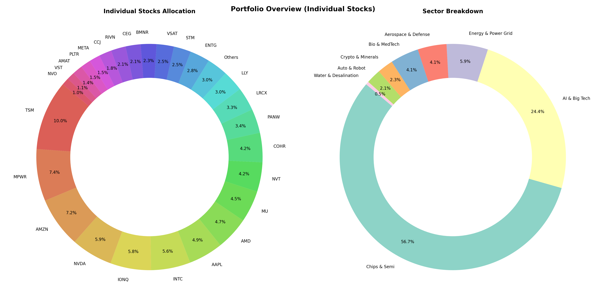
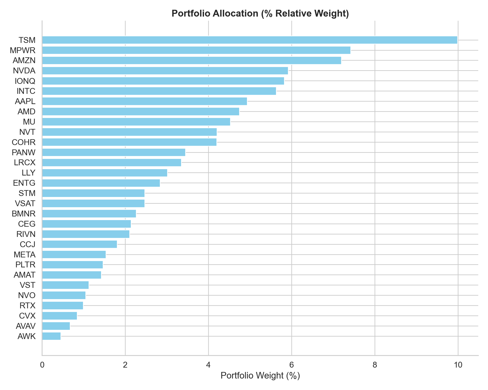
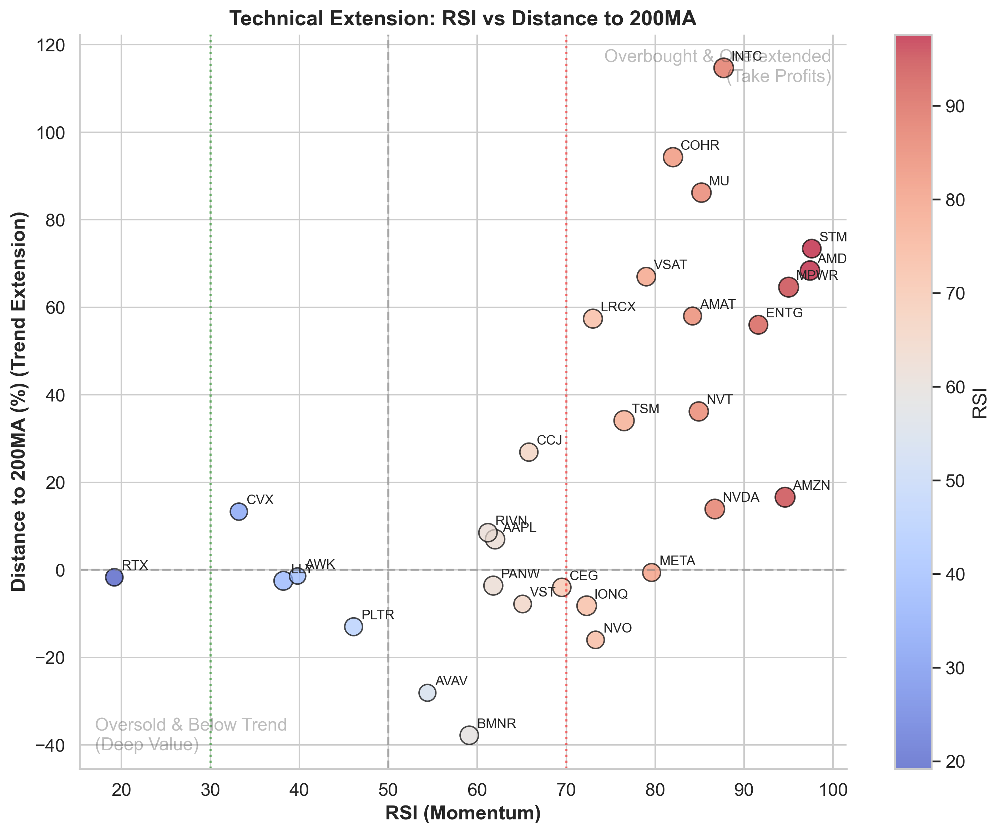
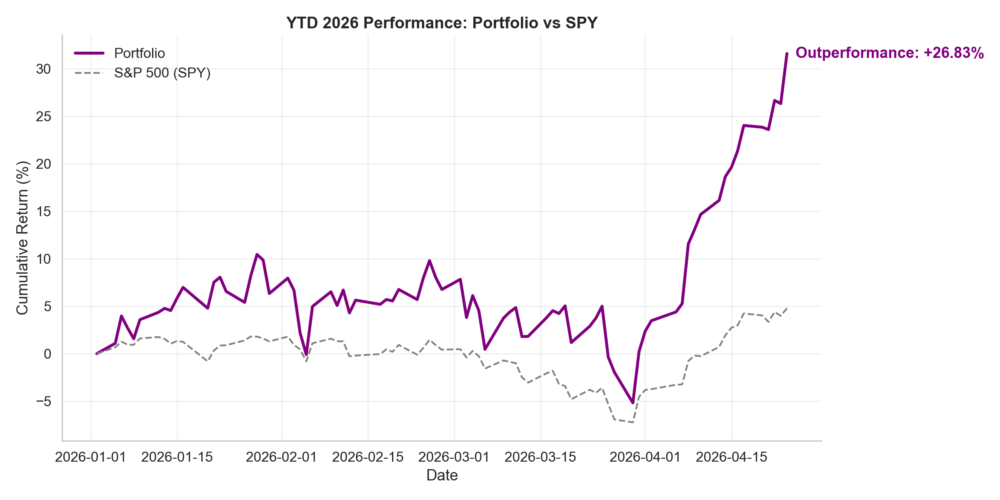
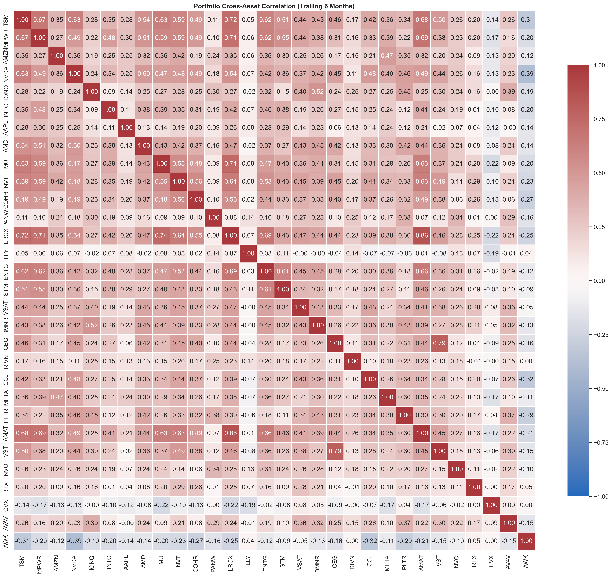
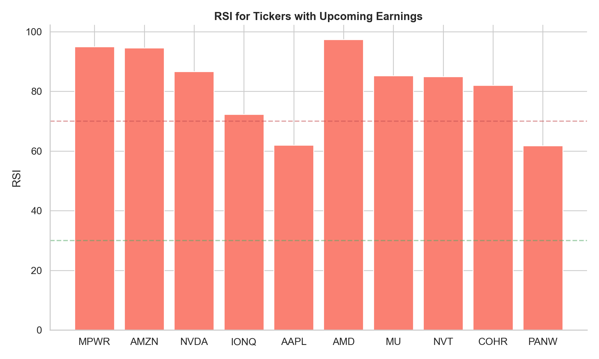

# 04-24 Chip & AI Growth Strategy Report

*Date: April 24, 2026*

This report provides an anonymized overview of the holdings in the **Chip & AI Growth Strategy**.

## 📊 Allocation & Sector Breakdown

*💡 **Note**: Slices smaller than 1% are grouped into 'Others' for readability.*

*💡 **Note**: Horizontal bar chart showing relative weights of all individual holdings.*

## 🧭 Technical Extension: RSI vs 200MA Map

*💡 **Note**: This scatter plot maps momentum (RSI on Y-axis) against trend extension (Distance to 200-day Moving Average on X-axis).*

## 📈 Performance Comparison (YTD 2026)

### Performance Metrics vs SPY
| Metric             | Portfolio   | SPY    |
|:-------------------|:------------|:-------|
| Total Return (YTD) | +31.62%     | +4.79% |
| Daily Volatility   | 2.18%       | 0.91%  |
| Max Drawdown       | -14.16%     | -8.89% |

## 📈 Correlation Analysis

*💡 **Caption**: Daily returns correlation for all individual holdings (Trailing 6 Months).*

## 🔍 Concentration Risk

**Concentration Risk Note**: The top 5 holdings account for **36.34%** of this growth portfolio.

## 🎯 Actionable Insights & Alerts

- 🚨 **TSM**: High momentum, RSI of **76.5**, **34.1%** above its 200MA. Consider trimming or using trailing stops.
- 🚨 **MPWR**: High momentum, RSI of **95.0**, **64.6%** above its 200MA. Consider trimming or using trailing stops.
- 🚨 **AMZN**: High momentum, RSI of **94.6**, **16.6%** above its 200MA. Consider trimming or using trailing stops.
- 🚨 **NVDA**: High momentum, RSI of **86.7**, **13.9%** above its 200MA. Consider trimming or using trailing stops.
- 🚨 **IONQ**: High momentum, RSI of **72.3**, **-8.2%** above its 200MA. Consider trimming or using trailing stops.
- 🚨 **INTC**: High momentum, RSI of **87.7**, **114.7%** above its 200MA. Consider trimming or using trailing stops.
- 🚨 **AMD**: High momentum, RSI of **97.4**, **68.4%** above its 200MA. Consider trimming or using trailing stops.
- 🚨 **MU**: High momentum, RSI of **85.2**, **86.2%** above its 200MA. Consider trimming or using trailing stops.
- 🚨 **NVT**: High momentum, RSI of **84.9**, **36.2%** above its 200MA. Consider trimming or using trailing stops.
- 🚨 **COHR**: High momentum, RSI of **82.0**, **94.3%** above its 200MA. Consider trimming or using trailing stops.
- 📉 **PANW**: Hovering just **-3.6%** above its 200MA. Watching for a bounce or breakdown.
- 🚨 **LRCX**: High momentum, RSI of **73.0**, **57.4%** above its 200MA. Consider trimming or using trailing stops.
- 🟢 **LLY**: Technically oversold (RSI: **38.2**). This could be a prime accumulation zone if you believe in the long-term story.
- 🚨 **ENTG**: High momentum, RSI of **91.6**, **56.0%** above its 200MA. Consider trimming or using trailing stops.
- 🚨 **STM**: High momentum, RSI of **97.6**, **73.4%** above its 200MA. Consider trimming or using trailing stops.
- 🚨 **VSAT**: High momentum, RSI of **79.0**, **67.0%** above its 200MA. Consider trimming or using trailing stops.
- 📉 **BMNR**: Hovering just **-37.8%** above its 200MA. Watching for a bounce or breakdown.
- 📉 **CEG**: Hovering just **-4.0%** above its 200MA. Watching for a bounce or breakdown.
- 🚨 **META**: High momentum, RSI of **79.6**, **-0.6%** above its 200MA. Consider trimming or using trailing stops.
- 📉 **PLTR**: Hovering just **-13.0%** above its 200MA. Watching for a bounce or breakdown.
- 🚨 **AMAT**: High momentum, RSI of **84.2**, **58.0%** above its 200MA. Consider trimming or using trailing stops.
- 📉 **VST**: Hovering just **-7.8%** above its 200MA. Watching for a bounce or breakdown.
- 🚨 **NVO**: High momentum, RSI of **73.3**, **-16.0%** above its 200MA. Consider trimming or using trailing stops.
- 🟢 **RTX**: Technically oversold (RSI: **19.2**). This could be a prime accumulation zone if you believe in the long-term story.
- 🟢 **CVX**: Technically oversold (RSI: **33.2**). This could be a prime accumulation zone if you believe in the long-term story.
- 📉 **AVAV**: Hovering just **-28.1%** above its 200MA. Watching for a bounce or breakdown.
- 🟢 **AWK**: Technically oversold (RSI: **39.8**). This could be a prime accumulation zone if you believe in the long-term story.

## 🔮 Earnings Watch

### Upcoming Prints Speculation
- **MPWR** (Earnings: 2026-04-30): RSI is **95.0**. Priced for perfection going into the print. High risk of gap down on any miss.
- **AMZN** (Earnings: 2026-04-29): RSI is **94.6**. Priced for perfection going into the print. High risk of gap down on any miss.
- **NVDA** (Earnings: 2026-05-20): RSI is **86.7**. Priced for perfection going into the print. High risk of gap down on any miss.
- **IONQ** (Earnings: 2026-05-06): RSI is **72.3**. Priced for perfection going into the print. High risk of gap down on any miss.
- **AAPL** (Earnings: 2026-04-30): RSI is **62.0**. Neutral momentum. Focus will be on guidance.
- **AMD** (Earnings: 2026-05-05): RSI is **97.4**. Priced for perfection going into the print. High risk of gap down on any miss.
- **MU** (Earnings: 2026-06-24): RSI is **85.2**. Priced for perfection going into the print. High risk of gap down on any miss.
- **NVT** (Earnings: 2026-05-01): RSI is **84.9**. Priced for perfection going into the print. High risk of gap down on any miss.
- **COHR** (Earnings: 2026-05-06): RSI is **82.0**. Priced for perfection going into the print. High risk of gap down on any miss.
- **PANW** (Earnings: 2026-05-20): RSI is **61.8**. Neutral momentum. Focus will be on guidance.

## 📑 Holdings Table

| Ticker   | Name   | Sector               |   Quantity | Portfolio_Weight_Pct   | Unrealized_PnL_Pct   |   RSI |   Dist_to_200MA | Upcoming_Earnings   |
|:---------|:-------|:---------------------|-----------:|:-----------------------|:---------------------|------:|----------------:|:--------------------|
| TSM      | TSM    | Chips & Semi         |     21.847 | 9.99%                  | +22.96%              |  76.5 |            34.1 |                     |
| MPWR     | MPWR   | Chips & Semi         |      4     | 7.42%                  | +45.80%              |  95   |            64.6 | 2026-04-30          |
| AMZN     | AMZN   | AI & Big Tech        |     24     | 7.20%                  | +12.23%              |  94.6 |            16.6 | 2026-04-29          |
| NVDA     | NVDA   | Chips & Semi         |     25.002 | 5.92%                  | +12.80%              |  86.7 |            13.9 | 2026-05-20          |
| IONQ     | IONQ   | AI & Big Tech        |    120     | 5.82%                  | -1.81%               |  72.3 |            -8.2 | 2026-05-06          |
| INTC     | INTC   | Chips & Semi         |     60     | 5.63%                  | +41.16%              |  87.7 |           114.7 |                     |
| AAPL     | AAPL   | AI & Big Tech        |     16.009 | 4.93%                  | +0.51%               |  62   |             7   | 2026-04-30          |
| AMD      | AMD    | Chips & Semi         |     12     | 4.74%                  | +60.81%              |  97.4 |            68.4 | 2026-05-05          |
| MU       | MU     | Chips & Semi         |      8.019 | 4.53%                  | +44.15%              |  85.2 |            86.2 | 2026-06-24          |
| NVT      | NVT    | Chips & Semi         |     26.019 | 4.20%                  | +15.93%              |  84.9 |            36.2 | 2026-05-01          |
| COHR     | COHR   | Chips & Semi         |     11     | 4.20%                  | +19.12%              |  82   |            94.3 | 2026-05-06          |
| PANW     | PANW   | AI & Big Tech        |     17     | 3.45%                  | +0.22%               |  61.8 |            -3.6 | 2026-05-20          |
| LRCX     | LRCX   | Chips & Semi         |     11.009 | 3.35%                  | +8.13%               |  73   |            57.4 | 2026-07-29          |
| LLY      | LLY    | Bio & MedTech        |      3     | 3.01%                  | -7.78%               |  38.2 |            -2.5 | 2026-04-30          |
| ENTG     | ENTG   | Chips & Semi         |     16     | 2.84%                  | +19.59%              |  91.6 |            56   | 2026-04-30          |
| STM      | STM    | Chips & Semi         |     43.024 | 2.47%                  | +30.77%              |  97.6 |            73.4 |                     |
| VSAT     | VSAT   | Aerospace & Defense  |     35     | 2.47%                  | +14.73%              |  79   |            67   | 2026-05-19          |
| BMNR     | BMNR   | Crypto & Minerals    |     90     | 2.26%                  | -31.10%              |  59.1 |           -37.8 | 2026-07-02          |
| CEG      | CEG    | Energy & Power Grid  |      6.005 | 2.14%                  | +2.34%               |  69.5 |            -4   | 2026-05-11          |
| RIVN     | RIVN   | Auto & Robot         |    112     | 2.10%                  | +2.12%               |  61.2 |             8.5 | 2026-04-30          |
| CCJ      | CCJ    | Energy & Power Grid  |     13     | 1.80%                  | +5.52%               |  65.8 |            26.9 | 2026-05-05          |
| META     | META   | AI & Big Tech        |      2.003 | 1.54%                  | -9.48%               |  79.6 |            -0.6 | 2026-04-29          |
| PLTR     | PLTR   | AI & Big Tech        |      9     | 1.46%                  | -4.62%               |  46.1 |           -13   | 2026-05-04          |
| AMAT     | AMAT   | Chips & Semi         |      3.004 | 1.42%                  | +22.00%              |  84.2 |            58   | 2026-05-14          |
| VST      | VST    | Energy & Power Grid  |      6.005 | 1.12%                  | -3.03%               |  65.1 |            -7.8 | 2026-05-07          |
| NVO      | NVO    | Bio & MedTech        |     22.413 | 1.05%                  | -13.80%              |  73.3 |           -16   | 2026-05-06          |
| RTX      | RTX    | Aerospace & Defense  |      5     | 0.99%                  | -14.67%              |  19.2 |            -1.7 | 2026-07-21          |
| CVX      | CVX    | Energy & Power Grid  |      4     | 0.84%                  | -10.34%              |  33.2 |            13.3 | 2026-05-01          |
| AVAV     | AVAV   | Aerospace & Defense  |      3     | 0.67%                  | -8.14%               |  54.4 |           -28.1 | 2026-06-23          |
| AWK      | AWK    | Water & Desalination |      3     | 0.45%                  | -5.64%               |  39.8 |            -1.4 | 2026-04-29          |

*Note: N/A indicates that intrinsic value could not be calculated.*

---
*Report generated automatically on 2026-04-24.*

## 🤖 NotebookLM Red-Team Critique

View Critique

As a senior macroeconomic strategist, I have reviewed the **Chip & AI Growth Strategy** portfolio. While the year-to-date performance is exceptional, the portfolio currently exhibits signs of **extreme technical overextension** and **significant concentration risk** that could lead to substantial drawdowns if the macro environment shifts or earnings disappoint.

### **1. Holdings and Sector Concentration**
The portfolio is aggressively positioned in the **Chips & Semiconductors** and **AI & Big Tech** sectors [1]. This thematic focus has yielded a **+31.62% YTD return**, significantly outperforming the SPY’s +4.79% [2]. However, this outperformance comes with a **concentration risk** where the top five holdings—TSM, MPWR, AMZN, NVDA, and IONQ—account for **36.34%** of the entire individual stock exposure [2, 3]. This creates a high level of idiosyncratic risk; any sector-specific regulatory headwind or supply chain disruption would have a disproportionate impact on the total portfolio value [2].

### **2. Risk Analysis: Technical Overextension**
The most pressing risk is the **"priced for perfection"** technical state of nearly all core holdings [4].
*   **Momentum Extremes:** Several major positions are deep in overbought territory, such as **STM (RSI: 97.6)**, **AMD (RSI: 97.4)**, and **MPWR (RSI: 95.0)** [3, 5]. Such high RSI levels typically precede a period of consolidation or sharp mean reversion [5].
*   **Trend Extension:** The distance from long-term moving averages is alarming; for instance, **INTC is 114.7% above its 200-day Moving Average (200MA)**, while **COHR is 94.3%** and **MU is 86.2%** above theirs [3, 5]. This suggests the current vertical move is likely unsustainable in the medium term [5].
*   **Volatility and Drawdown:** The portfolio’s daily volatility of **2.18%** is more than double that of the SPY (0.91%), and it has already experienced a **max drawdown of -14.16%**, indicating a much higher risk profile than a standard benchmark [2].

### **3. Strategic Critique and Earnings Outlook**
The current strategy appears to be a momentum-chasing approach that is highly vulnerable to **upcoming earnings "gap downs"** [4].
*   **Earnings Risk:** Heavyweights like **AMZN (RSI: 94.6)** and **MPWR (RSI: 95.0)** report at the end of April 2026, followed by **AMD** and **NVDA** in May [3, 4]. With RSI levels this high, even a positive earnings beat may result in a "sell the news" event if guidance does not exceed the market's heightened expectations [4].
*   **Diversification Laggards:** While the portfolio has small stakes in "oversold" or defensive names like **RTX (RSI: 19.2)** and **CVX (RSI: 33.2)**, these are negligible weights (0.99% and 0.84% respectively) compared to the semiconductor core [3].
*   **Performance Divergence:** There is a notable divergence between the winners and losers; while the tech core is surging, holdings like **BMNR** are sitting **-37.8% below their 200MA** with a **-31.10% unrealized loss**, suggesting the "growth" theme is not lifting all boats within the portfolio [3].

### **Strategist’s Recommendation**
The portfolio is currently in a **high-gamma, high-risk state** [2, 5]. From a macroeconomic perspective, the strategy requires immediate **de-risking** through the use of trailing stops or trimming overextended winners like **AMD, STM, and MPWR** to lock in gains before the May earnings cycle [4, 5]. Accumulating positions in currently oversold laggards like **LLY (RSI: 38.2)** or **AWK (RSI: 39.8)** could provide a necessary defensive hedge against a potential tech-led correction [3, 5].

