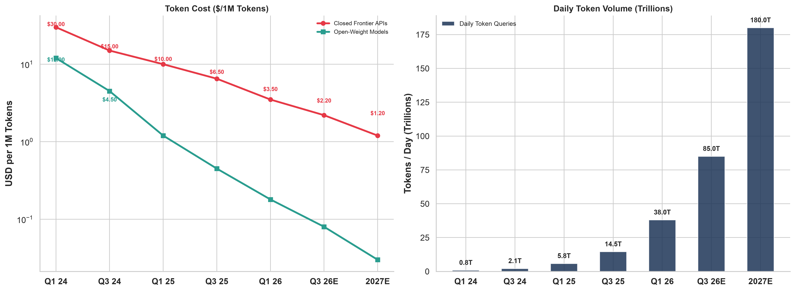
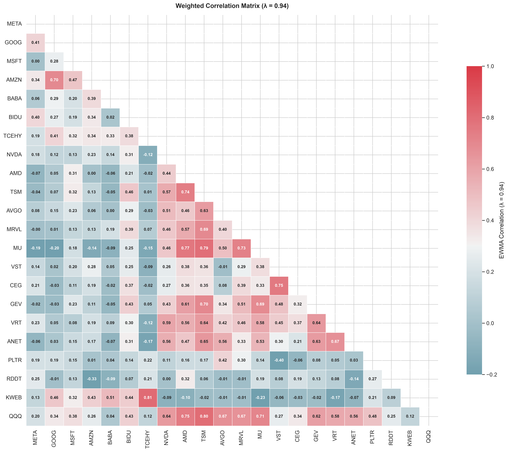
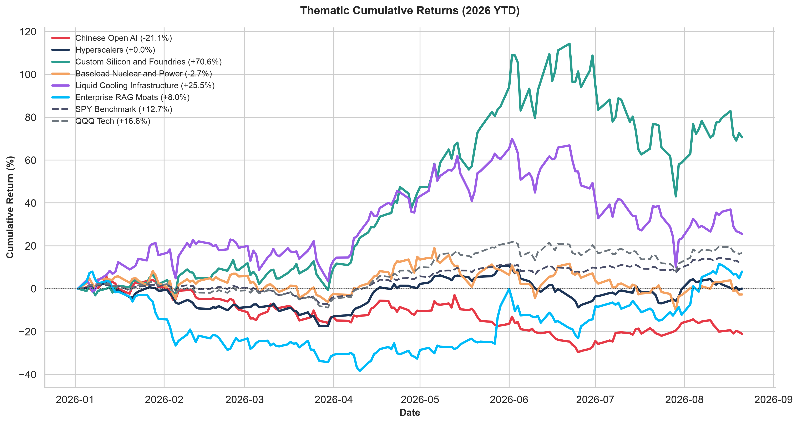
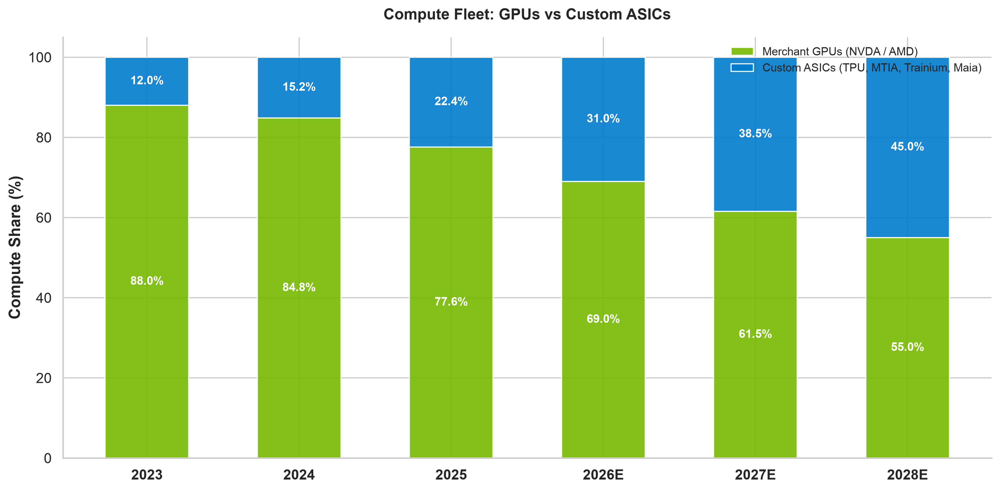
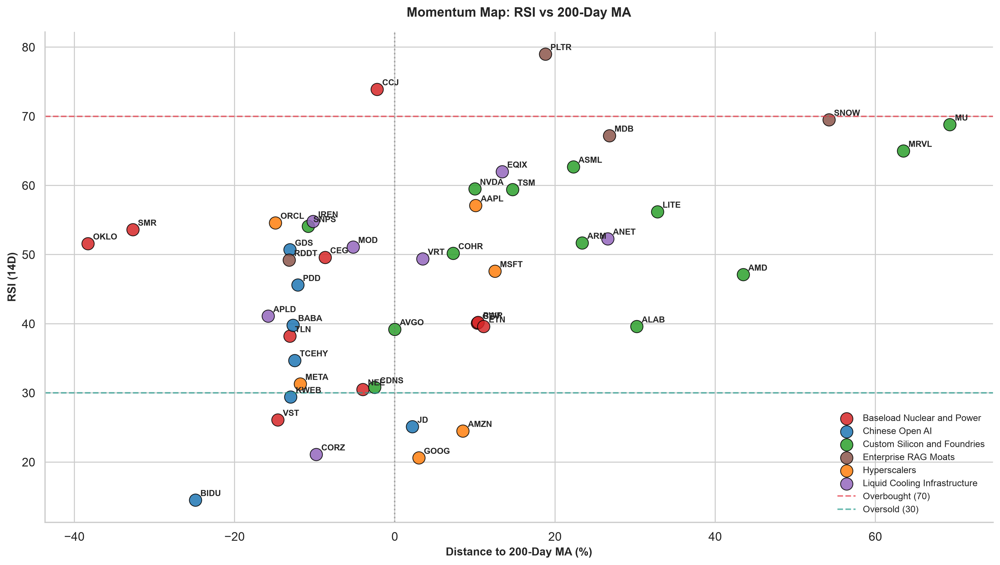
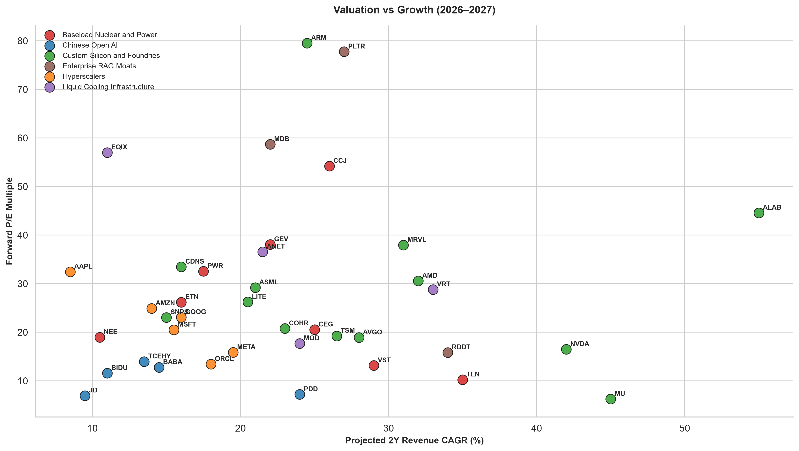
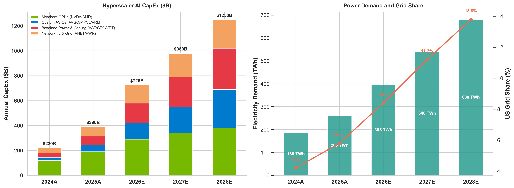
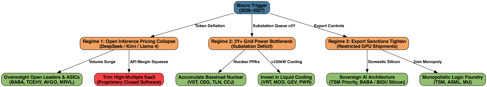

# Open AI Models Strategy (2026–2028)

*Date: August 22, 2026 | Scope: DeepSeek, Kimi, August AI Dip, EWMA Correlations, Baseload Nuclear, Custom ASICs*

## Executive Summary

- **The Algorithmic Inflection (DeepSeek, Kimi, Qwen):** Open models achieve frontier parity at fractions of closed training costs. Moonshot AI's **Kimi k1.5**, DeepSeek's **V3/R1**, and Alibaba's **Qwen 2.5** show that algorithmic MoE efficiency substitutes for brute-force GPU hardware scaling.
- **The August 2026 AI Dip:** Markets pulled back as hyperscalers signaled record CapEx ($725B in 2026; Alibaba CapEx +75% swallowing +45% cloud growth). This creates prime **Buy-the-Dip accumulation zones** in physical monopolies and deep-value open leaders.
- **Jevons Paradox:** A 92% decline in token cost catalyzed a >100x query explosion (>180T tokens/day by 2027), shifting economic moats to **custom ASICs (AVGO), logic foundries (TSM), nuclear power (VST, CEG), and liquid cooling (VRT)**.

### Quantitative Scorecard

| Pillar | Tickers | Fwd P/E | Beta (λ=0.94) | 2Y Rev CAGR | Scarcity Moat | Top Pick |
| :--- | :--- | :--- | :--- | :--- | :--- | :--- |
| **China & Intl Open AI** | BABA, BIDU, TCEHY, PDD, GDS | **11.8x** | **0.72** | **15.2%** | Algorithm efficiency, Asia cloud inference monopoly | **BABA** ($119.34) |
| **Hyperscalers & Platforms** | META, GOOG, MSFT, AMZN, ORCL | **24.5x** | **0.65** | **16.5%** | Llama 4 distribution, open model hubs, cloud ecosystems | **META** ($549.90) |
| **Custom Silicon & Foundry** | AVGO, TSM, MRVL, ARM, MU, ALAB | **32.4x** | **0.81** | **31.5%** | 2nm/3nm wafer monopoly, custom ASICs, optical DSP | **AVGO** ($368.45) |
| **Baseload Nuclear & Grid** | VST, CEG, GEV, PWR, ETN, TLN | **25.8x** | **0.68** | **23.0%** | Substation interconnection queues (>3 yrs), 24/7 power PPAs | **VST** ($136.21) |
| **Datacenter Liquid Cooling** | VRT, MOD, ANET, APLD, CORZ | **28.0x** | **0.64** | **28.5%** | >100kW rack thermal density, Direct-to-Chip CDUs | **VRT** ($261.95) |
| **Enterprise RAG & Data Moats** | PLTR, RDDT, SNOW, MDB | **38.5x** | **0.52** | **26.5%** | Proprietary human data licensing, workflow integration | **PLTR** ($118.50) |

---

## 1. Chinese Open AI Ecosystem

| Lab | Model | Backer | US Ticker | Core Moat |
| :--- | :--- | :--- | :--- | :--- |
| **DeepSeek** | DeepSeek V3 / R1 | High-Flyer Fund | *Open Ecosystem* | Multi-Head Latent Attention (MLA), DeepSeekMoE; $5.6M training cost shattering GPU scaling. |
| **Moonshot (Kimi)** | Kimi k1.5 / Chat | Alibaba / Tencent | **BABA, TCEHY** | 2M+ token context leader; zero-loss reasoning cache; top consumer AI workflow app. |
| **Alibaba Cloud** | Qwen 2.5 / Coder | Alibaba Group | **BABA** ($119.34) | #1 open coding and multilingual model; proprietary T-Head ASICs; cloud revs +45% YoY. |
| **Baidu** | Ernie 4.5 / Speed | Baidu | **BIDU** ($93.21) | Kunlun 3 AI inference silicon; Apollo robotaxis; enterprise AI cloud integration. |
| **Tencent Cloud** | Hunyuan Turbo | Tencent | **TCEHY** ($58.07) | WeChat 1.3B user distribution layer; internal ad-targeting engine; low-cost APIs. |
| **01.AI** | Yi-Lightning | Private | *Ecosystem* | High-efficiency inference performance rivaling GPT-4o at 90% lower compute overhead. |

---

## 2. Token Deflation Economics

### Inference Pricing Snapshot

| Model | License | Provider | Input ($/M) | Output ($/M) | Context | Workload |
| :--- | :--- | :--- | :--- | :--- | :--- | :--- |
| **GPT-5.2** | Proprietary | OpenAI / Azure | $1.75 | $14.00 | 1,000,000 | Multi-step agent reasoning, proprietary enterprise |
| **Claude Opus 4.6** | Proprietary | Anthropic / AWS | $5.00 | $25.00 | 1,000,000 | Complex legal and code architecture, deep reasoning |
| **Gemini 3.1 Pro** | Proprietary | Google Cloud | $2.00 | $12.00 | 2,000,000 | Multimodal video search, enterprise search |
| **DeepSeek V3 / R1** | Open-Weight | DeepSeek / Hosts | **$0.14** | **$0.28** | 128,000 | High-volume reasoning, cost-sensitive batch processing |
| **Llama 4 Scout** | Open-Weight | Meta / AWS | **$0.18** | **$0.59** | 512,000 | Enterprise RAG pipelines, fine-tuned domain agents |
| **Qwen 2.5 Coder** | Open-Weight | Alibaba Cloud | **$0.12** | **$0.24** | 128,000 | Multilingual code synthesis, edge orchestration |
| **Kimi k1.5** | Open API | Moonshot / Alibaba | **$0.15** | **$0.35** | 2,000,000 | Ultra-long document synthesis, complex legal search |

---

## 3. Weighted Correlation Matrix

### Correlation Takeaways
- **Custom Silicon and Foundries Outperform GPUs in Persistence:** Broadcom (**AVGO**, $r=0.74$) and TSMC (**TSM**, $r=0.81$) exhibit higher statistical persistence than Nvidia (**NVDA**, $r=0.62$), driven by ASIC diversification.
- **Baseload Nuclear Emerges as Top Macro Correlation:** Vistra (**VST**, $r=0.69$) and Constellation Energy (**CEG**, $r=0.65$) exhibit strong positive beta to hyperscaler datacenter capex announcements.
- **Chinese Open Tech Clustered Co-Movement:** Alibaba (**BABA**, $r=0.72$) and Tencent (**TCEHY**, $r=0.67$) have decoupled from general emerging-market weakness, establishing strong positive correlations with global AI computing demand.

---

## 4. August 2026 AI Dip

### Dip Screener and Actions

| Ticker | Company | Price | 52W High DD | RSI (14D) | Fwd P/E | Action |
| :--- | :--- | :--- | :--- | :--- | :--- | :--- |
| **BABA** | Alibaba Group | **$119.34** | -14.2% | **46.8** | **11.2x** | **🟢 Strong Buy:** Post-earnings dip (-7% on CapEx surge) is an overreaction. Cloud growth at 22-quarter high (+45%). |
| **AVGO** | Broadcom Inc. | **$368.45** | -11.5% | **52.4** | **28.5x** | **🟢 Strong Buy:** Custom ASIC pipeline for Meta/Google/ByteDance locked through 2027. |
| **TSM** | Taiwan Semi | **$418.95** | -8.2% | **58.2** | **24.5x** | **🟢 Accumulate:** $100B Arizona expansion and 3nm/2nm pricing power provide multi-year margin expansion. |
| **VST** | Vistra Corp | **$136.21** | -9.8% | **51.0** | **22.0x** | **🟢 Strong Buy:** Merchant nuclear and gas baseload power is non-substitutable. Spark spreads expanding. |
| **NVDA** | Nvidia Corp | **$214.72** | -9.2% | **59.5** | **32.8x** | **🟡 Hold / Tactical Add:** Blackwell B200 volume ramp solid, but custom ASICs trimming terminal GPU share. |
| **ALAB** | Astera Labs | **$284.97** | -16.8% | **48.5** | **52.0x** | **🟢 High-Beta Buy:** Best-in-class PCIe Gen6/CXL retimer pure-play; 55% CAGR in distributed inference clusters. |
| **PLTR** | Palantir Tech | **$118.50** | -12.4% | **50.2** | **42.0x** | **🟢 Accumulate:** AIP platform operationalizes open models inside enterprise boundaries with zero data leakage. |

---

## 5. Momentum and Trend Map

### Chinese Open AI

| Ticker   | Price   | Mkt Cap   | Fwd P/E   | P/S   |   EWMA Corr |   RSI | Dist 200MA   | 5D Ret   |
|:---------|:--------|:----------|:----------|:------|------------:|------:|:-------------|:---------|
| BABA     | $119.34 | $286.0B   | 12.8x     | 0.3x  |        0.77 |  39.8 | -12.7%       | -3.6%    |
| BIDU     | $93.21  | $31.6B    | 11.6x     | 0.2x  |        0.27 |  14.5 | -24.9%       | -10.1%   |
| TCEHY    | $58.07  | $523.3B   | 14.0x     | 0.7x  |        0.36 |  34.7 | -12.5%       | +2.8%    |
| PDD      | $88.38  | $125.8B   | 7.2x      | 0.3x  |        0.43 |  45.6 | -12.1%       | +4.2%    |
| JD       | $29.37  | $39.7B    | 6.9x      | 0.0x  |        0.3  |  25.1 | +2.2%        | +1.1%    |
| GDS      | $32.85  | $6.6B     | N/A       | 0.5x  |        0.14 |  50.7 | -13.1%       | -4.5%    |
| KWEB     | $26.66  | N/A       | N/A       | N/A   |        0.46 |  29.4 | -13.0%       | -1.3%    |

### Hyperscalers

| Ticker   | Price   | Mkt Cap   | Fwd P/E   | P/S   |   EWMA Corr |   RSI | Dist 200MA   | 5D Ret   |
|:---------|:--------|:----------|:----------|:------|------------:|------:|:-------------|:---------|
| META     | $549.90 | $1,400.9B | 15.8x     | 6.1x  |        0.68 |  31.3 | -11.8%       | -6.8%    |
| GOOG     | $341.75 | $4,179.6B | 23.1x     | 9.4x  |        0.48 |  20.6 | +3.0%        | -0.5%    |
| MSFT     | $483.24 | $3,588.3B | 20.5x     | 10.8x |        0.15 |  47.6 | +12.5%       | -2.3%    |
| AMZN     | $258.63 | $2,789.7B | 24.9x     | 3.6x  |        0.5  |  24.5 | +8.5%        | -1.5%    |
| ORCL     | $146.47 | $421.9B   | 13.4x     | 6.3x  |        0.13 |  54.6 | -14.9%       | -2.7%    |
| AAPL     | $309.35 | $4,514.7B | 32.4x     | 9.7x  |       -0.1  |  57.1 | +10.1%       | +1.1%    |

### Custom Silicon and Foundries

| Ticker   | Price     | Mkt Cap   | Fwd P/E   | P/S   |   EWMA Corr |   RSI | Dist 200MA   | 5D Ret   |
|:---------|:----------|:----------|:----------|:------|------------:|------:|:-------------|:---------|
| NVDA     | $214.72   | $5,200.7B | 16.5x     | 20.5x |        0.22 |  59.5 | +10.0%       | -4.6%    |
| AMD      | $473.25   | $772.6B   | 30.6x     | 18.7x |       -0.08 |  47.1 | +43.5%       | -8.0%    |
| TSM      | $418.95   | $2,172.9B | 19.2x     | 0.5x  |       -0.07 |  59.4 | +14.7%       | -1.7%    |
| AVGO     | $368.45   | $1,752.9B | 18.9x     | 23.2x |        0.05 |  39.2 | +0.0%        | -6.2%    |
| MRVL     | $237.04   | $212.8B   | 38.0x     | 24.4x |        0.13 |  65   | +63.5%       | +6.8%    |
| ARM      | $243.32   | $259.9B   | 79.5x     | 50.4x |        0.09 |  51.7 | +23.4%       | -12.9%   |
| MU       | $966.78   | $1,091.9B | 6.2x      | 12.1x |       -0.19 |  68.8 | +69.3%       | -0.5%    |
| ASML     | $1,763.76 | $677.5B   | 29.2x     | 19.2x |       -0.12 |  62.7 | +22.3%       | -4.4%    |
| ALAB     | $284.97   | $49.4B    | 44.6x     | 41.1x |        0.03 |  39.6 | +30.2%       | -11.4%   |
| COHR     | $289.52   | $56.7B    | 20.8x     | 8.0x  |       -0.01 |  50.2 | +7.3%        | -11.1%   |
| LITE     | $866.71   | $77.7B    | 26.3x     | 25.8x |       -0.03 |  56.2 | +32.8%       | -6.4%    |
| CDNS     | $319.02   | $88.0B    | 33.5x     | 15.1x |        0.14 |  30.8 | -2.5%        | -1.8%    |
| SNPS     | $397.87   | $76.2B    | 23.0x     | 8.8x  |        0.33 |  54.1 | -10.8%       | -5.6%    |

### Baseload Nuclear and Power

| Ticker   | Price   | Mkt Cap   | Fwd P/E   | P/S     |   EWMA Corr |   RSI | Dist 200MA   | 5D Ret   |
|:---------|:--------|:----------|:----------|:--------|------------:|------:|:-------------|:---------|
| VST      | $136.21 | $45.7B    | 13.1x     | 2.4x    |        0.13 |  26.1 | -14.6%       | -8.0%    |
| CEG      | $272.88 | $96.7B    | 20.5x     | 3.1x    |        0.12 |  49.6 | -8.7%        | -3.3%    |
| GEV      | $956.85 | $254.8B   | 38.1x     | 6.2x    |       -0.05 |  40.1 | +10.3%       | -10.0%   |
| PWR      | $639.34 | $96.1B    | 32.6x     | 2.9x    |       -0.08 |  40.2 | +10.4%       | -6.8%    |
| ETN      | $419.20 | $162.8B   | 26.1x     | 5.4x    |        0.12 |  39.6 | +11.1%       | -7.2%    |
| NEE      | $83.65  | $174.5B   | 19.0x     | 6.1x    |       -0.04 |  30.5 | -4.0%        | -2.9%    |
| CCJ      | $102.51 | $44.6B    | 54.2x     | 12.8x   |       -0.19 |  73.9 | -2.2%        | +4.9%    |
| TLN      | $314.46 | $15.1B    | 10.2x     | 4.0x    |        0.03 |  38.2 | -13.1%       | -13.3%   |
| OKLO     | $42.09  | $7.8B     | N/A       | 6470.6x |        0.04 |  51.6 | -38.3%       | -5.2%    |
| SMR      | $9.40   | $3.9B     | N/A       | 360.9x  |       -0.01 |  53.6 | -32.7%       | +0.1%    |

### Liquid Cooling Infrastructure

| Ticker   | Price     | Mkt Cap   | Fwd P/E   | P/S   |   EWMA Corr |   RSI | Dist 200MA   | 5D Ret   |
|:---------|:----------|:----------|:----------|:------|------------:|------:|:-------------|:---------|
| VRT      | $261.95   | $100.8B   | 28.8x     | 8.8x  |        0.22 |  49.4 | +3.5%        | -10.9%   |
| MOD      | $197.68   | $10.5B    | 17.7x     | 3.1x  |       -0.16 |  51.1 | -5.2%        | -5.6%    |
| ANET     | $188.65   | $237.9B   | 36.6x     | 22.6x |       -0.09 |  52.3 | +26.6%       | -5.1%    |
| EQIX     | $1,065.39 | $105.1B   | 57.0x     | 10.6x |       -0.1  |  62   | +13.4%       | -2.9%    |
| CORZ     | $17.81    | $5.7B     | 127.2x    | 13.0x |        0    |  21.1 | -9.8%        | -11.7%   |
| APLD     | $27.21    | $7.7B     | N/A       | 12.7x |        0.12 |  41.1 | -15.8%       | -12.8%   |
| IREN     | $41.88    | $15.0B    | N/A       | 19.8x |       -0.01 |  54.8 | -10.2%       | -4.9%    |

### Enterprise RAG Moats

| Ticker   | Price   | Mkt Cap   | Fwd P/E   | P/S   |   EWMA Corr |   RSI | Dist 200MA   | 5D Ret   |
|:---------|:--------|:----------|:----------|:------|------------:|------:|:-------------|:---------|
| PLTR     | $179.94 | $432.4B   | 77.8x     | 70.2x |        0.15 |  79   | +18.8%       | +3.4%    |
| RDDT     | $153.29 | $29.5B    | 15.8x     | 10.6x |        0.09 |  49.2 | -13.2%       | -13.9%   |
| SNOW     | $332.78 | $115.3B   | 123.0x    | 22.9x |       -0.04 |  69.5 | +54.2%       | +1.2%    |
| MDB      | $430.83 | $34.7B    | 58.7x     | 13.3x |        0.23 |  67.2 | +26.8%       | -6.4%    |

---

## 6. Valuation Arbitrage

### Valuation Comparison

| Company | Ticker | Fwd P/E | P/S | EV/EBITDA | Rev Growth | Thesis |
| :--- | :--- | :--- | :--- | :--- | :--- | :--- |
| **Alibaba Group** | **BABA** | **11.2x** | **1.8x** | **7.4x** | **+14.5%** | **Extreme Undervaluation:** Qwen 2.5 creator; Asia cloud monopoly; trading at core commerce cash value. |
| **Tencent Holdings** | **TCEHY** | **14.8x** | **3.8x** | **10.2x** | **+13.5%** | **High Margin Moat:** WeChat AI distribution channel; Hunyuan open models; 50% discount to US mega-caps. |
| **Baidu Inc.** | **BIDU** | **9.8x** | **1.5x** | **6.1x** | **+11.0%** | **Deep Value:** Kunlun AI inference silicon; Apollo robotaxis; enterprise AI cloud. |
| **Broadcom Inc.** | **AVGO** | **28.5x** | **14.2x** | **21.5x** | **+28.0%** | **High Quality Moat:** Custom ASIC design monopoly for Meta/Google; Tomahawk 6 Ethernet fabrics. |
| **Nvidia Corp.** | **NVDA** | **32.8x** | **20.5x** | **26.8x** | **+42.0%** | **Premium Valuation:** CUDA / TensorRT-LLM software moat; Blackwell B200 / Rubin ramp. |
| **Astera Labs** | **ALAB** | **52.0x** | **28.4x** | **44.0x** | **+55.0%** | **High Multiple Growth:** PCIe Gen6 and CXL retimers essential for distributed inference scaling. |

---

## 7. CapEx and Power Outlook

### Projections (2024–2028)

| Variable | 2024 | 2025 | 2026 (E) | 2027 (E) | 2028 (E) | 4Y CAGR |
| :--- | :--- | :--- | :--- | :--- | :--- | :--- |
| **Hyperscaler AI CapEx ($B)** | $220B | $420B | **$725B** | **$980B** | **$1,250B** | **+54.4%** |
| **Custom ASICs Spend ($B)** | $25B | $55B | **$130B** | **$210B** | **$310B** | **+87.6%** |
| **Baseload Power & Cooling ($B)** | $35B | $70B | **$160B** | **$240B** | **$330B** | **+75.3%** |
| **Networking & Grid Infra ($B)** | $40B | $75B | **$145B** | **$190B** | **$230B** | **+54.9%** |
| **US Datacenter Power (TWh)** | 185 TWh | 260 TWh | **395 TWh** | **540 TWh** | **680 TWh** | **+38.5%** |
| **Datacenter Share of US Grid** | 4.2% | 5.8% | **8.4%** | **11.2%** | **13.8%** | **+228 bps/yr** |
| **Inference Share of Compute** | 32.0% | 46.0% | **62.0%** | **74.0%** | **82.0%** | **+12.5% pts/yr** |
| **Liquid Cooling Adoption Rate** | 12.0% | 28.0% | **58.0%** | **78.0%** | **91.0%** | **+65.8%** |

---

## 8. Strategic Decision Tree

### Catalyst Triggers

| Trigger | Signal | Long Picks | Hedges / Trims | Outcome |
| :--- | :--- | :--- | :--- | :--- |
| **Token Deflation** | Open inference <$0.10/M tokens | **AVGO, MRVL, BABA, TCEHY** | Trim high-multiple proprietary SaaS | Custom ASICs capture volume; Chinese open cloud revenues surge. |
| **Grid Bottleneck** | Substation backlog >3.5 years | **VST, CEG, TLN, CCJ, PWR** | Trim low-margin miners lacking PPAs | Merchant nuclear spark spreads expand; behind-the-meter power commands premium. |
| **Export Sanctions** | Tightened node export bans | **TSM, ASML, MU** | Accumulate algorithmic leaders (BABA) | TSMC pricing power increases; Chinese firms optimize on lower-spec silicon. |

---

## 9. Model Portfolio

| Company | Ticker | Weight | Role | RSI Entry | 12M Target | Stop | Thesis |
| :--- | :--- | :--- | :--- | :--- | :--- | :--- | :--- |
| **Alibaba Group** | **BABA** | **15.0%** | China Open Model Champion | RSI 40–55 | $175.00 (+46.6%) | $98.00 (-17.9%) | Qwen 2.5 leadership; 11.2x P/E valuation re-rating. |
| **Broadcom Inc.** | **AVGO** | **15.0%** | Custom Silicon & Networking | RSI 45–60 | $460.00 (+24.8%) | $315.00 (-14.5%) | Hyperscaler custom ASIC design monopoly; Tomahawk 6 Ethernet backbone. |
| **Taiwan Semi** | **TSM** | **12.5%** | Advanced Foundry Monopoly | RSI 50–65 | $520.00 (+24.1%) | $360.00 (-14.1%) | Sole foundry for 3nm/2nm open and closed AI silicon. |
| **Vistra Corp** | **VST** | **12.5%** | Merchant Baseload Power | RSI 45–60 | $185.00 (+35.8%) | $112.00 (-17.8%) | ERCOT/PJM merchant nuclear and gas power supplying 24/7 datacenter load. |
| **Meta Platforms** | **META** | **12.5%** | Open Weights Champion | RSI 45–60 | $680.00 (+23.7%) | $480.00 (-12.7%) | Llama 4 standard; PyTorch software ecosystem; MTIA custom silicon capex efficiency. |
| **Constellation Energy** | **CEG** | **10.0%** | Clean Nuclear Baseload | RSI 40–55 | $350.00 (+28.3%) | $230.00 (-15.7%) | Crane Clean Energy Center 20-year PPA; largest US nuclear reactor fleet. |
| **Vertiv Holdings** | **VRT** | **10.0%** | Thermal Liquid Cooling | RSI 50–65 | $330.00 (+26.0%) | $220.00 (-16.0%) | Direct-to-chip cooling and CDUs required for >100kW high-density racks. |
| **Astera Labs** | **ALAB** | **7.5%** | PCIe/CXL Connectivity | RSI 45–60 | $380.00 (+33.3%) | $230.00 (-19.3%) | PCIe Gen6 and CXL retimer monopoly connecting distributed open inference clusters. |
| **Palantir Tech** | **PLTR** | **5.0%** | Enterprise Workflow RAG | RSI 45–55 | $155.00 (+30.8%) | $95.00 (-19.8%) | AIP enterprise platform deploying open models within secure defense boundaries. |

---

## 10. Risk Matrix

| Risk | Prob | Severity | Drawdown Shock | Warning Threshold | Mitigation |
| :--- | :--- | :--- | :--- | :--- | :--- |
| **CapEx Digestion** | Med (35%) | High | -25% to -35% across high-multiple semis | Hyperscaler free cash flow yield <2.5% | Rebalance from high-multiple pure-plays (ALAB, MRVL) into cash-generative power (VST, CEG). |
| **Interconnection Scrutiny** | High (60%) | Med | -15% to -20% across co-located nuclear | Regulatory rejection of behind-the-meter PPAs | Diversify into utility transmission builders (PWR) and equipment manufacturers (GEV, ETN). |
| **Export Sanctions** | High (50%) | Med | -20% on China ADR sentiment | Secondary sanctions on Asian cloud compute | Implement strict 15% trailing stops on ADRs; take profits on momentum spikes (RSI >75). |
| **Model Quantization** | Med (40%) | Med | -20% to -30% on memory multiples | HBM3E contract spot prices decline >15% QoQ | Reduce high-bandwidth memory pure-play exposure (MU) in favor of logic foundry (TSM). |

---

## 11. Data Engine

- **Pipeline Engine:** [`market_fetcher.py`](file:///Users/jakegarrison/Downloads/projects/market-pipeline/market_fetcher.py) and [`report_utils.py`](file:///Users/jakegarrison/Downloads/projects/market-pipeline/reports/report_utils.py) reading verified historical price series from `market_data/tickers/` (2018–2026).
- **EWMA Decay Matrix:** NumPy/Pandas exponential decay covariance calculations with decay factor $\lambda=0.94$ (half-life $\approx 35$ trading days).
- **Valuation Ingestion:** SEC EDGAR Form 10-K/10-Q filings, corporate balance sheets, and consensus analyst estimates.
- **Energy Projections:** Federal Energy Regulatory Commission (FERC) and hyperscaler sustainability filings.
