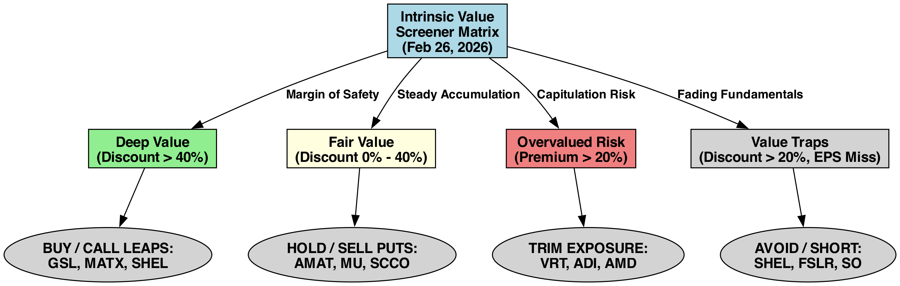
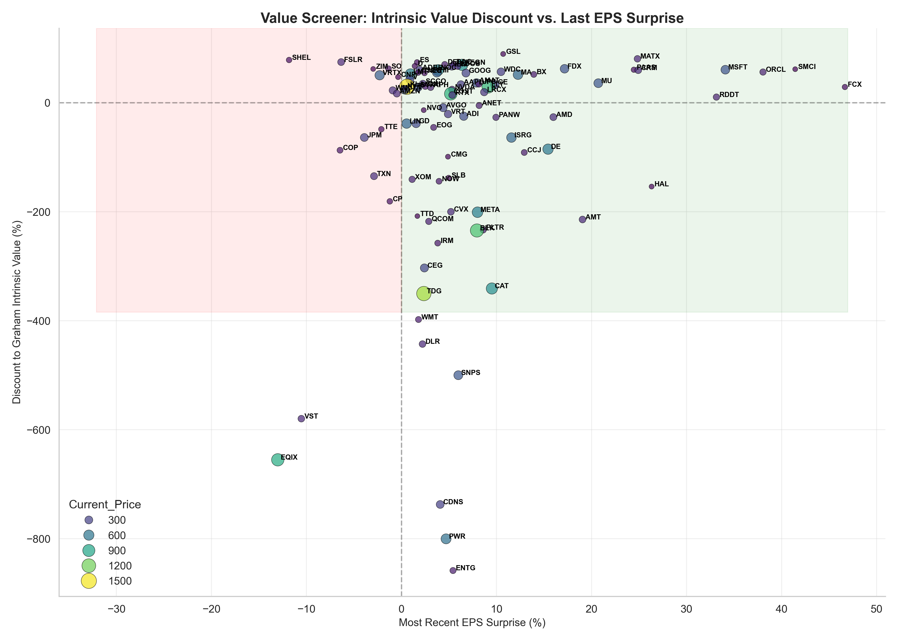

# Algorithmic Value Strategy - Screener Output

## Executive Summary
> *Analyzed **126 equities** utilizing Benjamin Graham's revised Intrinsic Value formula, substituting contemporary bond yields and trailing EPS. Objective: Identify deep-value dislocations in the market where growth estimates have not kept pace with pricing reality.*

- **Highest Margin of Safety:** GSL (Trading at a 89.4% discount)

## Data Quality & Potential Issues
> **Pipeline Diagnostics:** Out of `126` tickers analyzed, there are some data gaps that may affect metric coverage:
> - Missing Intrinsic Value (Often lacking Forward EPS/Growth projection): **20** tickers
> - Missing EPS Surprise (Missing quarterly expectations): **0** tickers
> - Missing Current Price data: **0** tickers

## Execution Matrix
Based on raw pricing efficiency against terminal growth estimates, the following dynamic decision matrix dictates capital flow.

---
## Analytical Output

### 📉 Dislocation Curve (Value vs Earnings Surprise)
The following scatter plot maps theoretical discount against actual corporate earnings execution. Equities in the **upper-right quadrant** represent the holy grail of value investing: severely undervalued companies that are consistently beating consensus earnings.

> [!CAUTION]
> **The Value Trap:** High-discount equities residing in the *lower-left* quadrant are actively missing earnings, suggesting their 'cheap' valuation is a direct function of collapsing forward guidance rather than market inefficiency.

### 🏆 Top Deep Value Targets
*Filtered for positive execution (Surprise > 0) and high margin of safety (Discount > 0).*

| Ticker   | Name   | Portfolio_Weight_Pct   | Unrealized_PnL_Pct   | Graham_Value   | Discount_to_Intrinsic_Value_Pct   |   RSI | Dist_to_200MA   |   MACD | MA_Cross   | Time_Horizon       | Exit_Strategy                |
|:---------|:-------|:-----------------------|:---------------------|:---------------|:----------------------------------|------:|:----------------|-------:|:-----------|:-------------------|:-----------------------------|
| GSL      | GSL    | 0%                     | 0%                   | $389.03        | +89.44%                           |  80.4 | +34.85%         |   1.31 | Golden     | Value Hold (Years) | Mean Reversion to Fair Value |
| MATX     | MATX   | 0%                     | 0%                   | $895.39        | +80.88%                           |  61.3 | +46.49%         |   5.61 | Golden     | Value Hold (Years) | Mean Reversion to Fair Value |
| ES       | ES     | 0%                     | 0%                   | $288.52        | +74.21%                           |  73.8 | +11.26%         |   1.71 | Golden     | Value Hold (Years) | Mean Reversion to Fair Value |
| DAC      | DAC    | 0%                     | 0%                   | $398.19        | +70.30%                           |  87.4 | +27.56%         |   4.4  | Golden     | Value Hold (Years) | Mean Reversion to Fair Value |
| REGN     | REGN   | 0%                     | 0%                   | $2655.75       | +70.22%                           |  53.5 | +24.10%         |   5.92 | Golden     | Value Hold (Years) | Mean Reversion to Fair Value |
| D        | D      | 0%                     | 0%                   | $198.40        | +68.22%                           |  56.6 | +8.35%          |   0.8  | Golden     | Value Hold (Years) | Mean Reversion to Fair Value |
| IBM      | IBM    | 0%                     | 0%                   | $722.92        | +66.89%                           |  23.7 | -13.56%         | -15.57 | Golden     | Value Hold (Years) | Mean Reversion to Fair Value |
| LDOS     | LDOS   | 0%                     | 0%                   | $527           | +65.96%                           |  40.4 | +1.26%          |  -3.66 | Golden     | Value Hold (Years) | Mean Reversion to Fair Value |
| SMCI     | SMCI   | 0%                     | 0%                   | $88.83         | +64.17%                           |  43.6 | -23.53%         |   0.2  | Death      | Value Hold (Years) | Mean Reversion to Fair Value |
| DELL     | DELL   | 0%                     | 0%                   | $423.32        | +63.73%                           |  72.6 | +19.74%         |   4.48 | Death      | Value Hold (Years) | Mean Reversion to Fair Value |
| FDX      | FDX    | 0%                     | 0%                   | $1036.04       | +62.62%                           |  76.3 | +48.87%         |  17.32 | Golden     | Value Hold (Years) | Mean Reversion to Fair Value |
| MSFT     | MSFT   | 0%                     | 0%                   | $1051.64       | +62.10%                           |  39.3 | -17.58%         | -13.78 | Death      | Value Hold (Years) | Mean Reversion to Fair Value |
| ADBE     | ADBE   | 0%                     | 0%                   | $654.69        | +60.15%                           |  44.7 | -24.54%         | -11.37 | Death      | Value Hold (Years) | Mean Reversion to Fair Value |
| CRM      | CRM    | 0%                     | 0%                   | $481.73        | +59.95%                           |  49.1 | -21.61%         |  -8.55 | Death      | Value Hold (Years) | Mean Reversion to Fair Value |
| PAAS     | PAAS   | 0%                     | 0%                   | $165.98        | +59.62%                           |  64.5 | +68.67%         |   2.87 | Golden     | Value Hold (Years) | Mean Reversion to Fair Value |
| NOC      | NOC    | 0%                     | 0%                   | $1896.81       | +59.51%                           |  69.2 | +33.29%         |  21.87 | Golden     | Value Hold (Years) | Mean Reversion to Fair Value |
| WDC      | WDC    | 0%                     | 0%                   | $661.98        | +59.20%                           |  43.9 | +101.66%        |  11.08 | Golden     | Value Hold (Years) | Mean Reversion to Fair Value |
| ORCL     | ORCL   | 0%                     | 0%                   | $354.01        | +57.84%                           |  43   | -32.09%         |  -7.63 | Death      | Value Hold (Years) | Mean Reversion to Fair Value |
| GOOG     | GOOG   | 0%                     | 0%                   | $700.88        | +56.29%                           |  33.8 | +22.12%         |  -4.46 | Golden     | Value Hold (Years) | Mean Reversion to Fair Value |
| NEE      | NEE    | 0%                     | 0%                   | $211.37        | +56.14%                           |  60.4 | +19.32%         |   2.21 | Golden     | Value Hold (Years) | Mean Reversion to Fair Value |
| CSCO     | CSCO   | 0%                     | 0%                   | $180.24        | +55.94%                           |  32.7 | +11.87%         |   0.15 | Golden     | Value Hold (Years) | Mean Reversion to Fair Value |
| HII      | HII    | 0%                     | 0%                   | $1017.93       | +55.43%                           |  71.8 | +50.49%         |  14.05 | Golden     | Value Hold (Years) | Mean Reversion to Fair Value |
| BX       | BX     | 0%                     | 0%                   | $250.92        | +54.04%                           |  29.9 | -23.83%         |  -7.81 | Death      | Value Hold (Years) | Mean Reversion to Fair Value |
| LMT      | LMT    | 0%                     | 0%                   | $1434.83       | +52.84%                           |  65.3 | +37.91%         |  22.68 | Golden     | Value Hold (Years) | Mean Reversion to Fair Value |
| MA       | MA     | 0%                     | 0%                   | $1077.58       | +51.65%                           |  43.2 | -7.04%          |  -8.77 | Death      | Value Hold (Years) | Mean Reversion to Fair Value |

---
*Generated algorithmically by `intrinsic_value_report.py`.*
