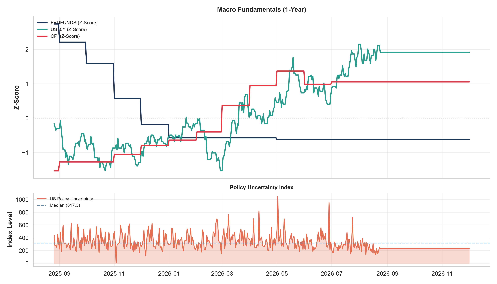
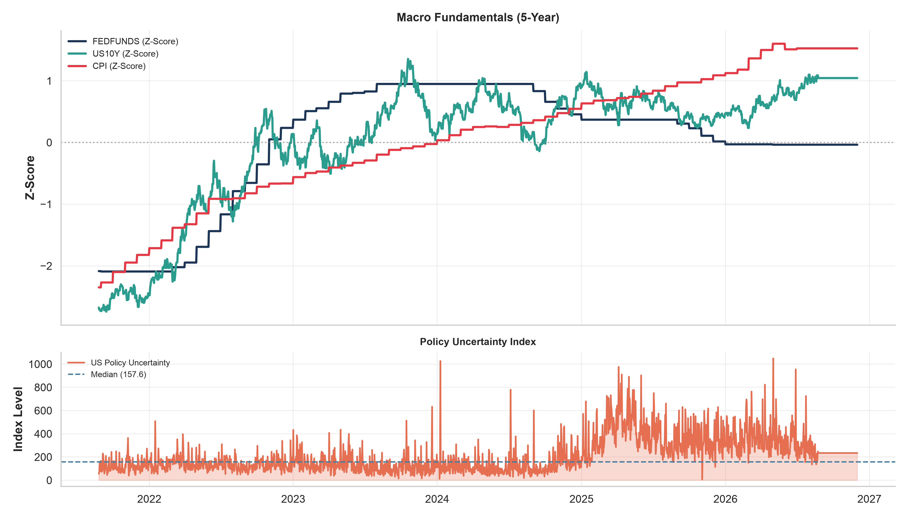
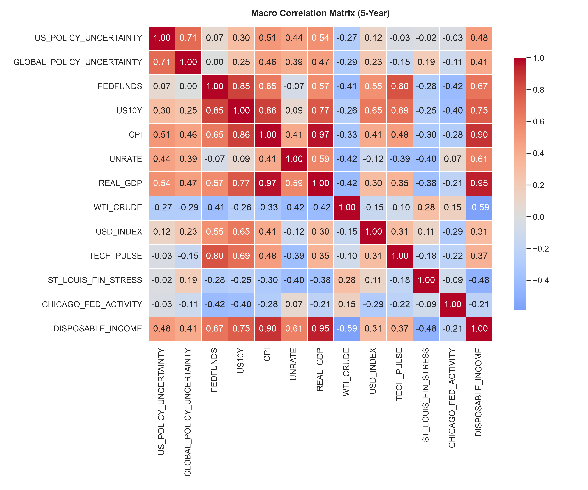

# Macroeconomic Indicators

## Overview
This report monitors 52 core macroeconomic indicators from the Federal Reserve Economic Data (FRED) system. Indicators are ranked by **5-Year Z-Score** to highlight the most statistically significant deviations in the current macroeconomic regime.

## Indicator Alerts
- *No severe macroeconomic anomalies or extreme jumps detected.*

## 1-Year Trends

## 5-Year Trends

## Correlation Matrix
### Top Positive Correlations
- **CPI** & **REAL_GDP**: `0.97`
- **REAL_GDP** & **DISPOSABLE_INCOME**: `0.95`
- **CPI** & **DISPOSABLE_INCOME**: `0.90`
- **US10Y** & **CPI**: `0.86`
- **FEDFUNDS** & **US10Y**: `0.85`

### Top Inverse Correlations
- **WTI_CRUDE** & **DISPOSABLE_INCOME**: `-0.59`
- **ST_LOUIS_FIN_STRESS** & **DISPOSABLE_INCOME**: `-0.48`
- **REAL_GDP** & **WTI_CRUDE**: `-0.42`
- **FEDFUNDS** & **CHICAGO_FED_ACTIVITY**: `-0.42`
- **UNRATE** & **WTI_CRUDE**: `-0.42`

## Indicator Dashboard
| Indicator                 |          Latest | 1M Chg   | 1Y Chg   |   5Y Z-Score | Date       |
|---------------------------|-----------------|----------|----------|--------------|------------|
| FREIGHT_PPI               |    526.89       | +0.00%   | +26.87%  |         2.78 | 2026-12-01 |
| M2_MONEY                  |  23218          | +0.00%   | +3.86%   |         2.46 | 2026-12-01 |
| COPPER_PRICE              |  13542.8        | +0.00%   | +14.86%  |         2.43 | 2026-12-01 |
| RD_INVESTMENT             |    937.77       | +0.00%   | +6.38%   |         1.95 | 2026-12-01 |
| GDP                       |  32475.2        | +0.00%   | +3.35%   |         1.6  | 2026-12-01 |
| SAVINGS_RATE              |      2.7        | +0.00%   | -25.00%  |        -1.57 | 2026-12-01 |
| TARIFFS                   |    326.32       | +0.00%   | -10.43%  |         1.57 | 2026-12-01 |
| UMICH_SENTIMENT           |     49.5        | +0.00%   | -6.43%   |        -1.54 | 2026-12-01 |
| CPI                       |    332.81       | +0.00%   | +2.08%   |         1.52 | 2026-12-01 |
| ELECTRIC_POWER_INDEX      |    116.45       | +0.00%   | -1.75%   |         1.52 | 2026-12-01 |
| REAL_GDP                  |  24270.6        | +0.00%   | +0.89%   |         1.45 | 2026-12-01 |
| HOUSEHOLD_NET_WORTH       |      1.8298e+08 | +0.00%   | +0.06%   |         1.43 | 2026-12-01 |
| US_POPULATION             | 343290          | +0.02%   | +0.24%   |         1.4  | 2026-12-01 |
| HOUSING_STARTS            |   1239          | +0.00%   | -10.09%  |        -1.4  | 2026-12-01 |
| FOOD_CPI                  |    350.16       | +0.00%   | +1.85%   |         1.38 | 2026-12-01 |
| SUGAR_PRICE               |     14.81       | +0.00%   | -0.82%   |        -1.35 | 2026-12-01 |
| USD_EUR                   |      1.17       | +0.00%   | +0.52%   |         1.31 | 2026-12-01 |
| US30Y                     |      5.23       | +0.00%   | +10.34%  |         1.27 | 2026-12-01 |
| KANSAS_CITY_FIN_STRESS    |     -0.85       | +0.00%   | -20.14%  |        -1.24 | 2026-12-01 |
| USD_JPY                   |    158.91       | +0.00%   | +2.34%   |         1.15 | 2026-12-01 |
| AAA_SPREAD                |      1.19       | +0.00%   | +1.71%   |         1.08 | 2026-12-01 |
| HY_SPREAD                 |      2.69       | +0.00%   | -8.50%   |        -1.05 | 2026-12-01 |
| WAREHOUSE_PPI             |    167.9        | +0.00%   | +1.83%   |         1.05 | 2026-12-01 |
| FED_ASSETS                |      6.7457e+06 | +0.00%   | +2.95%   |        -1.04 | 2026-12-01 |
| US10Y                     |      4.7        | +0.00%   | +14.91%  |         1.04 | 2026-12-01 |
| CHINA_IMPORTS             |  25150          | +0.00%   | +19.16%  |        -1.04 | 2026-12-01 |
| ST_LOUIS_FIN_STRESS       |     -0.83       | +0.00%   | -113.75% |        -1.04 | 2026-12-01 |
| DISPOSABLE_INCOME         |  18056.1        | +0.00%   | +0.21%   |         1.03 | 2026-12-01 |
| M2_VELOCITY               |      1.41       | +0.00%   | +0.21%   |         0.91 | 2026-12-01 |
| TECH_PULSE                |     96.31       | +0.00%   | +7.09%   |         0.9  | 2026-12-01 |
| USD_CNY                   |      6.72       | +0.00%   | -4.96%   |        -0.87 | 2026-12-01 |
| USD_INDEX                 |    118.06       | +0.00%   | -2.42%   |        -0.81 | 2026-12-01 |
| US_BIRTH_RATE             |     10.6        | +0.00%   | +0.00%   |        -0.75 | 2026-12-01 |
| TRUCK_PPI                 |    195.58       | +0.00%   | +8.01%   |         0.74 | 2026-12-01 |
| LIFE_EXPECTANCY           |     78.89       | +0.00%   | +0.00%   |         0.73 | 2026-12-01 |
| BAA_SPREAD                |      1.63       | +0.00%   | -8.43%   |        -0.69 | 2026-12-01 |
| CORP_SPREAD               |      0.81       | +0.00%   | -1.22%   |        -0.66 | 2026-12-01 |
| WTI_CRUDE                 |     86.48       | +0.00%   | +45.42%  |         0.55 | 2026-12-01 |
| CREDIT_CARD_DELINQUENCY   |      2.62       | +0.00%   | -0.38%   |         0.55 | 2026-12-01 |
| NAT_GAS_PRICE             |      2.96       | +0.00%   | -33.13%  |        -0.5  | 2026-12-01 |
| CORN_PRICE                |    213.19       | +0.00%   | +3.84%   |        -0.47 | 2026-12-01 |
| US02Y                     |      4.24       | +0.00%   | +19.77%  |         0.46 | 2026-12-01 |
| UNRATE                    |      4.1        | +0.00%   | -6.82%   |         0.39 | 2026-12-01 |
| AIR_PPI                   |    178.23       | +0.00%   | +0.17%   |         0.38 | 2026-12-01 |
| GLOBAL_POLICY_UNCERTAINTY |    241.69       | +0.00%   | -27.29%  |        -0.35 | 2026-12-01 |
| RECESSION_PROB            |      0.6        | +0.00%   | +114.29% |         0.32 | 2026-12-01 |
| MFG_CONST                 | 172674          | +0.00%   | -5.02%   |        -0.28 | 2026-12-01 |
| WHEAT_PRICE               |    228.74       | +0.00%   | +38.11%  |        -0.27 | 2026-12-01 |
| EUROPE_POLICY_UNCERTAINTY |    338.81       | +0.00%   | -4.10%   |        -0.23 | 2026-12-01 |
| US_POLICY_UNCERTAINTY     |    234.02       | +0.00%   | -9.25%   |         0.16 | 2026-12-01 |
| FEDFUNDS                  |      3.63       | +0.00%   | -2.42%   |        -0.04 | 2026-12-01 |
| CHICAGO_FED_ACTIVITY      |     -0.08       | +0.00%   | -33.33%  |         0.02 | 2026-12-01 |
