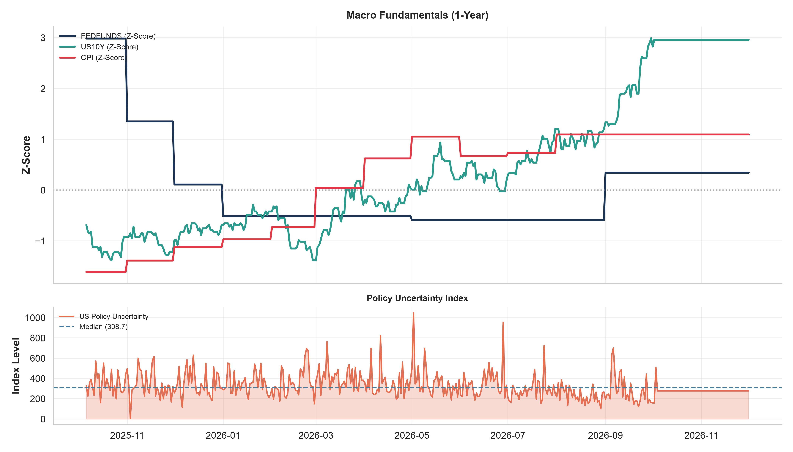
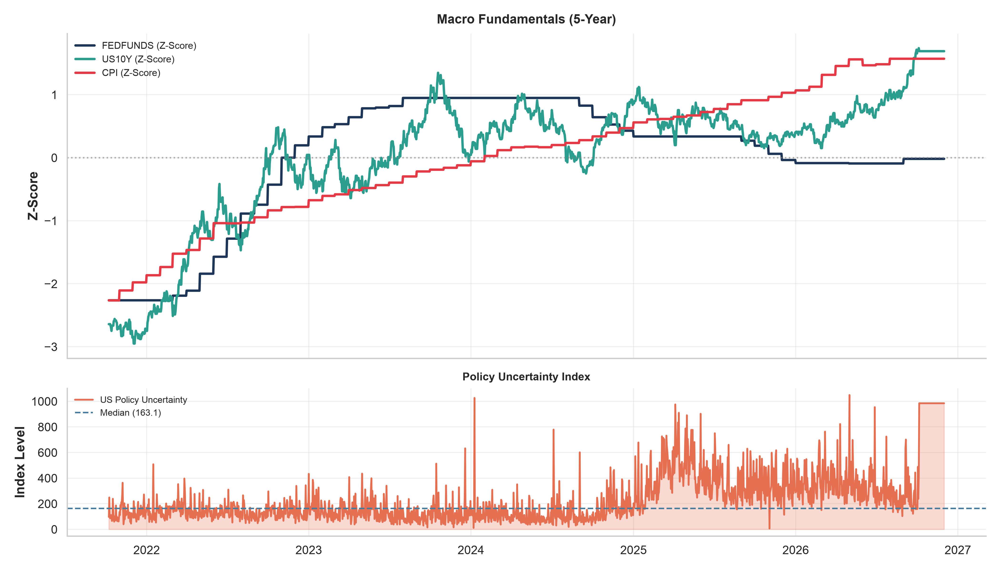
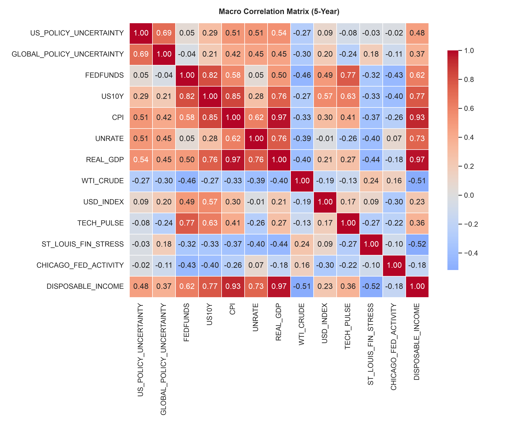

# Macroeconomic Indicators

## Overview
This report monitors 52 core macroeconomic indicators from the Federal Reserve Economic Data (FRED) system. Indicators are ranked by **5-Year Z-Score** to highlight the most statistically significant deviations in the current macroeconomic regime.

## Indicator Alerts
- *No severe macroeconomic anomalies or extreme jumps detected.*

## 1-Year Trends

## 5-Year Trends

## Correlation Matrix
### Top Positive Correlations
- **CPI** & **REAL_GDP**: `0.97`
- **REAL_GDP** & **DISPOSABLE_INCOME**: `0.96`
- **CPI** & **DISPOSABLE_INCOME**: `0.91`
- **US10Y** & **CPI**: `0.85`
- **FEDFUNDS** & **US10Y**: `0.82`

### Top Inverse Correlations
- **WTI_CRUDE** & **DISPOSABLE_INCOME**: `-0.56`
- **ST_LOUIS_FIN_STRESS** & **DISPOSABLE_INCOME**: `-0.51`
- **FEDFUNDS** & **WTI_CRUDE**: `-0.45`
- **FEDFUNDS** & **CHICAGO_FED_ACTIVITY**: `-0.44`
- **REAL_GDP** & **ST_LOUIS_FIN_STRESS**: `-0.44`

## Indicator Dashboard
| Indicator                 |          Latest | 1M Chg   | 1Y Chg   |   5Y Z-Score | Date       |
|---------------------------|-----------------|----------|----------|--------------|------------|
| FREIGHT_PPI               |    518.62       | +0.00%   | +24.88%  |         2.48 | 2026-12-01 |
| M2_MONEY                  |  23342.8        | +0.00%   | +4.42%   |         2.43 | 2026-12-01 |
| COPPER_PRICE              |  13542.8        | +0.00%   | +14.86%  |         2.27 | 2026-12-01 |
| ELECTRIC_POWER_INDEX      |    118.75       | +0.00%   | +0.19%   |         1.98 | 2026-12-01 |
| HOUSEHOLD_NET_WORTH       |      1.9587e+08 | +0.00%   | +7.46%   |         1.92 | 2026-12-01 |
| RD_INVESTMENT             |    936          | +0.00%   | +6.18%   |         1.87 | 2026-12-01 |
| US10Y                     |      5.24       | +0.00%   | +28.12%  |         1.66 | 2026-12-01 |
| US30Y                     |      5.56       | +0.00%   | +17.30%  |         1.61 | 2026-12-01 |
| TRUCK_PPI                 |    207.64       | +0.00%   | +14.67%  |         1.58 | 2026-12-01 |
| CPI                       |    334.13       | +0.00%   | +2.48%   |         1.58 | 2026-12-01 |
| GDP                       |  32486.1        | +0.00%   | +3.38%   |         1.56 | 2026-12-01 |
| TARIFFS                   |    326.32       | +0.00%   | -10.43%  |         1.5  | 2026-12-01 |
| KANSAS_CITY_FIN_STRESS    |     -0.95       | +0.00%   | -34.25%  |        -1.44 | 2026-12-01 |
| REAL_GDP                  |  24269.6        | +0.00%   | +0.89%   |         1.4  | 2026-12-01 |
| FOOD_CPI                  |    350.42       | +0.00%   | +1.93%   |         1.38 | 2026-12-01 |
| US_POPULATION             | 343290          | +0.02%   | +0.24%   |         1.36 | 2026-12-01 |
| AIR_PPI                   |    187.37       | +0.00%   | +5.31%   |         1.34 | 2026-12-01 |
| SAVINGS_RATE              |      3          | +0.00%   | -16.67%  |        -1.34 | 2026-12-01 |
| BAA_SPREAD                |      1.46       | +0.00%   | -17.98%  |        -1.34 | 2026-12-01 |
| SUGAR_PRICE               |     14.81       | +0.00%   | -0.82%   |        -1.31 | 2026-12-01 |
| UMICH_SENTIMENT           |     51.7        | +0.00%   | -2.27%   |        -1.27 | 2026-12-01 |
| ST_LOUIS_FIN_STRESS       |     -0.91       | +0.00%   | -137.63% |        -1.26 | 2026-12-01 |
| WTI_CRUDE                 |     96.41       | +0.00%   | +62.12%  |         1.25 | 2026-12-01 |
| HOUSING_STARTS            |   1275          | +0.00%   | -7.47%   |        -1.12 | 2026-12-01 |
| WAREHOUSE_PPI             |    168.97       | +0.00%   | +2.48%   |         1.1  | 2026-12-01 |
| DISPOSABLE_INCOME         |  18122.5        | +0.00%   | +0.58%   |         1.08 | 2026-12-01 |
| US02Y                     |      4.92       | +0.00%   | +38.98%  |         1.04 | 2026-12-01 |
| USD_JPY                   |    157.18       | +0.00%   | +1.22%   |         1.01 | 2026-12-01 |
| FED_ASSETS                |      6.7477e+06 | +0.00%   | +2.98%   |        -1    | 2026-12-01 |
| USD_CNY                   |      6.71       | +0.00%   | -5.10%   |        -0.94 | 2026-12-01 |
| M2_VELOCITY               |      1.42       | +0.00%   | +0.43%   |         0.92 | 2026-12-01 |
| TECH_PULSE                |     96.05       | +0.00%   | +6.80%   |         0.83 | 2026-12-01 |
| CHINA_IMPORTS             |  27070.7        | +0.00%   | +28.26%  |        -0.81 | 2026-12-01 |
| USD_EUR                   |      1.14       | +0.00%   | -1.92%   |         0.77 | 2026-12-01 |
| US_BIRTH_RATE             |     10.6        | +0.00%   | +0.00%   |        -0.72 | 2026-12-01 |
| LIFE_EXPECTANCY           |     78.89       | +0.00%   | +0.00%   |         0.71 | 2026-12-01 |
| CREDIT_CARD_DELINQUENCY   |      2.62       | +0.00%   | -0.38%   |         0.52 | 2026-12-01 |
| NAT_GAS_PRICE             |      2.96       | +0.00%   | -33.13%  |        -0.48 | 2026-12-01 |
| CORN_PRICE                |    213.19       | +0.00%   | +3.84%   |        -0.46 | 2026-12-01 |
| CORP_SPREAD               |      0.83       | +0.00%   | +1.22%   |        -0.46 | 2026-12-01 |
| UNRATE                    |      4.1        | +0.00%   | -6.82%   |         0.45 | 2026-12-01 |
| MFG_CONST                 | 169795          | +0.00%   | -6.60%   |        -0.38 | 2026-12-01 |
| EUROPE_POLICY_UNCERTAINTY |    325.67       | +0.00%   | -7.82%   |        -0.38 | 2026-12-01 |
| GLOBAL_POLICY_UNCERTAINTY |    241.69       | +0.00%   | -27.29%  |        -0.36 | 2026-12-01 |
| WHEAT_PRICE               |    228.74       | +0.00%   | +38.11%  |        -0.26 | 2026-12-01 |
| HY_SPREAD                 |      3.02       | +0.00%   | +2.72%   |        -0.21 | 2026-12-01 |
| USD_INDEX                 |    120.33       | +0.00%   | -0.54%   |        -0.19 | 2026-12-01 |
| US_POLICY_UNCERTAINTY     |    193.14       | +0.00%   | -25.10%  |        -0.13 | 2026-12-01 |
| CHICAGO_FED_ACTIVITY      |     -0.04       | +0.00%   | +33.33%  |         0.12 | 2026-12-01 |
| AAA_SPREAD                |      1.02       | +0.00%   | -12.82%  |         0.12 | 2026-12-01 |
| FEDFUNDS                  |      3.63       | +0.00%   | -2.42%   |        -0.08 | 2026-12-01 |
| RECESSION_PROB            |      0.76       | +0.00%   | +35.71%  |        -0.07 | 2026-12-01 |
