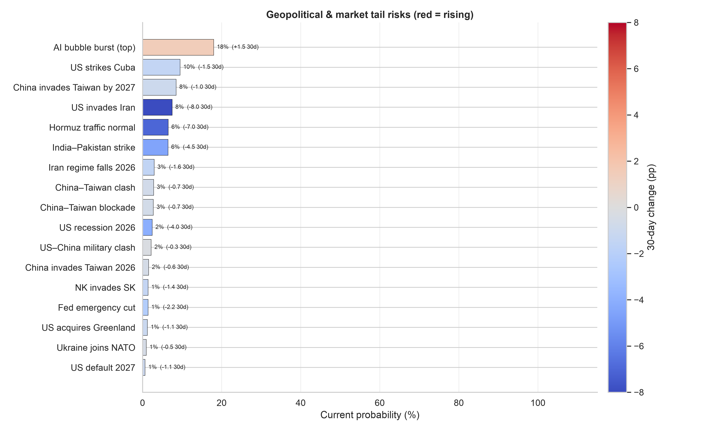

# Political Sentiment Report

*Generated 2026-11-20. Probabilities are Polymarket
Yes-prices (0–100%); Δ columns are percentage-point changes versus the
nearest prior print 1 / 7 / 30 days earlier.*

> [!NOTE]
> Sources: Polymarket Gamma/CLOB (odds, volume) and VoteHub (approval polls,
> 14-day trailing mean). Data as of 2026-11-20.

## Regime Dashboard
| Signal                     | Outcome           | Prob   | Δ1d   | Δ7d   | Δ30d   | As of      |
|----------------------------|-------------------|--------|-------|-------|--------|------------|
| House → Democrats          | Democratic Party  | 100.0% | +0.0  | +0.0  | +8.5   | 2026-11-20 |
| Senate → Democrats         | Democratic Party  | 100.0% | +0.0  | +0.0  | +36.5  | 2026-11-20 |
| Dec FOMC (top)             | 25 bps increase   | 90.5%  | -1.0  | +2.0  | +13.0  | 2026-11-20 |
| Fed cuts in 2026 (top)     | 0 (0 bps)         | 98.5%  | +0.2  | +0.1  | +1.5   | 2026-11-20 |
| Fed funds end-2026 (top)   | 4.25%             | 92.0%  | +3.0  | +5.3  | +24.8  | 2026-11-20 |
| 10Y high 2026 (top bucket) | 5.3%              | 26.5%  | -10.0 | -13.5 | —      | 2026-11-20 |
| Shutdown by Dec 31         | December 31       | 32.5%  | -4.0  | -9.5  | —      | 2026-11-20 |
| US recession 2026          | Yes               | 2.5%   | +0.3  | +0.3  | -5.0   | 2026-11-20 |
| Taiwan invasion 2026       | Yes               | 1.8%   | +0.1  | +0.5  | -0.4   | 2026-11-20 |
| Taiwan invasion by 2027    | Yes               | 7.5%   | +0.0  | +0.0  | -2.0   | 2026-11-20 |
| Hormuz normal by Dec 31    | Yes               | 6.5%   | -2.0  | -4.0  | -7.0   | 2026-11-12 |
| Anthropic IPO by Dec 15    | December 15, 2026 | 100.0% | +0.1  | +1.1  | +25.5  | 2026-11-20 |
| Trump approve (14d)        | Approve           | 36.2%  | -0.2  | -0.9  | -0.3   | 2026-11-16 |
| Trump disapprove (14d)     | Disapprove        | 60.7%  | +0.1  | +1.2  | -1.3   | 2026-11-16 |

## Biggest Movers (7-day, volume ≥ $10K)
| Key             | Outcome           | Prob   | Δ1d   | Δ7d   | Δ30d   | Volume   |
|-----------------|-------------------|--------|-------|-------|--------|----------|
| eth_price_2026  | ↓ 2,000           | 84.0%  | +17.0 | +57.5 | +54.5  | $773K    |
| wti_nov_2026    | ↑ $90             | 25.5%  | +0.5  | -57.0 | —      | $75K     |
| eth_price_2026  | ↓ 1,500           | 68.8%  | +31.1 | +51.1 | +60.1  | $3.6M    |
| ai_bubble_burst | December 31, 2026 | 44.9%  | +36.9 | +38.4 | +34.2  | $3.3M    |
| ai_bubble_burst | June 30, 2027     | 63.0%  | +44.5 | +37.5 | +42.0  | $199K    |
| wti_nov_2026    | ↑ $95             | 9.5%   | -0.5  | -33.5 | —      | $81K     |
| us5y_low_2026   | Below 4.70%       | 90.2%  | -5.0  | +32.2 | —      | $26K     |
| us5y_low_2026   | Below 4.65%       | 82.5%  | -1.5  | +29.0 | —      | $81K     |
| eth_price_2026  | ↓ 1,250           | 31.5%  | +13.0 | +24.5 | +23.0  | $1.1M    |
| eth_price_2026  | ↓ 1,750           | 35.5%  | +10.5 | +23.0 | +22.5  | $1.0M    |
| wti_nov_2026    | ↑ $100            | 4.8%   | -1.0  | -22.3 | —      | $143K    |
| wti_nov_2026    | ↓ $80             | 62.0%  | -9.0  | +21.5 | —      | $205K    |

## Market Read-Through
- **Rates gate unlikely to release**: Dec FOMC `25 bps increase` at 90% — hike priced.
- **Oil tail open**: Hormuz-normal-by-Dec-31 only 6%.
- **Gridlock priced**: Dem House 100% / Senate 100% — expect veto politics, little fiscal legislation.
- **Growth scare not priced**: 2026 recession only 3%.

## Markets by Category

### Elections
| Key               | Outcome                  | Prob   | Δ7d   |
|-------------------|--------------------------|--------|-------|
| approval_low_2026 | 36%                      | 45.0%  | -5.0  |
| approval_low_2026 | 35%                      | 16.0%  | -3.5  |
| approval_low_2026 | 34%                      | 9.0%   | +2.5  |
| approval_trump    | Disapprove               | 60.7%  | +1.2  |
| approval_trump    | Approve                  | 36.2%  | -0.9  |
| dem_nominee_2028  | Jon Ossoff               | 26.2%  | -0.1  |
| dem_nominee_2028  | Alexandria Ocasio-Cortez | 14.1%  | -0.4  |
| dem_nominee_2028  | Gavin Newsom             | 10.1%  | -0.1  |
| gop_nominee_2028  | Robert F. Kennedy Jr.    | 49.0%  | +0.0  |
| gop_nominee_2028  | J.D. Vance               | 29.1%  | -4.6  |
| gop_nominee_2028  | Marco Rubio              | 25.2%  | +7.3  |
| house_2026        | Democratic Party         | 100.0% | +0.0  |
| house_2026        | Party A                  | 0.0%   | +0.0  |
| house_2026        | Party B                  | 0.0%   | +0.0  |
| pres_winner_2028  | Jon Ossoff               | 16.8%  | -0.5  |
| pres_winner_2028  | JD Vance                 | 15.0%  | +2.2  |
| pres_winner_2028  | Marco Rubio              | 9.7%   | +0.2  |
| senate_2026       | Democratic Party         | 100.0% | +0.0  |
| senate_2026       | Party A                  | 0.0%   | +0.0  |
| senate_2026       | Party B                  | 0.0%   | +0.0  |

### Fed & Rates
| Key                   | Outcome          | Prob   | Δ7d   |
|-----------------------|------------------|--------|-------|
| fed_cuts_2026         | 0 (0 bps)        | 98.5%  | +0.1  |
| fed_cuts_2026         | 1 (25 bps)       | 0.5%   | -0.2  |
| fed_cuts_2026         | 2 (50 bps)       | 0.2%   | +0.0  |
| fed_decision_dec_2026 | 25 bps increase  | 90.5%  | +2.0  |
| fed_decision_dec_2026 | No change        | 5.5%   | +3.8  |
| fed_decision_dec_2026 | 50+ bps increase | 2.4%   | -7.3  |
| fed_emergency_cut     | Yes              | 1.2%   | -0.4  |
| fed_rate_end_2026     | 4.25%            | 92.0%  | +5.3  |
| fed_rate_end_2026     | 4.0%             | 3.8%   | +0.6  |
| fed_rate_end_2026     | ≥ 4.5%           | 3.2%   | -5.9  |
| fed_rate_end_2027     | 4.5%             | 24.0%  | -3.5  |
| fed_rate_end_2027     | 4.25%            | 21.0%  | -3.0  |
| fed_rate_end_2027     | 4.75%            | 20.5%  | +0.0  |
| powell_out            | Yes              | 11.5%  | +3.0  |
| us10y_high_2026       | 5.3%             | 26.5%  | -13.5 |
| us10y_high_2026       | 5.4%             | 11.0%  | -10.0 |
| us10y_high_2026       | 5.5%             | 8.2%   | -3.8  |
| us5y_low_2026         | Below 4.70%      | 90.2%  | +32.2 |
| us5y_low_2026         | Below 4.65%      | 82.5%  | +29.0 |
| us5y_low_2026         | Below 4.60%      | 59.5%  | +20.0 |

### Fiscal, Economy & Trade
| Key                   | Outcome                             | Prob   | Δ7d   |
|-----------------------|-------------------------------------|--------|-------|
| bills_law_2026        | Export-control chip security        | 56.0%  | +1.0  |
| bills_law_2026        | AI-chip export licensing            | 48.5%  | +13.0 |
| bills_law_2026        | Data center utility cost protection | 31.0%  | +13.0 |
| china_gdp_2026        | 4.0–5.0%                            | 97.2%  | +1.2  |
| china_gdp_2026        | 3.0–4.0%                            | 1.1%   | +0.0  |
| china_gdp_2026        | 5.0–6.0%                            | 1.1%   | -0.6  |
| china_tariff_2026     | 5–15%                               | 92.0%  | +2.5  |
| china_tariff_2026     | 15–25%                              | 5.0%   | -3.5  |
| china_tariff_2026     | 25–35%                              | 2.2%   | -0.1  |
| ez_inflation_2026     | 3.1%+                               | 93.3%  | +10.7 |
| ez_inflation_2026     | 1.6–1.8%                            | 2.7%   | —     |
| ez_inflation_2026     | 1.9–2.1%                            | 2.2%   | +0.7  |
| gov_shutdown          | December 31                         | 32.5%  | -9.5  |
| gov_shutdown          | December 12                         | 25.0%  | -9.5  |
| trade_deals_2026      | Mexico                              | 21.0%  | +12.5 |
| trade_deals_2026      | Canada                              | 16.0%  | +5.5  |
| trade_deals_2026      | Indonesia                           | 12.5%  | +4.0  |
| trump_impeached_2026  | December 31, 2027                   | 55.5%  | +3.0  |
| trump_impeached_2026  | June 30, 2027                       | 40.5%  | +6.5  |
| trump_impeached_2026  | December 31, 2026                   | 1.1%   | +0.0  |
| us_default_2027       | Yes                                 | 0.7%   | +0.0  |
| us_inflation_oct_2026 | 3.7%                                | 95.3%  | -0.1  |
| us_inflation_oct_2026 | 3.6%                                | 1.7%   | -0.1  |
| us_inflation_oct_2026 | 3.8%                                | 0.8%   | +0.4  |
| us_recession_2026     | Yes                                 | 2.5%   | +0.3  |
| wti_nov_2026          | ↓ $85                               | 99.0%  | +12.5 |
| wti_nov_2026          | ↓ $90                               | 65.0%  | +17.5 |
| wti_nov_2026          | ↓ $80                               | 62.0%  | +21.5 |

### Geopolitics
| Key                          | Outcome                                                    | Prob   | Δ7d   |
|------------------------------|------------------------------------------------------------|--------|-------|
| bab_el_mandeb_closed         | December 31                                                | 5.5%   | -2.0  |
| bab_el_mandeb_closed         | November 30                                                | 1.2%   | -1.7  |
| bab_el_mandeb_closed         | October 31                                                 | 0.1%   | -0.4  |
| china_japan_clash            | Yes                                                        | 2.4%   | +0.2  |
| china_taiwan_blockade        | Yes                                                        | 2.8%   | +0.9  |
| china_taiwan_clash           | Yes                                                        | 4.0%   | +1.8  |
| china_taiwan_invasion        | Yes                                                        | 1.8%   | +0.5  |
| china_taiwan_invasion_2027   | Yes                                                        | 7.5%   | +0.0  |
| greenland_acquire            | Yes                                                        | 1.5%   | +0.1  |
| hormuz_traffic_normal        | December 15                                                | 50.0%  | —     |
| hormuz_traffic_normal        | Yes                                                        | 6.5%   | -4.0  |
| hormuz_traffic_normal        | Strait of Hormuz traffic returns to normal by December 31? | 3.2%   | —     |
| india_pakistan_strike        | Yes                                                        | 6.5%   | +0.3  |
| iran_nuclear_deal            | December 31                                                | 5.0%   | -2.5  |
| iran_nuclear_deal            | November 30                                                | 0.7%   | -0.4  |
| iran_regime_fall_2026        | Yes                                                        | 2.5%   | +0.0  |
| israel_strike_countries_2026 | 4                                                          | 83.9%  | +5.9  |
| israel_strike_countries_2026 | 5                                                          | 10.6%  | -2.4  |
| israel_strike_countries_2026 | 6                                                          | 2.3%   | -0.9  |
| kim_out                      | Yes                                                        | 1.7%   | +0.1  |
| nk_invade_sk                 | Yes                                                        | 1.6%   | +0.3  |
| putin_out                    | June 30, 2027                                              | 8.5%   | +0.0  |
| putin_out                    | March 31, 2027                                             | 5.5%   | -1.0  |
| putin_out                    | December 31, 2026                                          | 1.2%   | -0.4  |
| russia_ukraine_ceasefire     | December 31, 2027                                          | 69.5%  | +0.0  |
| russia_ukraine_ceasefire     | November 30, 2027                                          | 67.5%  | -1.0  |
| russia_ukraine_ceasefire     | October 31, 2027                                           | 67.5%  | +0.5  |
| trump_meetings_2026          | Vladimir Putin                                             | 98.6%  | +9.1  |
| trump_meetings_2026          | Mohammed bin Salman                                        | 90.5%  | +1.0  |
| trump_meetings_2026          | King Mohammed VI                                           | 4.0%   | -4.0  |
| ukraine_nato                 | Yes                                                        | 0.7%   | -0.2  |
| us_china_military_clash      | Yes                                                        | 1.9%   | -0.2  |
| us_invade_iran               | Yes                                                        | 6.5%   | -1.0  |
| us_russia_nuclear_deal       | Yes                                                        | 2.9%   | -5.1  |
| us_strike_cuba               | Yes                                                        | 8.5%   | -2.5  |
| venezuela_leader_2026        | Nicolás Maduro                                             | 89.8%  | -2.0  |
| venezuela_leader_2026        | Delcy Rodríguez                                            | 6.5%   | +0.0  |
| venezuela_leader_2026        | No Head of State                                           | 0.3%   | -0.2  |
| xi_out                       | Yes                                                        | 1.7%   | +0.0  |

### Markets & IPOs
| Key                  | Outcome           | Prob   | Δ7d   |
|----------------------|-------------------|--------|-------|
| ai_bubble_burst      | June 30, 2027     | 63.0%  | +37.5 |
| ai_bubble_burst      | December 31, 2026 | 44.9%  | +38.4 |
| anthropic_ipo        | December 15, 2026 | 100.0% | +1.1  |
| anthropic_ipo        | December 31, 2026 | 100.0% | +1.3  |
| anthropic_ipo        | November 19, 2026 | 100.0% | —     |
| btc_ath_by           | Yes               | 1.4%   | -0.6  |
| btc_gold_spx_2026    | S&P 500           | 95.5%  | +6.5  |
| btc_gold_spx_2026    | Gold              | 2.8%   | -3.2  |
| btc_gold_spx_2026    | Bitcoin           | 2.2%   | -1.3  |
| eth_price_2026       | ↓ 2,000           | 84.0%  | +57.5 |
| eth_price_2026       | ↓ 1,500           | 68.8%  | +51.1 |
| eth_price_2026       | ↓ 1,750           | 35.5%  | +23.0 |
| ipos_2026            | Anthropic         | 99.6%  | +2.4  |
| ipos_2026            | Perplexity        | 10.5%  | +5.6  |
| ipos_2026            | Freddie Mac       | 5.4%   | -0.6  |
| largest_company_2026 | Apple             | 92.9%  | +7.2  |
| largest_company_2026 | NVIDIA            | 4.5%   | -6.0  |
| largest_company_2026 | Alphabet          | 1.0%   | +0.3  |
| largest_ipo_2026     | SpaceX            | 98.6%  | +6.5  |
| largest_ipo_2026     | xAI               | 25.5%  | +0.0  |
| largest_ipo_2026     | Anthropic         | 3.2%   | -3.5  |
| openai_ipo           | June 30, 2027     | 47.5%  | +2.0  |
| openai_ipo           | March 31, 2027    | 15.0%  | -7.5  |
| openai_ipo           | December 31, 2026 | 1.6%   | +0.2  |

### Foreign Politics
| Key               | Outcome                            | Prob   | Δ7d   |
|-------------------|------------------------------------|--------|-------|
| france_pres_2027  | Marine Le Pen                      | 45.6%  | -0.4  |
| france_pres_2027  | David Lisnard                      | 17.8%  | +1.1  |
| france_pres_2027  | Jean-Luc Mélenchon                 | 14.5%  | +1.0  |
| japan_pm_out      | Yes                                | 1.9%   | +0.4  |
| leader_out_2026   | None before 2027                   | 56.5%  | +7.5  |
| leader_out_2026   | Netanyahu - Israel PM              | 31.0%  | -7.5  |
| leader_out_2026   | Lecornu - France PM                | 2.1%   | +0.8  |
| modi_out          | Yes                                | 1.4%   | -0.1  |
| taiwan_local_2026 | Kuomintang (KMT)                   | 62.5%  | -1.5  |
| taiwan_local_2026 | Democratic Progressive Party (DPP) | 37.9%  | +1.6  |
| taiwan_local_2026 | Taiwan People’s Party (TPP)        | 0.1%   | +0.0  |

## Upcoming Key Events (next 90 days)
| Date       | Event                                  | Category   | Notes                                          |
|------------|----------------------------------------|------------|------------------------------------------------|
| 2026-11-28 | Taiwan local (9-in-1) elections        | foreign    | KMT vs DPP                                     |
| 2026-11-30 | OPEC+ ministerial meeting              | energy     | approx                                         |
| 2026-12-09 | FOMC decision                          | fed        | Dec 8-9 meeting + SEP                          |
| 2026-12-10 | CPI release (Nov)                      | data       | approx; verify bls.gov                         |
| 2026-12-10 | ECB decision                           | cb         | approx                                         |
| 2026-12-14 | G20 summit (Miami, US presidency)      | summit     | Dec 14-15                                      |
| 2026-12-15 | China Central Economic Work Conference | foreign    | approx; sets 2027 growth target tone           |
| 2026-12-17 | BoE decision                           | cb         | approx                                         |
| 2026-12-18 | BoJ decision                           | cb         | Dec 17-18                                      |
| 2027-01-01 | Brazil presidential inauguration       | foreign    |                                                |
| 2027-01-03 | 120th Congress convenes                | congress   | Speaker vote                                   |
| 2027-01-13 | CPI release (Dec)                      | data       | approx; verify bls.gov                         |
| 2027-01-18 | World Economic Forum (Davos)           | summit     | approx                                         |
| 2027-01-27 | FOMC decision                          | fed        | Jan 26-27 meeting                              |
| 2027-02-01 | India Union Budget                     | foreign    |                                                |
| 2027-02-01 | State of the Union                     | domestic   | date TBD                                       |
| 2027-02-15 | India Uttar Pradesh state election     | foreign    | approx Feb-Mar; biggest state, Modi bellwether |
