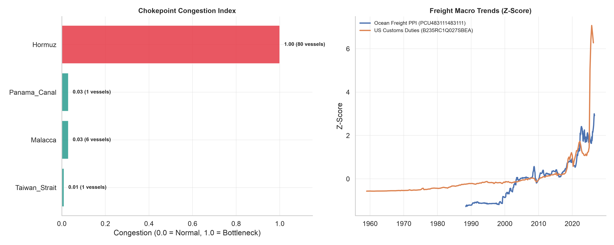

# Global Shipping & Logistics Report
**Generated:** 2026-08-05 16:31:38

## 🚢 Overview
This report monitors global maritime chokepoints and shipping macroeconomic indicators to track supply chain bottlenecks, freight costs, and logistical disruptions.

## 📈 Congestion Trends

## 📍 Latest Chokepoint Status (As of 2026-08-05)
| Chokepoint    |   Vessel Count |   Congestion Index |
|---------------|----------------|--------------------|
| Hormuz        |             80 |               1    |
| Malacca       |            200 |               1    |
| Panama_Canal  |              1 |               0.03 |
| Taiwan_Strait |             15 |               0.1  |

## 🌍 Shipping Macro Metrics
| Metric                              |   Latest Value | YoY Change    | Date       |
|-------------------------------------|----------------|---------------|------------|
| Ocean Freight PPI (PCU483111483111) |         459.38 | (+13.49% YoY) | 2026-06-01 |
| US Customs Duties (B235RC1Q027SBEA) |         326.32 | (+21.91% YoY) | 2026-04-01 |
